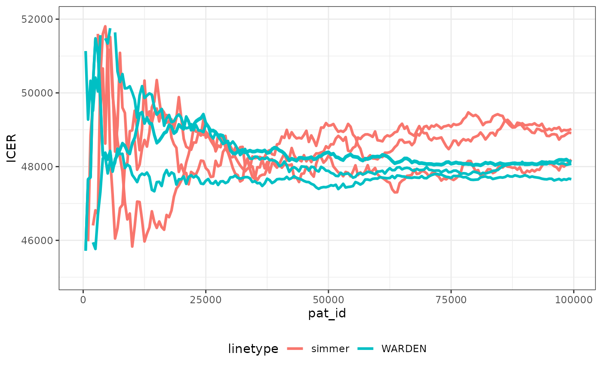
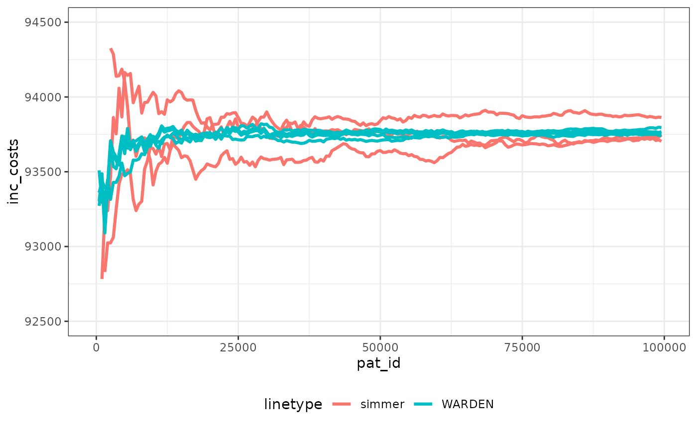
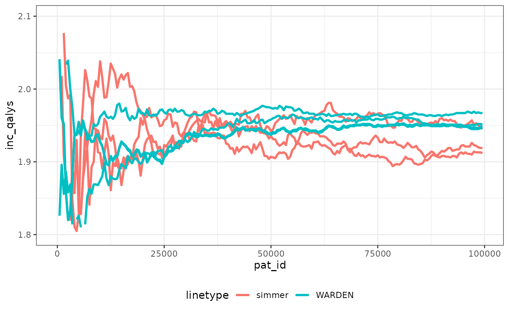

# Degeling et al. (2025) using WARDEN instead of simmer

## Introduction

This document makes use of the code provided by [Degeling et
al. (2025)](https://link.springer.com/article/10.1007/s40258-025-00983-8)
which use simmer in their original approach, to showcase how the same
model would be written with WARDEN instead of using simmer, reflecting
on the advantages and disadvantages of each approach.

Note that the model used is not resource constrained, so in WARDEN we
would use with the `constrained = FALSE` argument (which is FALSE by
default). We will then see an alternative approach that could have been
taken in the model design to simplify the code and reduce the number of
events defined.

In this document I have made a few modifications to ensure the random
numbers used are cloned for a patient across arms, that way we should be
able to reduce the number of simulations needed to achieve convergence.

### Main options

``` r
library(WARDEN)
library(flexsurv)
#> Loading required package: survival
library(dplyr)
#> 
#> Attaching package: 'dplyr'
#> The following objects are masked from 'package:stats':
#> 
#>     filter, lag
#> The following objects are masked from 'package:base':
#> 
#>     intersect, setdiff, setequal, union
library(ggplot2)
library(kableExtra)
#> 
#> Attaching package: 'kableExtra'
#> The following object is masked from 'package:dplyr':
#> 
#>     group_rows
library(purrr)
library(tidyr)

rllogiscure <- function(n = 1, cure, shape, scale) ifelse(runif(n) < cure, Inf, flexsurv::rllogis(n = n, shape = shape, scale = scale))

qllogiscure <- function(q1=0.5,q2=0.5, cure, shape, scale) ifelse(q1 < cure, Inf, flexsurv::qllogis(q2, shape = shape, scale = scale))

#Load the data directly

df_survival_models <- data.frame(
  d_RF_R_1_low_dist = "llogis cure",
  d_RF_R_1_low_cure = 0.488186991523229,
  d_RF_R_1_low_shape = 1.77977114896326,
  d_RF_R_1_low_scale = 1.38283630454774,
  d_RF_R_1_high_dist = "llogis cure",
  d_RF_R_1_high_cure = 0.214810267441731,
  d_RF_R_1_high_shape = 1.77977114896326,
  d_RF_R_1_high_scale = 0.789492793640768,
  d_RF_R_2_low_dist = "llogis cure",
  d_RF_R_2_low_cure = 0.65641085001312,
  d_RF_R_2_low_shape = 1.77977114896326,
  d_RF_R_2_low_scale = 1.58521155099032,
  d_RF_R_2_high_dist = "llogis cure",
  d_RF_R_2_high_cure = 0.353984786085761,
  d_RF_R_2_high_shape = 1.77977114896326,
  d_RF_R_2_high_scale = 0.905033438728147,
  d_RF_D_dist = "gompertz",
  d_RF_D_shape = 0.100559042221505,
  d_RF_D_rate = 0.00665743407339234,
  d_R_D_1_dist = "llogis",
  d_R_D_1_shape = 1.485045044099,
  d_R_D_1_scale = 1.00935168932233,
  d_R_D_2_dist = "llogis",
  d_R_D_2_shape = 1.44829250447263,
  d_R_D_2_scale = 0.810984232666931
)

fit_RF_R <- list()

fit_RF_R$coefficients <- c(theta = -0.0472608287028634, shape = 0.576484788040251, scale = 0.324136683094238, 
`rxLev+5FU` = 0.694601105199585, node4 = -1.24890939590147, `scale(rxLev+5FU)` = 0.136581185984944, 
`scale(node4)` = -0.560501256173105)

fit_RF_R$cov <- structure(c(0.0196583147504792, 0.00156218752250396, -0.00257474768797604, 
-0.016302156542927, -0.0100195566305646, 0.00134971798565362, 
0.00170701620954217, 0.00156218752250396, 0.00365083117648361, 
-0.00128500487043069, -0.000244113496363589, 2.02965101911069e-05, 
-0.000143663350415706, 0.000680998903126475, -0.00257474768797604, 
-0.00128500487043069, 0.0092867442776243, 0.00151695259640943, 
0.00133526552969664, -0.00625680296067579, -0.00661478811857714, 
-0.016302156542927, -0.000244113496363589, 0.00151695259640943, 
0.0338463064763289, -0.0025154671522777, -0.00322763710020272, 
-9.12647224737586e-05, -0.0100195566305646, 2.02965101911069e-05, 
0.00133526552969664, -0.0025154671522777, 0.0454732545912484, 
0.00012107663391756, -0.00307943086438432, 0.00134971798565362, 
-0.000143663350415706, -0.00625680296067579, -0.00322763710020272, 
0.00012107663391756, 0.0148872736561986, 0.000478467611046574, 
0.00170701620954217, 0.000680998903126475, -0.00661478811857714, 
-9.12647224737586e-05, -0.00307943086438432, 0.000478467611046574, 
0.0149353581264385), dim = c(7L, 7L), dimnames = list(c("theta", 
"shape", "scale", "rxLev+5FU", "node4", "scale(rxLev+5FU)", "scale(node4)"
), c("theta", "shape", "scale", "rxLev+5FU", "node4", "scale(rxLev+5FU)", 
"scale(node4)")))

fit_R_D <- list()

fit_R_D$coefficients <-c(shape = 0.395445104521237, scale = 0.00930823299238263, `rxLev+5FU` = -0.218814899889124, 
`shape(rxLev+5FU)` = -0.0250598251068813)

fit_R_D$cov <- structure(c(0.00464605840970939, -0.000117142438483793, 0.000117142438483891, 
-0.00464605840970939, -0.000117142438483793, 0.00796369089713632, 
-0.00796369089713637, 0.000117142438483782, 0.000117142438483891, 
-0.00796369089713637, 0.0198528324519912, 0.000147891836828856, 
-0.00464605840970939, 0.000117142438483782, 0.000147891836828856, 
0.0112399289334457), dim = c(4L, 4L), dimnames = list(c("shape", 
"scale", "rxLev+5FU", "shape(rxLev+5FU)"), c("shape", "scale", 
"rxLev+5FU", "shape(rxLev+5FU)")))
```

``` r
options(scipen = 999)
options(digits=3)
options(tibble.print_max = 50)
```

## “One to one conversion”

The first way to create the model is by copying the approach taken in
the original paper. We will then reformulate this structure to get the
same outcomes but simplifying the model structure thanks to WARDEN per
cycle outcome recording.

### Inputs

As with any model, we need to load inputs, set initial TTE, event
reactions, utilities/costs, etc. We’ll first replicate the deterministic
analysis, and will then redo the inputs to use the probabilistic
analysis, showcasing as well how
[`pick_val_v()`](https://jsanchezalv.github.io/WARDEN/reference/pick_val_v.md)
function can be used to have everything done at once.

``` r

common_all_inputs <-add_item(input = {
                      drc         <- 0.04 
                      drq         <- 0.015
                      p_highrisk  <- 0.6
                      d_BS_shape <- df_survival_models$d_RF_D_shape
                      d_BS_rate  <- df_survival_models$d_RF_D_rate
                      d_TTR_cure_1_low  <- df_survival_models$d_RF_R_1_low_cure
                      
                      d_TTR_cure_1_high <- df_survival_models$d_RF_R_1_high_cure
                      d_TTR_cure_2_low  <- df_survival_models$d_RF_R_2_low_cure
                      d_TTR_cure_2_high <- df_survival_models$d_RF_R_2_high_cure
                      
                      d_TTR_shape_1_low  <- df_survival_models$d_RF_R_1_low_shape
                      d_TTR_shape_1_high <- df_survival_models$d_RF_R_1_high_shape
                      d_TTR_shape_2_low  <- df_survival_models$d_RF_R_2_low_shape
                      d_TTR_shape_2_high <- df_survival_models$d_RF_R_2_high_shape
                      
                      d_TTR_scale_1_low  <- df_survival_models$d_RF_R_1_low_scale
                      d_TTR_scale_1_high <- df_survival_models$d_RF_R_1_high_scale
                      d_TTR_scale_2_low  <- df_survival_models$d_RF_R_2_low_scale
                      d_TTR_scale_2_high <- df_survival_models$d_RF_R_2_high_scale
                      
                      # Adjuvant treatment costs
                      c_adjuvant_cycle_1 <- 5000
                      c_adjuvant_cycle_2 <- 15000
                      
                      # Utility during adjuvant treatment
                      u_adjuvant <- 0.70
                      
                      # Other adjuvant treatment parameters
                      t_adjuvant_cycle      <- 3/52 # in years
                      n_max_adjuvant_cycles <- 10
                      
                      # Probability of toxicities during a cycle
                      # - conditional on treatment arm
                      p_tox_1 <- 0.20
                      p_tox_2 <- 0.40
                      
                      # Costs of toxicities
                      c_tox <- 2000
                      
                      # Disutility of toxicities
                      u_dis_tox <- 0.10
                      
                      
                      ## DISEASE MONITORING
                      
                      # Cost of a monitoring cycle
                      c_monitor <- 1000
                      
                      # Utility while free of recurrence
                      u_diseasefree <- 0.80
                      
                      # Other disease monitoring parameters
                      t_monitor_cycle      <- 1 # in years
                      n_max_monitor_cycles <- 5
                      
                      
                      ## RECURRENCE OF DISEASE
                      
                      # Log-logistic distribution for the time-to-death due to cancer after recurrence                    (TTD)
                      # - conditional on treatment arm
                      d_TTD_shape_1 <- df_survival_models$d_R_D_1_shape
                      d_TTD_shape_2 <- df_survival_models$d_R_D_2_shape
                      
                      d_TTD_scale_1 <- df_survival_models$d_R_D_1_scale
                      d_TTD_scale_2 <- df_survival_models$d_R_D_2_scale
                      
                      # Cost of treatment for advanced disease
                      c_advanced <- 40000
                      
                      # Utility during advanced disease
                      u_advanced <- 0.60
                      
})  


#Put objects here that do not change as we loop through treatments for a patient
#We preload the random numbers to clone them across arms for a given patient
common_pt_inputs <- add_item(input={
    HighRisk <- as.integer(runif(1) < p_highrisk)
  
    random_adv <- runif(1)
    random_tox <- runif(10) #max of 10 instances
    random_cure1 <- runif(1)
    random_cure2 <- runif(1)
}) 

unique_pt_inputs <- add_item(input = {
    AdjuvantCycles <- 0
    MonitorCycles <- 0
    Toxicities <- 0
    n_tox <- 0
    q_total <- u_adjuvant
    p_toxicity <- if(arm == "one") {p_tox_1} else {p_tox_2}
    c_adjuvant_cycle <- if(arm == "one") {c_adjuvant_cycle_1} else {c_adjuvant_cycle_2}

})
```

### Events

#### Add Initial Events

We initialize the event times as in the original code. As we are only
interested in replicating the final results, we focus on the key events
and interactions. We have relabeled “TTR” as “advanced”.

``` r
init_event_list <- 
  add_tte(arm=c("one","two"), evts = c("trt_cycle","monitor_cycle","advanced","death") , other_inp ="fl_adv",input={
    trt_cycle <- 0
    monitor_cycle <- t_monitor_cycle
  # Sampling BS, we don't need to use the random number as the seed is reset before this chunk is executed automatically
  death <- rgompertz(n = 1, shape = d_BS_shape, rate = d_BS_rate)
  
  # Sampling TTR conditional on arm and HighRisk
  if(arm == "one" & HighRisk == 0) {
    advanced <- qllogiscure(q1 = random_cure1,
                            q2 = random_cure2,
                            cure   = d_TTR_cure_1_low, 
                            shape  = d_TTR_shape_1_low, 
                            scale  = d_TTR_scale_1_low)
  } else if(arm == "one" & HighRisk == 1) {
    advanced <- qllogiscure(q1 = random_cure1,
                            q2 = random_cure2,
                            cure   = d_TTR_cure_1_high, 
                            shape  = d_TTR_shape_1_high, 
                            scale  = d_TTR_scale_1_high)
  } else if(arm == "two" & HighRisk == 0) {
    advanced <- qllogiscure(q1 = random_cure1,
                            q2 = random_cure2,
                            cure   = d_TTR_cure_2_low, 
                            shape  = d_TTR_shape_2_low, 
                            scale  = d_TTR_scale_2_low)
  } else if(arm == "two" & HighRisk == 1) {
    advanced <- qllogiscure(q1 = random_cure1,
                            q2 = random_cure2,
                            cure   = d_TTR_cure_2_high, 
                            shape  = d_TTR_shape_2_high, 
                            scale  = d_TTR_scale_2_high)
  } else { 
    stop("This should not happen in selecting the advanced distribution!");
  }
  
    
  })
```

#### Add Reaction to Those Events

It’s interesting to note that while in the paper they mention Toxicities
accumulate (and that is true at the “global” level), the local value of
Toxicities when it’s executing the adjustment to QALYs and Costs stays
being 0 and 1 (i.e., as if the toxicity disutility lasts only during the
treatment cycle). For the sake of replication, we keep that
interpretation here.

``` r
evt_react_list <-
  add_reactevt(name_evt = "trt_cycle",
               input = {
                   AdjuvantCycles <- AdjuvantCycles + 1
                   
                   Toxicities <- if(random_tox[AdjuvantCycles] < p_toxicity){1} else{0}
                   n_tox <- n_tox + Toxicities
                   
                   
                   cost_adj <- c_adjuvant_cycle + Toxicities*c_tox
                   q_total <- u_adjuvant - Toxicities*u_dis_tox
  
                   #we create new treatment cycle if possible, if not we call monitoring at end of cycle
                   if(AdjuvantCycles<n_max_adjuvant_cycles){
                     new_event(c(trt_cycle = t_adjuvant_cycle + curtime))
                   } else{
                     modify_event(c(monitor_cycle = t_adjuvant_cycle + curtime))
                   }
                   
               }) %>%
  add_reactevt(name_evt = "monitor_cycle",
               input = {
                 MonitorCycles <- MonitorCycles + 1
                 cost_monitor <- c_monitor
                 q_total <- u_diseasefree
                 
                 if(MonitorCycles<n_max_monitor_cycles){
                  new_event(c(monitor_cycle = curtime + t_monitor_cycle))
                 }
               }) %>%
  add_reactevt(name_evt = "advanced",
               input = {
                 modify_event(c(trt_cycle = Inf, monitor_cycle = Inf)) #remove the trt_cycle and monitor_cycle event
                 
                 # Sample TTD based on arm
                if(arm == "one") {
                  TTD <- qllogis(random_adv,
                                 shape = d_TTD_shape_1,
                                 scale = d_TTD_scale_1)
                } else if(arm == "two") {
                  TTD <- qllogis(random_adv,
                                 shape = d_TTD_shape_2,
                                 scale = d_TTD_scale_2)
                } else { 
                  stop("This should not happen in selecting the TTD distribution!");
                }
                final_TTD <- TTD+curtime
                # Check whether TTD is lower than BS, if not correct to BS.
                 if(get_event("death") > final_TTD){
                   modify_event(c(death = final_TTD)) 
                 }
                q_total <- u_advanced
                cost_advanced <- c_advanced
                 
               })%>%
  add_reactevt(name_evt = "death",
               input = {
                 curtime   <- Inf #exits simulation, no need to remove other evts
               }) 
```

### Costs and Utilities

``` r

util_ongoing <- "q_total"

cost_instant <- c("cost_adj","cost_monitor","cost_advanced")
```

### Model

#### Model Execution

For the sake of reducing running times of this vignette, we have pre-run
all results, so we leave a small run only to showcase results.

``` r
results <- run_sim(  
  npats=5000,                               # number of patients to be simulated
  n_sim=1,                                  # number of simulations to run
  psa_bool = FALSE,                         # use PSA or not. If n_sim > 1 and psa_bool = FALSE, then difference in outcomes is due to sampling (number of pats simulated)  
  arm_list = c("one", "two"),             # intervention list
  common_all_inputs = common_all_inputs,    # inputs common that do not change within a simulation
  common_pt_inputs = common_pt_inputs,      # inputs that change within a simulation but are not affected by the intervention
  unique_pt_inputs = unique_pt_inputs,
  init_event_list = init_event_list,        # initial event list
  evt_react_list = evt_react_list,          # reaction of events
  util_ongoing_list = util_ongoing,
  cost_instant_list = cost_instant,
  ipd = 2
)
#> Analysis number: 1
#> Simulation number: 1
#> Patient-arm data aggregated across events by selecting the last value for input_out items.
#> Time to run simulation 1: 14.6s
#> Time to run analysis 1: 14.6s
#> Total time to run: 14.61s
#> Simulation finalized;
```

### Post-processing of Model Outputs

#### Summary of Example Results

``` r


summary_results_det(results[[1]][[1]], arm ="two") #print first simulation
#>                            one       two
#> costs                 77004.39 170643.81
#> dcosts                93639.42      0.00
#> lys                       8.41     10.74
#> dlys                      2.33      0.00
#> qalys                     6.41      8.35
#> dqalys                    1.94      0.00
#> ICER                  40207.55        NA
#> ICUR                  48287.58        NA
#> INMB                   3320.73        NA
#> costs_undisc          79161.60 173625.80
#> dcosts_undisc         94464.20      0.00
#> lys_undisc                9.86     12.78
#> dlys_undisc               2.92      0.00
#> qalys_undisc              7.56      9.97
#> dqalys_undisc             2.42      0.00
#> ICER_undisc           32354.46        NA
#> ICUR_undisc           39051.82        NA
#> INMB_undisc           26483.04        NA
#> cost_adj              49310.73 148203.86
#> dcost_adj             98893.13      0.00
#> cost_adj_undisc       49792.60 149675.00
#> dcost_adj_undisc      99882.40      0.00
#> cost_advanced         25461.82  19651.38
#> dcost_advanced        -5810.44      0.00
#> cost_advanced_undisc  26944.00  20904.00
#> dcost_advanced_undisc -6040.00      0.00
#> cost_monitor           2231.84   2788.57
#> dcost_monitor           556.73      0.00
#> cost_monitor_undisc    2425.00   3046.80
#> dcost_monitor_undisc    621.80      0.00
#> q_total                   6.41      8.35
#> dq_total                  1.94      0.00
#> q_total_undisc            7.56      9.97
#> dq_total_undisc           2.42      0.00

psa_ipd <- bind_rows(map(results[[1]], "merged_df")) 

psa_ipd[1:10,] %>%
  kable() %>%
  kable_styling(bootstrap_options = c("striped", "hover", "condensed", "responsive"))
```

| pat_id | arm | total_lys | total_qalys | total_costs | total_lys_undisc | total_qalys_undisc | total_costs_undisc | cost_adj | cost_monitor | cost_advanced | q_total | cost_adj_undisc | cost_monitor_undisc | cost_advanced_undisc | nexttime | number_events | simulation | sensitivity |
|-------:|:----|----------:|------------:|------------:|-----------------:|-------------------:|-------------------:|---------:|-------------:|--------------:|--------:|----------------:|--------------------:|---------------------:|---------:|--------------:|-----------:|------------:|
|      1 | one |      8.91 |        7.05 |       59980 |             9.56 |               7.57 |              61000 |    55454 |         4526 |             0 |    7.05 |           56000 |                5000 |                    0 |    34.59 |            16 |          1 |           1 |
|      2 | one |      2.29 |        1.60 |       92205 |             2.33 |               1.63 |              95000 |    53476 |          978 |         37751 |    1.60 |           54000 |                1000 |                40000 |     9.32 |            13 |          1 |           1 |
|      3 | one |      3.63 |        2.52 |       90270 |             3.73 |               2.59 |              94000 |    51495 |         1918 |         36858 |    2.52 |           52000 |                2000 |                40000 |    14.29 |            14 |          1 |           1 |
|      4 | one |      6.79 |        4.80 |       93183 |             7.16 |               5.05 |             100000 |    55463 |         3691 |         34029 |    4.80 |           56000 |                4000 |                40000 |    29.35 |            16 |          1 |           1 |
|      5 | one |      4.35 |        3.30 |       93393 |             4.50 |               3.41 |             100000 |    55427 |         3691 |         34275 |    3.30 |           56000 |                4000 |                40000 |    23.84 |            16 |          1 |           1 |
|      6 | one |      6.77 |        4.11 |       78980 |             7.13 |               4.33 |              80000 |    39685 |            0 |         39295 |    4.11 |           40000 |                   0 |                40000 |    16.34 |            10 |          1 |           1 |
|      7 | one |     21.75 |       17.33 |       58012 |            26.28 |              20.96 |              59000 |    53485 |         4526 |             0 |   17.33 |           54000 |                5000 |                    0 |    68.05 |            16 |          1 |           1 |
|      8 | one |     11.28 |        8.95 |       59967 |            12.34 |               9.80 |              61000 |    55441 |         4526 |             0 |    8.95 |           56000 |                5000 |                    0 |    40.16 |            16 |          1 |           1 |
|      9 | one |      4.05 |        2.59 |       92638 |             4.18 |               2.67 |              95000 |    53441 |          978 |         38220 |    2.59 |           54000 |                1000 |                40000 |    12.69 |            13 |          1 |           1 |
|     10 | one |     27.70 |       16.78 |       98424 |            35.71 |              21.59 |             101000 |    59378 |          978 |         38068 |   16.78 |           60000 |                1000 |                40000 |    75.85 |            13 |          1 |           1 |

## Rethinking the Approach

We can rethink a bit the general approach. Thanks to WARDEN per cycle
discounting, the treatment cycles and the monitoring events could be
replaced for a simpler approach but with similar outcomes. This is a
suggested approach already mentioned in the original paper.

To do so, we just declare in the inputs the characteristics of the
cycles (i.e., the cycle length and maximum amount of cycles), and we
keep the events as needed (we just need the start event and the
monitoring starting event, no need to keep the cycles). For the
toxicities, we just calculate how many toxicities a patient would have,
and we use the proportion to calculate the average cost that would apply
through each of the cycles.

This simplifies the modelling, the number of events, and increases
running speed (roughly twice as fast) while providing the same model
structure.

``` r
unique_pt_inputs2 <- add_item(input = {
    n_tox <- 0
    q_total <- u_adjuvant
    p_toxicity <- if(arm == "one") {p_tox_1} else {p_tox_2}
    #this is for the rethinking approach
    cost_tox <- 0
    cost_monitor <- 0
    cost_adj <- 0
    
    cost_tox_cycle_l <- t_adjuvant_cycle
    cost_tox_cycle_starttime <- 0
    cost_tox_max_cycles <- n_max_adjuvant_cycles
    
    cost_adj_cycle_l <- t_adjuvant_cycle
    cost_adj_cycle_starttime <- 0
    cost_adj_max_cycles <- n_max_adjuvant_cycles
    
    cost_monitor_cycle_l <- t_monitor_cycle
    cost_monitor_cycle_starttime <- t_monitor_cycle
    cost_monitor_max_cycles <- n_max_monitor_cycles
    
    c_adjuvant_cycle <- if(arm == "one") {c_adjuvant_cycle_1} else {c_adjuvant_cycle_2}

})


init_event_list <- 
  add_tte(arm=c("one","two"), evts = c("start","monitoring","advanced","death") ,input={
    start <- 0
    
  # Sampling BS
  death <- rgompertz(n = 1, shape = d_BS_shape, rate = d_BS_rate)
  
  # Sampling TTR conditional on arm and HighRisk
  if(arm == "one" & HighRisk == 0) {
    advanced <- qllogiscure(q1 = random_cure1,
                            q2 = random_cure2,
                            cure   = d_TTR_cure_1_low, 
                            shape  = d_TTR_shape_1_low, 
                            scale  = d_TTR_scale_1_low)
  } else if(arm == "one" & HighRisk == 1) {
    advanced <- qllogiscure(q1 = random_cure1,
                            q2 = random_cure2,
                            cure   = d_TTR_cure_1_high, 
                            shape  = d_TTR_shape_1_high, 
                            scale  = d_TTR_scale_1_high)
  } else if(arm == "two" & HighRisk == 0) {
    advanced <- qllogiscure(q1 = random_cure1,
                            q2 = random_cure2,
                            cure   = d_TTR_cure_2_low, 
                            shape  = d_TTR_shape_2_low, 
                            scale  = d_TTR_scale_2_low)
  } else if(arm == "two" & HighRisk == 1) {
    advanced <- qllogiscure(q1 = random_cure1,
                            q2 = random_cure2,
                            cure   = d_TTR_cure_2_high, 
                            shape  = d_TTR_shape_2_high, 
                            scale  = d_TTR_scale_2_high)
  } else { 
    stop("This should not happen in selecting the TTR distribution!")
  }
  
  #we can already tell if monitoring event will occur or not
  monitoring <- if(t_adjuvant_cycle*(n_max_adjuvant_cycles + 1) > min(death,advanced)){Inf}else{t_adjuvant_cycle*(n_max_adjuvant_cycles + 1)}
  })


evt_react_list <-
  add_reactevt(name_evt = "start",
               input = {
                  #how many toxic events will we have?
                   n_cycles_tobedone <- min(10,next_event()$event_time %/% t_adjuvant_cycle)
                   n_tox <- ifelse(n_cycles_tobedone ==0, 0,sum(random_tox[1:n_cycles_tobedone] < p_toxicity))
                   #calculate the proportion out of maximum possible
                   prop_tox <- n_tox/(n_cycles_tobedone)
                   prop_tox <- if(is.na(prop_tox)){0}else{prop_tox}
                   
                   cost_tox <- prop_tox*c_tox
                   cost_adj <- c_adjuvant_cycle 
                   q_total <- u_adjuvant - prop_tox*u_dis_tox
  
                   
               }) %>%
  add_reactevt(name_evt = "monitoring",
               input = {
                 cost_adj <- 0
                 cost_tox <- 0

                 cost_monitor <- c_monitor
                 cost_monitor_cycle_starttime <- curtime

                 q_total <- u_diseasefree
                 
               }) %>%
  add_reactevt(name_evt = "advanced",
               input = {
                 
                 cost_adj <- 0
                 cost_tox <- 0
                 cost_monitor <- 0

                 # Sample TTD based on arm
                if(arm == "one") {
                  TTD <- flexsurv::qllogis(random_adv,
                                 shape = d_TTD_shape_1,
                                 scale = d_TTD_scale_1)
                } else if(arm == "two") {
                  TTD <- flexsurv::qllogis(random_adv,
                                 shape = d_TTD_shape_2,
                                 scale = d_TTD_scale_2)
                } else { 
                  stop("This should not happen in selecting the TTD distribution!")
                }
                final_TTD <- TTD+curtime
                # Check whether TTD is lower than BS, if not correct to BS.
                 if(get_event("death") > final_TTD){
                   modify_event(c(death = final_TTD)) 
                 }
                 
                 cost_advanced <- c_advanced
                 q_total <- u_advanced
               })%>%
  add_reactevt(name_evt = "death",
               input = {
                 curtime <- Inf #exits simulation, no need to remove other evts
               }) 

util_ongoing <- "q_total"

cost_instant <- c("cost_advanced")

cost_cycle <- c("cost_tox","cost_adj","cost_monitor")

results2 <- run_sim(  
  npats=5000,                               # number of patients to be simulated
  n_sim=1,                                  # number of simulations to run
  psa_bool = FALSE,                         # use PSA or not. If n_sim > 1 and psa_bool = FALSE, then difference in outcomes is due to sampling (number of pats simulated)  
  arm_list = c("one", "two"),             # intervention list
  common_all_inputs = common_all_inputs,    # inputs common that do not change within a simulation
  common_pt_inputs = common_pt_inputs,      # inputs that change within a simulation but are not affected by the intervention
  unique_pt_inputs = unique_pt_inputs2,
  init_event_list = init_event_list,        # initial event list
  evt_react_list = evt_react_list,          # reaction of events
  util_ongoing_list = util_ongoing,
  cost_instant_list = cost_instant,
  cost_cycle_list = cost_cycle,
  ipd = 2,
  input_out = c("n_tox")
)
#> Analysis number: 1
#> Simulation number: 1
#> Patient-arm data aggregated across events by selecting the last value for input_out items.
#> Time to run simulation 1: 6.53s
#> Time to run analysis 1: 6.54s
#> Total time to run: 6.54s
#> Simulation finalized;
```

### Summary of Results

We can check speed of convergence. Note that making sure the random
numbers are “cloned” per patient across arms means that convergence
occurs faster than in the original paper, which can save computation
time, and ensures more stability of all the outcomes.

We have plotted the observations through the simulation run for simmer
with 3 different seeds (to display Monte Carlo error) and WARDEN
(original, reworked and reworked with two different seeds). It’s very
noticeable that stability of the ICER is achieved faster with WARDEN,
this is due to the use of cloning of the random numbers, which means
that ~30,000 simulations would suffice to achieve stability. While the
differences between simulations seem relatively large, in reality with
the cloning random numbers approach it can be seen that the ICER remains
within 2% of the final value already after 10,000 simulations.

The running times with the original WARDEN approach are comparable to
those of simmer shown by the paper, even if simmer uses a complex C++
implementation in the back-end. By using the reworked approach, WARDEN
is able to cut running time by half. In my computer simmer took between
220 and 300 seconds to run 100,000 simulations. With WARDEN, the “one to
one” approach took around 200 seconds. The reworked approach took 100
seconds.

    #>                                    one       two
    #> costs                         76971.21 170610.19
    #> dcosts                        93638.98      0.00
    #> lys                               8.41     10.74
    #> dlys                              2.33      0.00
    #> qalys                             6.41      8.35
    #> dqalys                            1.94      0.00
    #> ICER                          40207.36        NA
    #> ICUR                          48323.43        NA
    #> INMB                           3248.79        NA
    #> costs_undisc                  79131.80 173596.60
    #> dcosts_undisc                 94464.80      0.00
    #> lys_undisc                        9.86     12.78
    #> dlys_undisc                       2.92      0.00
    #> qalys_undisc                      7.55      9.97
    #> dqalys_undisc                     2.42      0.00
    #> ICER_undisc                   32354.67        NA
    #> ICUR_undisc                   39075.66        NA
    #> INMB_undisc                   26409.41        NA
    #> cost_adj                      45641.06 140680.89
    #> dcost_adj                     95039.83      0.00
    #> cost_adj_cycle_l                  0.20      0.19
    #> dcost_adj_cycle_l                 0.00      0.00
    #> cost_adj_cycle_starttime          0.00      0.00
    #> dcost_adj_cycle_starttime         0.00      0.00
    #> cost_adj_max_cycles              34.36     33.60
    #> dcost_adj_max_cycles             -0.76      0.00
    #> cost_adj_undisc               46087.00 142077.00
    #> dcost_adj_undisc              95990.00      0.00
    #> cost_advanced                 25461.82  19651.38
    #> dcost_advanced                -5810.44      0.00
    #> cost_advanced_undisc          26944.00  20904.00
    #> dcost_advanced_undisc         -6040.00      0.00
    #> cost_monitor                   2191.30   2754.63
    #> dcost_monitor                   563.33      0.00
    #> cost_monitor_cycle_l              3.44      3.36
    #> dcost_monitor_cycle_l            -0.08      0.00
    #> cost_monitor_cycle_starttime      2.72      2.62
    #> dcost_monitor_cycle_starttime    -0.10      0.00
    #> cost_monitor_max_cycles          17.18     16.80
    #> dcost_monitor_max_cycles         -0.38      0.00
    #> cost_monitor_undisc            2387.80   3017.60
    #> dcost_monitor_undisc            629.80      0.00
    #> cost_tox                       3677.03   7523.29
    #> dcost_tox                      3846.26      0.00
    #> cost_tox_cycle_l                  0.20      0.19
    #> dcost_tox_cycle_l                 0.00      0.00
    #> cost_tox_cycle_starttime          0.00      0.00
    #> dcost_tox_cycle_starttime         0.00      0.00
    #> cost_tox_max_cycles              34.36     33.60
    #> dcost_tox_max_cycles             -0.76      0.00
    #> cost_tox_undisc                3713.00   7598.00
    #> dcost_tox_undisc               3885.00      0.00
    #> n_tox                             2.01      4.01
    #> dn_tox                            2.00      0.00
    #> q_total                           6.41      8.35
    #> dq_total                          1.94      0.00
    #> q_total_undisc                    7.55      9.97
    #> dq_total_undisc                   2.42      0.00

| pat_id | arm | total_lys | total_qalys | total_costs | total_lys_undisc | total_qalys_undisc | total_costs_undisc | cost_advanced | cost_tox | cost_adj | cost_monitor | cost_tox_cycle_l | cost_adj_cycle_l | cost_monitor_cycle_l | cost_tox_cycle_starttime | cost_adj_cycle_starttime | cost_monitor_cycle_starttime | cost_tox_max_cycles | cost_adj_max_cycles | cost_monitor_max_cycles | q_total | cost_advanced_undisc | cost_tox_undisc | cost_adj_undisc | cost_monitor_undisc | nexttime | number_events | n_tox | simulation | sensitivity |
|-------:|:----|----------:|------------:|------------:|-----------------:|-------------------:|-------------------:|--------------:|---------:|---------:|-------------:|-----------------:|-----------------:|---------------------:|-------------------------:|-------------------------:|-----------------------------:|--------------------:|--------------------:|------------------------:|--------:|---------------------:|----------------:|----------------:|--------------------:|---------:|--------------:|------:|-----------:|------------:|
|      1 | one |      8.91 |        7.04 |       59950 |             9.56 |               7.56 |              61000 |             0 |     5939 |    49495 |         4516 |            0.173 |            0.173 |                    3 |                        0 |                        0 |                         2.27 |                  30 |                  30 |                      15 |    7.04 |                    0 |            6000 |           50000 |                5000 |    19.75 |             3 |     3 |          1 |           1 |
|      1 | two |      8.91 |        7.04 |      160919 |             9.56 |               7.56 |             163000 |             0 |     7919 |   148484 |         4516 |            0.173 |            0.173 |                    3 |                        0 |                        0 |                         2.27 |                  30 |                  30 |                      15 |    7.04 |                    0 |            8000 |          150000 |                5000 |    19.75 |             3 |     4 |          1 |           1 |
|      2 | one |      2.29 |        1.59 |       92181 |             2.33 |               1.62 |              95000 |         37751 |     3960 |    49495 |          975 |            0.231 |            0.231 |                    4 |                        0 |                        0 |                         2.90 |                  40 |                  40 |                      20 |    1.59 |                40000 |            4000 |           50000 |                1000 |     6.78 |             4 |     2 |          1 |           1 |
|      2 | two |     26.83 |       21.37 |      160919 |            34.25 |              27.31 |             163000 |             0 |     7919 |   148484 |         4516 |            0.173 |            0.173 |                    3 |                        0 |                        0 |                         2.27 |                  30 |                  30 |                      15 |   21.37 |                    0 |            8000 |          150000 |                5000 |    69.13 |             3 |     4 |          1 |           1 |
|      3 | one |      3.63 |        2.52 |       90246 |             3.73 |               2.58 |              94000 |         36858 |     1980 |    49495 |         1913 |            0.231 |            0.231 |                    4 |                        0 |                        0 |                         2.90 |                  40 |                  40 |                      20 |    2.52 |                40000 |            2000 |           50000 |                2000 |    10.18 |             4 |     1 |          1 |           1 |
|      3 | two |      3.62 |        2.55 |      196715 |             3.73 |               2.62 |             202000 |         36419 |     9899 |   148484 |         1913 |            0.231 |            0.231 |                    4 |                        0 |                        0 |                         2.90 |                  40 |                  40 |                      20 |    2.55 |                40000 |           10000 |          150000 |                2000 |    10.48 |             4 |     5 |          1 |           1 |
|      4 | one |      6.79 |        4.79 |       93146 |             7.16 |               5.04 |             100000 |         34029 |     5939 |    49495 |         3682 |            0.231 |            0.231 |                    4 |                        0 |                        0 |                         2.90 |                  40 |                  40 |                      20 |    4.79 |                40000 |            6000 |           50000 |                4000 |    19.08 |             4 |     3 |          1 |           1 |
|      4 | two |      6.86 |        4.95 |      192173 |             7.24 |               5.21 |             201000 |         33234 |     5939 |   148484 |         4516 |            0.231 |            0.231 |                    4 |                        0 |                        0 |                         2.90 |                  40 |                  40 |                      20 |    4.95 |                40000 |            6000 |          150000 |                5000 |    19.83 |             4 |     3 |          1 |           1 |
|      5 | one |      4.35 |        3.29 |       93391 |             4.50 |               3.40 |             100000 |         34275 |     5939 |    49495 |         3682 |            0.231 |            0.231 |                    4 |                        0 |                        0 |                         2.90 |                  40 |                  40 |                      20 |    3.29 |                40000 |            6000 |           50000 |                4000 |    13.57 |             4 |     3 |          1 |           1 |
|      5 | two |      4.78 |        3.65 |      193594 |             4.96 |               3.79 |             202000 |         33509 |     7919 |   148484 |         3682 |            0.231 |            0.231 |                    4 |                        0 |                        0 |                         2.90 |                  40 |                  40 |                      20 |    3.65 |                40000 |            8000 |          150000 |                4000 |    15.06 |             4 |     4 |          1 |           1 |



## Probabilistic Case

We will now use
the[`pick_val_v()`](https://jsanchezalv.github.io/WARDEN/reference/pick_val_v.md)
function. We just showcase this, and will not run it for the sake of
saving computation time.

``` r

thetaToProb <- function(x) unname(exp(x) / (1 + exp(x)))

#Uncertainty is only assumed on TTR, utility, toxicities, TTD and certain costs

l_inputs<- list(parameter_name = list("m_TTR",
                                      "u_adjuvant",
                                      "p_tox_1", 
                                      "p_tox_2",
                                      "c_tox",
                                      "u_dis_tox",
                                      "u_diseasefree",
                                      "m_TTD",
                                      "c_advanced",
                                      "u_advanced"),
                 base_value = list(
                   c(df_survival_models$d_RF_R_1_low_cure,
                    df_survival_models$d_RF_R_1_high_cure,
                    df_survival_models$d_RF_R_2_low_cure,
                    df_survival_models$d_RF_R_2_high_cure,
                    df_survival_models$d_RF_R_1_low_shape,
                    df_survival_models$d_RF_R_1_high_shape,
                    df_survival_models$d_RF_R_2_low_shape,
                    df_survival_models$d_RF_R_2_high_shape,
                    df_survival_models$d_RF_R_1_low_scale,
                    df_survival_models$d_RF_R_1_high_scale,
                    df_survival_models$d_RF_R_2_low_scale,
                    df_survival_models$d_RF_R_2_high_scale),
                    0.7,
                    0.2,
                    0.4,
                    2000,
                    0.1,
                    0.8,
                    c(df_survival_models$d_R_D_1_shape,
                    df_survival_models$d_R_D_2_shape,
                    df_survival_models$d_R_D_1_scale,
                    df_survival_models$d_R_D_2_scale),
                    40000,
                    0.6),
                 PSA_dist = list("mvrnorm",
                                 "rlnorm",
                                 "rbeta",
                                 "rbeta",
                                 "rgamma",
                                 "rlnorm",
                                 "rlnorm",
                                 "mvrnorm",
                                 "rgamma",
                                 "rlnorm"),
                 a=list(fit_RF_R$coefficients,
                        -0.35738872,
                        0.1*500,
                        0.2*500,10000,
                        -2.30756026,
                        -0.2237682,
                        fit_R_D$coefficients,
                        200000,
                        -0.51165826),
                 b=list(fit_RF_R$cov,
                        0.03778296,
                        (1-0.1)*500,
                        (1-0.2)*500,
                        5,
                        0.09975135,
                        0.0353443,
                        fit_R_D$cov,
                        5,0.04080783),
                 n=list(1,1,1,1,1,1,1,1,1,1),
                 psa_indicators = list(1,1,1,1,1,1,1,1,1,1)
                 )

common_all_inputs2 <-add_item(input = {
 
                      drc         <- 0.04 
                      drq         <- 0.015
                      p_highrisk  <- 0.6
                      
                      pick_val_v(
                        base= l_inputs[["base_value"]],
                        psa = pick_psa(
                            l_inputs[["PSA_dist"]],
                            l_inputs[["n"]],
                            l_inputs[["a"]],
                            l_inputs[["b"]]),
                        psa_ind     = psa_bool,
                        sens_ind    = FALSE, 
                        names_out   = l_inputs[["parameter_name"]],
                        indicator   = rep(1,10), 
                        indicator_psa = l_inputs[["psa_indicators"]],
                        deploy_env = TRUE
                      ) 

                      
                      d_BS_shape <- df_survival_models$d_RF_D_shape
                      d_BS_rate  <- df_survival_models$d_RF_D_rate
                      d_TTR_cure_1_low  <- thetaToProb(m_TTR["theta"])
                      d_TTR_cure_1_high <- thetaToProb(m_TTR["theta"]+ m_TTR["node4"])
                      d_TTR_cure_2_low  <- thetaToProb(m_TTR["theta"]+ m_TTR["rxLev+5FU"])
                      d_TTR_cure_2_high <- thetaToProb(m_TTR["theta"]+ m_TTR["rxLev+5FU"] + m_TTR["node4"])
                      d_TTR_shape_1_low  <- exp(m_TTR["shape"])
                      d_TTR_shape_1_high <- exp(m_TTR["shape"])
                      d_TTR_shape_2_low  <- exp(m_TTR["shape"])
                      d_TTR_shape_2_high <- exp(m_TTR["shape"])
                      d_TTR_scale_1_low  <- exp(m_TTR["scale"])
                      d_TTR_scale_1_high <- exp(m_TTR["scale"]+ m_TTR["scale(node4)"])
                      d_TTR_scale_2_low  <- exp(m_TTR["scale"]+ m_TTR["scale(rxLev+5FU)"])
                      d_TTR_scale_2_high <- exp(m_TTR["scale"]+ m_TTR["scale(rxLev+5FU)"] + m_TTR["scale(node4)"])

                      # Adjuvant treatment costs
                      c_adjuvant_cycle_1 <- 5000
                      c_adjuvant_cycle_2 <- 15000
                      
                      # Other adjuvant treatment parameters
                      t_adjuvant_cycle      <- 3/52 # in years
                      n_max_adjuvant_cycles <- 10
                      
                     
                      ## DISEASE MONITORING
                      
                      # Cost of a monitoring cycle
                      c_monitor <- 1000
                      
                      # Other disease monitoring parameters
                      t_monitor_cycle      <- 1 # in years
                      n_max_monitor_cycles <- 5
                      
                      
                      ## RECURRENCE OF DISEASE
                      
                      # Log-logistic distribution for the time-to-death due to cancer after recurrence                    (TTD)
                      # - conditional on treatment arm
                      d_TTD_shape_1 <- exp(m_TTD["shape"])
                      d_TTD_shape_2 <- exp(m_TTD["shape"] + m_TTD["shape(rxLev+5FU)"])
                      
                      d_TTD_scale_1 <- exp(m_TTD["scale"])
                      d_TTD_scale_2 <- exp(m_TTD["scale"] + m_TTD["rxLev+5FU"])
                     

})  

results_psa <- run_sim_parallel(  
  npats=1000,                               # number of patients to be simulated
  n_sim=5,                                  # number of simulations to run
  psa_bool = TRUE,                         # use PSA or not. If n_sim > 1 and psa_bool = FALSE, then difference in outcomes is due to sampling (number of pats simulated)  
  arm_list = c("one", "two"),             # intervention list
  common_all_inputs = common_all_inputs2,    # inputs common that do not change within a simulation
  common_pt_inputs = common_pt_inputs,      # inputs that change within a simulation but are not affected by the intervention
  unique_pt_inputs = unique_pt_inputs2,
  init_event_list = init_event_list,        # initial event list
  evt_react_list = evt_react_list,          # reaction of events
  util_ongoing_list = util_ongoing,
  cost_instant_list = cost_instant,
  cost_cycle_list = cost_cycle,
  ipd = 3,
  ncores = 1 #for github pages to work, could be set to min(future::availableCores(omit=1),4)
)
#> Analysis number: 1
#> Simulation number: 1
#> Data aggregated across events and patients by selecting the last value for input_out numeric items and then averaging across patients. Only last value of non-numeric and length > 1 items in simulation is displayed.
#> Simulation number: 2
#> Simulation number: 3
#> Simulation number: 4
#> Simulation number: 5
#> Time to run analysis 1: 8.08s
#> Total time to run: 8.08s
#> Simulation finalized;
  
summary_results_sim(results_psa[[1]], arm ="two") 
#>                                                    one
#> costs                          75,121 (72,414; 76,651)
#> dcosts                         91,912 (88,244; 94,067)
#> lys                                  8.48 (7.56; 9.24)
#> dlys                                 2.21 (1.22; 3.71)
#> qalys                                6.53 (5.69; 7.19)
#> dqalys                               1.83 (1.02; 2.99)
#> ICER                           47,479 (23,800; 76,118)
#> ICUR                           57,357 (29,520; 91,432)
#> INMB                            -627 (-42,131; 61,219)
#> costs_undisc                   77,307 (74,294; 79,044)
#> dcosts_undisc                  92,706 (88,603; 95,129)
#> lys_undisc                            9.95 (8.8; 10.9)
#> dlys_undisc                          2.78 (1.54; 4.67)
#> qalys_undisc                         7.69 (6.65; 8.52)
#> dqalys_undisc                        2.28 (1.27; 3.75)
#> ICER_undisc                    38,237 (18,992; 60,960)
#> ICUR_undisc                    46,393 (23,640; 73,647)
#> INMB_undisc                   21,250 (-30,159; 98,795)
#> cost_adj                       46,079 (45,526; 46,724)
#> dcost_adj                      95,023 (93,947; 96,982)
#> cost_adj_cycle_l                       0.2 (0.19; 0.2)
#> dcost_adj_cycle_l              -0.004 (-0.011; -0.001)
#> cost_adj_cycle_starttime                      0 (0; 0)
#> dcost_adj_cycle_starttime                     0 (0; 0)
#> cost_adj_max_cycles                  34.4 (33.6; 34.9)
#> dcost_adj_max_cycles             -0.778 (-1.83; -0.26)
#> cost_adj_undisc                46,531 (45,970; 47,185)
#> dcost_adj_undisc               95,972 (94,880; 97,960)
#> cost_advanced                  24,760 (22,591; 26,587)
#> dcost_advanced                 -5,292 (-8,788; -3,248)
#> cost_advanced_undisc           26,269 (23,788; 28,322)
#> dcost_advanced_undisc          -5,523 (-9,481; -3,284)
#> cost_monitor                      2,271 (2,149; 2,368)
#> dcost_monitor                           496 (324; 710)
#> cost_monitor_cycle_l                 3.44 (3.36; 3.48)
#> dcost_monitor_cycle_l          -0.078 (-0.183; -0.026)
#> cost_monitor_cycle_starttime         2.71 (2.67; 2.74)
#> dcost_monitor_cycle_starttime  -0.094 (-0.156; -0.057)
#> cost_monitor_max_cycles              17.2 (16.8; 17.4)
#> dcost_monitor_max_cycles        -0.389 (-0.915; -0.13)
#> cost_monitor_undisc               2,475 (2,337; 2,588)
#> dcost_monitor_undisc                    556 (360; 801)
#> cost_tox                          2,012 (1,764; 2,252)
#> dcost_tox                         1,685 (1,406; 2,013)
#> cost_tox_cycle_l                       0.2 (0.19; 0.2)
#> dcost_tox_cycle_l              -0.004 (-0.011; -0.001)
#> cost_tox_cycle_starttime                      0 (0; 0)
#> dcost_tox_cycle_starttime                     0 (0; 0)
#> cost_tox_max_cycles                  34.4 (33.6; 34.9)
#> dcost_tox_max_cycles             -0.778 (-1.83; -0.26)
#> cost_tox_undisc                   2,032 (1,782; 2,274)
#> dcost_tox_undisc                  1,702 (1,420; 2,033)
#> q_total                              6.53 (5.69; 7.19)
#> dq_total                             1.83 (1.02; 2.99)
#> q_total_undisc                       7.69 (6.65; 8.52)
#> dq_total_undisc                      2.28 (1.27; 3.75)
#>                                                      two
#> costs                         167,033 (164,895; 169,735)
#> dcosts                                          0 (0; 0)
#> lys                                    10.7 (10.1; 11.3)
#> dlys                                            0 (0; 0)
#> qalys                                  8.35 (7.96; 8.74)
#> dqalys                                          0 (0; 0)
#> ICER                                        NaN (NA; NA)
#> ICUR                                        NaN (NA; NA)
#> INMB                                        NaN (NA; NA)
#> costs_undisc                  170,013 (167,647; 172,918)
#> dcosts_undisc                                   0 (0; 0)
#> lys_undisc                             12.7 (11.9; 13.5)
#> dlys_undisc                                     0 (0; 0)
#> qalys_undisc                           9.96 (9.47; 10.4)
#> dqalys_undisc                                   0 (0; 0)
#> ICER_undisc                                 NaN (NA; NA)
#> ICUR_undisc                                 NaN (NA; NA)
#> INMB_undisc                                 NaN (NA; NA)
#> cost_adj                      141,102 (139,724; 143,435)
#> dcost_adj                                       0 (0; 0)
#> cost_adj_cycle_l                        0.19 (0.19; 0.2)
#> dcost_adj_cycle_l                               0 (0; 0)
#> cost_adj_cycle_starttime                        0 (0; 0)
#> dcost_adj_cycle_starttime                       0 (0; 0)
#> cost_adj_max_cycles                      33.6 (33; 34.2)
#> dcost_adj_max_cycles                            0 (0; 0)
#> cost_adj_undisc               142,503 (141,105; 144,870)
#> dcost_adj_undisc                                0 (0; 0)
#> cost_advanced                    19,468 (17,798; 21,064)
#> dcost_advanced                                  0 (0; 0)
#> cost_advanced_undisc             20,746 (18,841; 22,543)
#> dcost_advanced_undisc                           0 (0; 0)
#> cost_monitor                        2,767 (2,687; 2,870)
#> dcost_monitor                                   0 (0; 0)
#> cost_monitor_cycle_l                    3.36 (3.3; 3.42)
#> dcost_monitor_cycle_l                           0 (0; 0)
#> cost_monitor_cycle_starttime           2.61 (2.58; 2.64)
#> dcost_monitor_cycle_starttime                   0 (0; 0)
#> cost_monitor_max_cycles                16.8 (16.5; 17.1)
#> dcost_monitor_max_cycles                        0 (0; 0)
#> cost_monitor_undisc                 3,030 (2,937; 3,141)
#> dcost_monitor_undisc                            0 (0; 0)
#> cost_tox                            3,697 (3,582; 4,013)
#> dcost_tox                                       0 (0; 0)
#> cost_tox_cycle_l                        0.19 (0.19; 0.2)
#> dcost_tox_cycle_l                               0 (0; 0)
#> cost_tox_cycle_starttime                        0 (0; 0)
#> dcost_tox_cycle_starttime                       0 (0; 0)
#> cost_tox_max_cycles                      33.6 (33; 34.2)
#> dcost_tox_max_cycles                            0 (0; 0)
#> cost_tox_undisc                     3,733 (3,618; 4,053)
#> dcost_tox_undisc                                0 (0; 0)
#> q_total                                8.35 (7.96; 8.74)
#> dq_total                                        0 (0; 0)
#> q_total_undisc                         9.96 (9.47; 10.4)
#> dq_total_undisc                                 0 (0; 0)
```
