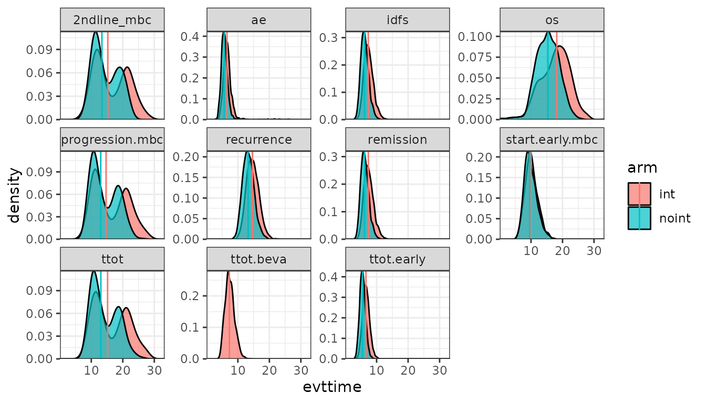
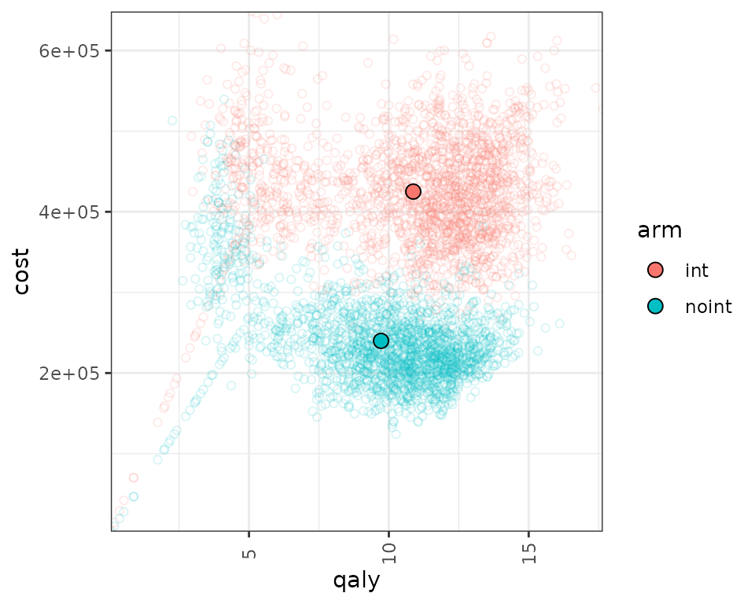

# Example in Early Breast Cancer

## Introduction

This document runs a discrete event simulation model in the context of
early breast cancer to show how the functions can be used to generate a
model in only a few steps.

When running a DES, it’s important to consider speed. Simulation based
models can be computationally expensive, which means that using
efficient coding can have a substantial impact on performance.

### Main options

``` r
library(WARDEN)

library(purrr)
library(dplyr)
#> 
#> Attaching package: 'dplyr'
#> The following objects are masked from 'package:stats':
#> 
#>     filter, lag
#> The following objects are masked from 'package:base':
#> 
#>     intersect, setdiff, setequal, union
library(ggplot2)
library(kableExtra)
#> 
#> Attaching package: 'kableExtra'
#> The following object is masked from 'package:dplyr':
#> 
#>     group_rows
```

### Model Concept

Patients start in early breast cancer, and draw times to event. Patients
also draw a probability of going into metastatic breast cancer or going
into remission. If they go into remission, they can have a metastatic
recurrence. At any point in time they can die, depending on the risk of
each disease stage.

### Load Data

The dummy data for costs and utility is generated below.

``` r
#Utilities
df_util <- data.frame( name = c("util.idfs.ontx" ,"util.idfs.offtx" ,"util.remission" ,"util.recurrence" ,"util.mbc.progression.mbc" ,"util.mbc.pps"),
                         value = c(0.75, 0.8,0.9,0.7,0.6,0.5),
                         se=rep(0.02,6),
                         stringsAsFactors = FALSE
)


#Costs
df_cost <- data.frame( name = c("cost.idfs.tx" ,"cost.recurrence" ,"cost.mbc.tx" ,"cost.tx.beva" ,"cost.idfs.txnoint",
                                  "cost.idfs","cost.mbc.progression.mbc","cost.mbc.pps","cost.2ndline","cost.ae"),
                         value = c(40000,5000,3000,10000,30000,
                                   10000,20000,30000,20000,1000),
                         stringsAsFactors = FALSE
) %>%
  mutate(se= value/5)
```

## General inputs with delayed execution

Initial inputs and flags that will be used in the model can be defined
below. We can define inputs that are common to all patients
(`common_all_inputs`) within a simulation, inputs that are unique to a
patient independently of the treatment (e.g. natural death, defined in
`common_pt_inputs`), and inputs that are unique to that patient and that
treatment (`unique_pt_inputs`). Items can be included through the
[`add_item()`](https://jsanchezalv.github.io/WARDEN/reference/add_item.md)
function, and can be used in subsequent items (e.g. below, we define
`sex_pt` and we use it in `nat.os.s` to get the background mortality for
that patient). All these inputs are generated before the events and the
reaction to events are executed. Furthermore, the program first executes
`common_all_inputs`, then `common_pt_inputs` and then
`unique_pt_inputs`. So one could use the items generated in
`common_all_inputs` in `unique_pt_inputs`.

The flag `fl.remission` is drawn using a Bernoulli distribution with
probability 0.8. This means that 80% of the patients will have a
remission, while 20% will go into early metastatic BC. Note that this
could also be modeled differently by using a time to remission and time
to early metastatic BC, comparing these and choosing the pathway
depending on which one is smaller.

We also define here the specific utilities and costs that will be used
in the model. It is strongly recommended to assign unnamed objects if
they are going to be processed in the model. In this case, this is not
affected. However, keeping the name when extracting a value
e.g. `util.remission` (e.g. using one bracket instead of two in
`util_v[["util.remission"]]`) may cause the outputs from the model to
change names, depending on use. This is because of how R works: it would
correspond to a named list with a named vector/element, which R
concatenates, so in this case it could end up generating
`qaly.util.remission` as an output of the model instead of just `qaly`).
However this is unlikely to occur most of the times, and if the inputs
are intermediary (i.e., not utilities/costs that appear in
`ongoing_inputs` and such), it would cause no trouble.

``` r
#Each patient is identified through "i"
#Items used in the model should be unnamed numeric/vectors! otherwise if they are processed by model it can lead to strangely named outcomes
#In this case, util_v is a named vector, but it's not processed by the model. We extract unnamed numerics from it.

#Put objects here that do not change on any patient or intervention loop
common_all_inputs <- add_item(input={ 
  #utilities
        pick_val_v(
            base =  df_util$value,
            psa = MASS::mvrnorm(1,df_util$value,diag(df_util$se^2)),
            sens = df_util$value,
            psa_ind = psa_bool,
            sens_ind = sensitivity_bool,
            indicator = rep(0, nrow(df_util)),
            names_out =df_util$name,
            deploy_env=TRUE
        )
  #costs
        pick_val_v(
            base =  df_cost$value,
            psa = rgamma_mse(1,df_cost$value,df_cost$se),
            sens = df_cost$value,
            psa_ind = psa_bool,
            sens_ind = sensitivity_bool,
            indicator = rep(0, nrow(df_cost)),
            names_out =df_cost$name,
            deploy_env=TRUE
        )
        })
#Put objects here that do not change as we loop through interventions for a patient
common_pt_inputs <- add_item(input={ 
    sex_pt <- ifelse(rbinom(1,1,p=0.01),"male","female")
    nat.os.s <- rcond_gompertz(1,
                               shape=if(sex_pt=="male"){0.102}else{0.115},
                               rate=if(sex_pt=="male"){0.000016}else{0.0000041},
                               lower_bound = 50)   #in years, for a patient who is 50yo
    fl.remission <- rbinom(1,1,0.8) #80% probability of going into remission
    })

#Put objects here that change as we loop through treatments for each patient (e.g. events can affect fl.tx, but events do not affect nat.os.s)
#common across arm but changes per pt could be implemented here (if (arm==)... )
unique_pt_inputs <- add_item(input={
    fl.idfs.ontx              <- 1
    fl.idfs                   <- 1
    fl.mbcs.ontx              <- 1
    fl.mbcs.progression.mbc   <- 1
    fl.tx.beva                <- 1  
    fl.mbcs                   <- 0
    fl.mbcs_2ndline           <- 0
    fl.recurrence             <- 0
    q_default <- if (fl.idfs==1) {
        util.idfs.ontx * fl.idfs.ontx + (1-fl.idfs.ontx) * (1-fl.idfs.ontx) 
    } else if (fl.idfs==0 & fl.mbcs==0) {
        util.remission * fl.remission + fl.recurrence*util.recurrence
    } else if (fl.mbcs==1) {
        util.mbc.progression.mbc * fl.mbcs.progression.mbc + (1-fl.mbcs.progression.mbc)*util.mbc.pps
    }
    c_default <- if(arm=="noint"){cost.idfs.txnoint* fl.idfs.ontx  + cost.idfs}else{(cost.idfs.tx) * fl.idfs.ontx + cost.tx.beva * fl.tx.beva + cost.idfs}
    c_ae <- 0
    rnd_stream_ae  <- random_stream(100)
    rnd_stream_mbc <- random_stream(100)
})
```

## Events

### Add Initial Events

Events are added below through the
[`add_tte()`](https://jsanchezalv.github.io/WARDEN/reference/add_tte.md)
function. We use this function twice, one per intervention. We must
define several arguments: one to indicate the intervention, one to
define the names of the events used, one to define the names of other
objects created that we would like to store (optional, maybe we generate
an intermediate input which is not an event but that we want to save)
and the actual input in which we generate the time to event. Events and
other objects will be automatically initialized to `Inf`. We draw the
times to event for the patients. This chunk is a bit more complex, so
it’s worth spending a bit of time explaining it.

The `init_event_list` object is populated by using the
[`add_tte()`](https://jsanchezalv.github.io/WARDEN/reference/add_tte.md)
function twice, one for the “int” strategy and other for the “noint”
strategy. We first declare the `start` time to be `0`.

We then proceed to generate the actual time to event. We use the
[`draw_tte()`](https://jsanchezalv.github.io/WARDEN/reference/draw_tte.md)
function to generate the time to event using a log-normal distribution
for the event variables that are of interest. One should always be aware
of how the competing risks interact with each other. While we have
abstracted from these type of corrections here, it is recommended to
have an understanding about how these affect the results and have a look
at the competing risks/semi-competing risks literature.

Note that in our model, the initial list of events are
`start, ttot, ttot.beva, progression.mbc, os, idfs, ttot.early, remission, recurrence and start.early.mbc`.
However, other, non-initial events can be defined in the reactions part
seen in the section below.

``` r
init_event_list <- 
  add_tte(arm="int",
               evts = c("start","ttot", "ttot.beva","progression.mbc", "os","idfs","ttot.early","remission","recurrence","start.early.mbc","ae","2ndline_mbc"),
               other_inp = c("os.early","os.mbc"),
               input={ #intervention
    start <- 0
    
    #Early
    
    idfs <- draw_tte(1,'lnorm',coef1=2, coef2=log(0.2)) 
    ttot.early <- min(draw_tte(1,'lnorm',coef1=2, coef2=log(0.2)),idfs)
    ttot.beva <- draw_tte(1,'lnorm',coef1=2, coef2=log(0.2))
    
    os.early <- draw_tte(1,'lnorm',coef1=3, coef2=log(0.2)) 
    
    #if patient has remission, check when will recurrence happen
    if (fl.remission) { 
      recurrence <- idfs +draw_tte(1,'lnorm',coef1=2, coef2=log(0.2))
      remission <- idfs
      
      #if recurrence happens before death
      if (min(os.early,nat.os.s)>recurrence) { 
        
        #Late metastatic (after finishing idfs and recurrence)
        
        os.mbc <- draw_tte(1,'lnorm',coef1=0.8, coef2=log(0.2)) + idfs  +  recurrence 
        
        progression.mbc <- draw_tte(1,'lnorm',coef1=0.5, coef2=log(0.2)) + idfs +  recurrence 
        
        ttot <- draw_tte(1,'lnorm',coef1=0.5, coef2=log(0.2)) + idfs +  recurrence
        
        
      }
      
    } else{ #If early metastatic
      start.early.mbc <- draw_tte(1,'lnorm',coef1=2.3, coef2=log(0.2))
      
      idfs <- ifelse(start.early.mbc<idfs,start.early.mbc,idfs)
      ttot.early <- min(ifelse(start.early.mbc<idfs,start.early.mbc,idfs),ttot.early)
      
      os.mbc <- draw_tte(1,'lnorm',coef1=0.8, coef2=log(0.2)) + start.early.mbc
      
      progression.mbc <- draw_tte(1,'lnorm',coef1=0.5, coef2=log(0.2)) + start.early.mbc
      
      ttot <- draw_tte(1,'lnorm',coef1=0.5, coef2=log(0.2)) + start.early.mbc
      
    }
    
    os <- min(os.mbc,os.early,nat.os.s)
    

  }) %>%  add_tte(arm="noint",
                       evts = c("start","ttot", "ttot.beva","progression.mbc", "os","idfs","ttot.early","remission","recurrence","start.early.mbc"),
                       other_inp = c("os.early","os.mbc"),                       
                       input={  #reference strategy
    start <- 0

    #Early
    
    idfs <- draw_tte(1,'lnorm',coef1=2, coef2=log(0.2),beta_tx = 1.2) 
    ttot.early <- min(draw_tte(1,'lnorm',coef1=2, coef2=log(0.2),beta_tx = 1.2),idfs)
    
    os.early <- draw_tte(1,'lnorm',coef1=3, coef2=log(0.2),beta_tx = 1.2) 
    
    #if patient has remission, check when will recurrence happen
    if (fl.remission) { 
      recurrence <- idfs +draw_tte(1,'lnorm',coef1=2, coef2=log(0.2))
      remission <- idfs
      
      #if recurrence happens before death
      if (min(os.early,nat.os.s)>recurrence) { 
        
        #Late metastatic (after finishing idfs and recurrence)
        
        os.mbc <- draw_tte(1,'lnorm',coef1=0.8, coef2=log(0.2)) + idfs  +  recurrence 
        
        progression.mbc <- draw_tte(1,'lnorm',coef1=0.5, coef2=log(0.2)) + idfs +  recurrence 
        
        ttot <- draw_tte(1,'lnorm',coef1=0.5, coef2=log(0.2)) + idfs +  recurrence
        
      }
      
    } else{ #If early metastatic
      start.early.mbc <- draw_tte(1,'lnorm',coef1=2.3, coef2=log(0.2))
      
      idfs <- ifelse(start.early.mbc<idfs,start.early.mbc,idfs)
      ttot.early <- min(ifelse(start.early.mbc<idfs,start.early.mbc,idfs),ttot.early)
      
      os.mbc <- draw_tte(1,'lnorm',coef1=0.8, coef2=log(0.2)) + start.early.mbc
      
      progression.mbc <- draw_tte(1,'lnorm',coef1=0.5, coef2=log(0.2)) + start.early.mbc
      
      ttot <- draw_tte(1,'lnorm',coef1=0.5, coef2=log(0.2)) + start.early.mbc
      
      
    }    
    os <- min(os.mbc,os.early,nat.os.s)
    
  })
```

### Add Reaction to Those Events

Once the initial times of the events have been defined, we also need to
declare how events react and affect each other. To do so, we use the
`evt_react_list` object and the
[`add_reactevt()`](https://jsanchezalv.github.io/WARDEN/reference/add_reactevt.md)
function. This function just needs to state which event is affected, and
the actual reaction (usually setting flags to 1 or 0, or creating
new/adjusting events).

There are a series of objects that can be used in this context to help
with the reactions. Apart from the global objects and flags defined
above, we can also use `curtime` for the current event time, `prevtime`
for the time of the previous event, `cur_evtlist` is the C++ external
pointer which can be interacted with using the event functions that is
yet to happen for that patient, `arm` for the current treatment in the
loop, `evt` for the current event being processed, `i` expresses the
patient iteration, and `simulation` the specific simulation (relevant
when the number of simulations is greater than 1). Furthermore, one can
also call any other input/item that has been created before or create
new ones. For example, we could even modify a cost/utility item by
changing it directly, e.g. through `cost.idfs.tx <- 500)`.

| Item          | What does it do                                                       |
|---------------|-----------------------------------------------------------------------|
| `curtime`     | Current event time (numeric)                                          |
| `prevtime`    | Time of the previous event (numeric)                                  |
| `cur_evtlist` | External pointer of C++ events that is yet to happen for that patient |
| `evt`         | Current event being processed (character)                             |
| `i`           | Patient being iterated (numeric)                                      |
| `arm`         | Intervention being iterated (character)                               |
| `simulation`  | Simulation being iterated (numeric)                                   |
| `sens`        | Sensitivity analysis being iterated (numeric)                         |

The functions to add/modify events and inputs use named vectors or
lists. Whenever several inputs/events are added or modified, it’s
recommended to group them within one function, as it reduces the
computation cost. So rather than use two
[`modify_event()`](https://jsanchezalv.github.io/WARDEN/reference/modify_event.md)
with a list of one element, it’s better to group them into a single
[`modify_event()`](https://jsanchezalv.github.io/WARDEN/reference/modify_event.md)
with a list of two elements.

The list of relevant functions to be used within `add_reactevt` are:
[`new_event()`](https://jsanchezalv.github.io/WARDEN/reference/new_event.md)allows
to generate events and add them to the vector of events. It accepts more
than one event but a single event per event type.
[`modify_event()`](https://jsanchezalv.github.io/WARDEN/reference/modify_event.md)
allows to modify events (e.g. delay death). When adding an event, the
name of the events and the time of the events must be defined. When
using `modify_event`, one must indicate which events are affected and
what are the new times of the events. If the event specified does not
exist or has already occurred, it will return an error. `modify_event`
with `create_if_null = TRUE` argument will also generate events if they
don’t exist.
[`remove_event()`](https://jsanchezalv.github.io/WARDEN/reference/remove_event.md)
will remove an event from the event queue (could also be modified
instead and set to `Inf`).
[`get_event()`](https://jsanchezalv.github.io/WARDEN/reference/get_event.md)
will return the TTE of the specified event name.
[`has_event()`](https://jsanchezalv.github.io/WARDEN/reference/has_event.md)
will return a TRUE/FALSE flag depending on whether the given patient has
a specific event in the queue (will return TRUE even if time is `Inf`).
[`next_event()`](https://jsanchezalv.github.io/WARDEN/reference/next_event.md)
will return a list with the next event in the queue, with time, patient,
and event name (`patient_id`, `event_name()`, and `time`).
`next_event_pt` will return a list with the next event in the queue for
a specific patient, with time, patient, and event name (`patient_id`,
`event_name`, and `time`).
[`queue_empty()`](https://jsanchezalv.github.io/WARDEN/reference/queue_empty.md)
will return TRUE if the queue of events is empty (no more events to
process, but `Inf` events are considered part of the queue)
[`queue_size()`](https://jsanchezalv.github.io/WARDEN/reference/queue_size.md)
allows to check the size of the queue of events, including `Inf` events.

Note that one could potentially omit part of the modeling set in
`init_event_list` and actually define new events dynamically through the
reactions (we do that below for the `"ae"` event). However, this can
have an impact in computation time, so if possible it’s always better to
use `init_event_list`.

The model will run until `curtime` is set to `Inf`, so the event that
terminates the model (in this case, `os`), should modify `curtime` and
set it to `Inf`.

Finally, note that there could be two different ways of accumulating
continuous outcomes, backwards (see SSD example to see how the
implementation would change) and forwards (as in the example below).
This option can be modified in the
[`run_sim()`](https://jsanchezalv.github.io/WARDEN/reference/run_sim.md)
function using the `accum_backwards` argument, which assumes forwards by
default.

``` r

evt_react_list <-
  add_reactevt(name_evt = "start",
               input = { }) %>%
  add_reactevt(name_evt = "ttot",
               input = {
                 q_default <- if (fl.idfs==1) {
                                util.idfs.ontx * fl.idfs.ontx + (1-fl.idfs.ontx) * (1-fl.idfs.ontx) 
                              } else if (fl.idfs==0 & fl.mbcs==0) {
                                util.remission * fl.remission + fl.recurrence*util.recurrence
                              } else if (fl.mbcs==1) {
                                util.mbc.progression.mbc * fl.mbcs.progression.mbc + (1-fl.mbcs.progression.mbc)*util.mbc.pps
                              }
                 c_default <- cost.mbc.tx  * fl.mbcs.ontx + cost.mbc.progression.mbc * fl.mbcs.progression.mbc + cost.mbc.pps * (1-fl.mbcs.progression.mbc) + cost.2ndline*fl.mbcs_2ndline
                 fl.mbcs.ontx <-  0 #Flag that patient is now off-treatment
                 
               }) %>%
  add_reactevt(name_evt = "ttot.beva",
               input = {
                 q_default <- if (fl.idfs==1) {
                                util.idfs.ontx * fl.idfs.ontx + (1-fl.idfs.ontx) * (1-fl.idfs.ontx) 
                              } else if (fl.idfs==0 & fl.mbcs==0) {
                                util.remission * fl.remission + fl.recurrence*util.recurrence
                              } else if (fl.mbcs==1) {
                                util.mbc.progression.mbc * fl.mbcs.progression.mbc + (1-fl.mbcs.progression.mbc)*util.mbc.pps
                              }
                 c_default <- cost.mbc.tx  * fl.mbcs.ontx + cost.mbc.progression.mbc * fl.mbcs.progression.mbc + cost.mbc.pps * (1-fl.mbcs.progression.mbc) + cost.2ndline*fl.mbcs_2ndline
                fl.tx.beva <- 0 #Flag that patient is now off-treatment
                 
               }) %>%
  add_reactevt(name_evt = "progression.mbc",
               input = {
                 q_default <- if (fl.idfs==1) {
                                util.idfs.ontx * fl.idfs.ontx + (1-fl.idfs.ontx) * (1-fl.idfs.ontx) 
                              } else if (fl.idfs==0 & fl.mbcs==0) {
                                util.remission * fl.remission + fl.recurrence*util.recurrence
                              } else if (fl.mbcs==1) {
                                util.mbc.progression.mbc * fl.mbcs.progression.mbc + (1-fl.mbcs.progression.mbc)*util.mbc.pps
                              }
                 c_default <- cost.mbc.tx  * fl.mbcs.ontx + cost.mbc.progression.mbc * fl.mbcs.progression.mbc + cost.mbc.pps * (1-fl.mbcs.progression.mbc) + cost.2ndline*fl.mbcs_2ndline
                 fl.mbcs.progression.mbc <- 0
                 fl.mbcs_2ndline <- 1 #Flag that patient is progressed and going in 2nd line
                 
                 new_event(c("2ndline_mbc" = curtime + qexp(rnd_stream_mbc$draw_n(), 0.08)/12))
                 
               }) %>%
  add_reactevt(name_evt = "idfs",
               input = {
                 q_default = if (fl.idfs==1) {
                                util.idfs.ontx * fl.idfs.ontx + (1-fl.idfs.ontx) * (1-fl.idfs.ontx) 
                              } else if (fl.idfs==0 & fl.mbcs==0) {
                                util.remission * fl.remission + fl.recurrence*util.recurrence
                              } else if (fl.mbcs==1) {
                                util.mbc.progression.mbc * fl.mbcs.progression.mbc + (1-fl.mbcs.progression.mbc)*util.mbc.pps
                              }
                 c_default <- if(arm=="noint"){cost.idfs.txnoint* fl.idfs.ontx  + cost.idfs}else{(cost.idfs.tx) * fl.idfs.ontx + cost.tx.beva * fl.tx.beva + cost.idfs}
                 fl.idfs <- 0
                 
               }) %>%
  add_reactevt(name_evt = "ttot.early",
               input = {
                 q_default <- if (fl.idfs==1) {
                                util.idfs.ontx * fl.idfs.ontx + (1-fl.idfs.ontx) * (1-fl.idfs.ontx) 
                              } else if (fl.idfs==0 & fl.mbcs==0) {
                                util.remission * fl.remission + fl.recurrence*util.recurrence
                              } else if (fl.mbcs==1) {
                                util.mbc.progression.mbc * fl.mbcs.progression.mbc + (1-fl.mbcs.progression.mbc)*util.mbc.pps
                              }
                 c_default <- if(arm=="noint"){cost.idfs.txnoint* fl.idfs.ontx  + cost.idfs}else{(cost.idfs.tx) * fl.idfs.ontx + cost.tx.beva * fl.tx.beva + cost.idfs}
                 fl.idfs.ontx <- 0
                 fl.tx.beva <- 0 #Flag that patient is now off-treatment
                 
                 n_ae <- qpois(rnd_stream_ae$draw_n(),lambda=0.25*(curtime -prevtime)) #1 AE every 4 years
                 
                 if (n_ae>0) {
                     new_event(c("ae" = curtime + 0.0001))
                     n_ae <- n_ae - 1
                 }
               }) %>%
  add_reactevt(name_evt = "remission",
               input = {
                 q_default <- if (fl.idfs==1) {
                                util.idfs.ontx * fl.idfs.ontx + (1-fl.idfs.ontx) * (1-fl.idfs.ontx) 
                              } else if (fl.idfs==0 & fl.mbcs==0) {
                                util.remission * fl.remission + fl.recurrence*util.recurrence
                              } else if (fl.mbcs==1) {
                                util.mbc.progression.mbc * fl.mbcs.progression.mbc + (1-fl.mbcs.progression.mbc)*util.mbc.pps
                              }
                 c_default <- cost.recurrence * fl.recurrence
                 fl.remission <- 1
                 
               }) %>%
  add_reactevt(name_evt = "recurrence",
               input = {
                 q_default <- if (fl.idfs==1) {
                                util.idfs.ontx * fl.idfs.ontx + (1-fl.idfs.ontx) * (1-fl.idfs.ontx) 
                              } else if (fl.idfs==0 & fl.mbcs==0) {
                                util.remission * fl.remission + fl.recurrence*util.recurrence
                              } else if (fl.mbcs==1) {
                                util.mbc.progression.mbc * fl.mbcs.progression.mbc + (1-fl.mbcs.progression.mbc)*util.mbc.pps
                              }
                 c_default <- cost.recurrence * fl.recurrence
                 fl.recurrence <- 1
                 fl.remission <- 0
                 fl.mbcs <- 1
                 fl.mbcs.progression.mbc <- 1 #ad-hoc for plot
                 
               }) %>%
  add_reactevt(name_evt = "start.early.mbc",
               input = {
                 q_default <- if (fl.idfs==1) {
                                util.idfs.ontx * fl.idfs.ontx + (1-fl.idfs.ontx) * (1-fl.idfs.ontx) 
                              } else if (fl.idfs==0 & fl.mbcs==0) {
                                util.remission * fl.remission + fl.recurrence*util.recurrence
                              } else if (fl.mbcs==1) {
                                util.mbc.progression.mbc * fl.mbcs.progression.mbc + (1-fl.mbcs.progression.mbc)*util.mbc.pps
                              }
                 c_default <- cost.recurrence * fl.recurrence
                 fl.mbcs <- 1
                 fl.mbcs.progression.mbc <- 1
                 
               }) %>%
  add_reactevt(name_evt = "2ndline_mbc",
               input = {
                 q_default <- if (fl.idfs==1) {
                                util.idfs.ontx * fl.idfs.ontx + (1-fl.idfs.ontx) * (1-fl.idfs.ontx) 
                              } else if (fl.idfs==0 & fl.mbcs==0) {
                                util.remission * fl.remission + fl.recurrence*util.recurrence
                              } else if (fl.mbcs==1) {
                                util.mbc.progression.mbc * fl.mbcs.progression.mbc + (1-fl.mbcs.progression.mbc)*util.mbc.pps
                              }
                 c_default <- cost.mbc.tx  * fl.mbcs.ontx + cost.mbc.progression.mbc * fl.mbcs.progression.mbc + cost.mbc.pps * (1-fl.mbcs.progression.mbc) + cost.2ndline*fl.mbcs_2ndline
                 fl.mbcs_2ndline <- 0
                 
                 n_ae <- qpois(rnd_stream_ae$draw_n(),lambda=0.25*(curtime -prevtime)) #1 AE every 4 years

                 if (n_ae>0) {
                     new_event(c("ae" = curtime + 0.0001))
                     n_ae <- n_ae - 1
                 }
               }) %>%
  add_reactevt(name_evt = "ae",
               input = {
                 if (n_ae>0) {
                     new_event(c("ae" = curtime))
                     n_ae <- n_ae - 1
                 }
                 
                 q_default = if (fl.idfs==1) {
                                util.idfs.ontx * fl.idfs.ontx + (1-fl.idfs.ontx) * (1-fl.idfs.ontx) 
                              } else if (fl.idfs==0 & fl.mbcs==0) {
                                util.remission * fl.remission + fl.recurrence*util.recurrence
                              } else if (fl.mbcs==1) {
                                util.mbc.progression.mbc * fl.mbcs.progression.mbc + (1-fl.mbcs.progression.mbc)*util.mbc.pps
                              }
                 c_default <- cost.mbc.tx  * fl.mbcs.ontx + cost.mbc.progression.mbc * fl.mbcs.progression.mbc + cost.mbc.pps * (1-fl.mbcs.progression.mbc) + cost.2ndline*fl.mbcs_2ndline
                 c_ae <- cost.ae
                 
                 modify_event(c("os" =max(get_event("os") - 0.125,curtime +0.0001) ))#each AE brings forward death by 1.5 months
               }) %>%
  add_reactevt(name_evt = "os",
               input = {
                 q_default <- if (fl.idfs==1) {
                                util.idfs.ontx * fl.idfs.ontx + (1-fl.idfs.ontx) * (1-fl.idfs.ontx) 
                              } else if (fl.idfs==0 & fl.mbcs==0) {
                                util.remission * fl.remission + fl.recurrence*util.recurrence
                              } else if (fl.mbcs==1) {
                                util.mbc.progression.mbc * fl.mbcs.progression.mbc + (1-fl.mbcs.progression.mbc)*util.mbc.pps
                              }
                 c_default <- cost.mbc.tx  * fl.mbcs.ontx + cost.mbc.progression.mbc * fl.mbcs.progression.mbc + cost.mbc.pps * (1-fl.mbcs.progression.mbc) + cost.2ndline*fl.mbcs_2ndline
                 fl.tx.beva <- 0
                 fl.mbcs.ontx <- 0
                 fl.idfs <- 0
                 fl.mbcs <- 0
                 curtime <- Inf
               }) 
```

## Costs and Utilities

Costs and utilities are introduced below. However, it’s worth noting
that the model is able to run without costs or utilities.

Utilities/Costs/Other outputs are defined by declaring which object
belongs to utilities/costs/other outputs, and whether they need to be
discounted continuously or discretely (instantaneous). These will be
passed to the
[`run_sim()`](https://jsanchezalv.github.io/WARDEN/reference/run_sim.md)
function. \## Utilities

``` r

util_ongoing <- "q_default"
```

### Costs

``` r


cost_ongoing <- "c_default"

cost_instant <-  "c_ae"
```

## Model

### Model Execution

The model can be run using the function
[`run_sim()`](https://jsanchezalv.github.io/WARDEN/reference/run_sim.md)
below. We must define the number of patients to be simulated, the number
of simulations, whether we want to run a PSA or not, the strategy list,
the inputs, events and reactions defined above, utilities, costs and
also if we want any extra output and the level of ipd data desired to be
exported.

It is worth noting that the `psa_bool` argument does not run a PSA
automatically, but is rather an additional input/flag of the model that
we use as a reference to determine whether we want to use a
deterministic or stochastic input. As such, it could also be defined in
`common_all_inputs` as the first item to be defined, and the result
would be the same. However, we recommend it to be defined in
[`run_sim()`](https://jsanchezalv.github.io/WARDEN/reference/run_sim.md).

Note that the distribution chosen, the number of events and the
interaction between events can have a substantial impact on the running
time of the model.

``` r
#Logic is: per patient, per intervention, per event, react to that event.
results <- run_sim(  
  npats=2000,                              # number of patients to be simulated
  n_sim=1,                                  # number of simulations to run
  psa_bool = FALSE,                         # use PSA or not. If n_sim > 1 and psa_bool = FALSE, then difference in outcomes is due to sampling (number of pats simulated)  
  arm_list = c("int", "noint"),             # intervention list
  common_all_inputs = common_all_inputs,    # inputs common that do not change within a simulation
  common_pt_inputs = common_pt_inputs,      # inputs that change within a simulation but are not affected by the intervention
  unique_pt_inputs = unique_pt_inputs,      # inputs that change within a simulation between interventions
  init_event_list = init_event_list,        # initial event list
  evt_react_list = evt_react_list,          # reaction of events
  util_ongoing_list = util_ongoing,
  cost_ongoing_list = cost_ongoing,
  cost_instant_list = cost_instant,
  input_out = c(                            # list of additional outputs (Flags, etc) that the user wants to export for each patient and event
                "os.early",
                "os.mbc",
                "nat.os.s",
                "sex_pt"
                )
          )
#> Analysis number: 1
#> Simulation number: 1
#> Time to run simulation 1: 3.34s
#> Time to run analysis 1: 3.34s
#> Total time to run: 3.34s
#> Simulation finalized;
```

## Post-processing of Model Outputs

### Summary of Results

Once the model has been run, we can use the results and summarize them
using the `summary_results_det` to print the results of the last
simulation (if nsim=1, it’s the deterministic case), and
`summary_results_sim` to show the PSA results (with the confidence
intervals). We can also use the individual patient data generated by the
simulation, which we collect here to plot in the `psa_ipd` object.

``` r


summary_results_det(results[[1]][[1]]) 
#>                         int      noint
#> costs             425039.19  239900.74
#> dcosts                 0.00  185138.44
#> lys                   13.60      12.18
#> dlys                   0.00       1.42
#> qalys                 10.87       9.72
#> dqalys                 0.00       1.15
#> ICER                     NA  130507.30
#> ICUR                     NA  160592.84
#> INMB                     NA -127496.26
#> costs_undisc      486746.96  267302.14
#> dcosts_undisc          0.00  219444.82
#> lys_undisc            17.71      15.30
#> dlys_undisc            0.00       2.41
#> qalys_undisc          14.31      12.31
#> dqalys_undisc          0.00       2.01
#> ICER_undisc              NA   90922.02
#> ICUR_undisc              NA  109343.68
#> INMB_undisc              NA -119098.45
#> c_ae                 466.29     567.66
#> dc_ae                  0.00    -101.37
#> c_ae_undisc          569.00     673.50
#> dc_ae_undisc           0.00    -104.50
#> c_default         424572.90  239333.08
#> dc_default             0.00  185239.82
#> c_default_undisc  486177.96  266628.64
#> dc_default_undisc      0.00  219549.32
#> nat.os.s              34.45      34.45
#> dnat.os.s              0.00       0.00
#> os.early              20.40      16.95
#> dos.early              0.00       3.45
#> os.mbc                21.73      19.41
#> dos.mbc                0.00       2.33
#> q_default             10.87       9.72
#> dq_default             0.00       1.15
#> q_default_undisc      14.31      12.31
#> dq_default_undisc      0.00       2.01

summary_results_sim(results[[1]])
#>                                                int
#> costs                   425,039 (425,039; 425,039)
#> dcosts                                    0 (0; 0)
#> lys                              13.6 (13.6; 13.6)
#> dlys                                      0 (0; 0)
#> qalys                         10.87 (10.87; 10.87)
#> dqalys                                    0 (0; 0)
#> ICER                                  NaN (NA; NA)
#> ICUR                                  NaN (NA; NA)
#> INMB                                  NaN (NA; NA)
#> costs_undisc            486,747 (486,747; 486,747)
#> dcosts_undisc                             0 (0; 0)
#> lys_undisc                    17.71 (17.71; 17.71)
#> dlys_undisc                               0 (0; 0)
#> qalys_undisc                  14.31 (14.31; 14.31)
#> dqalys_undisc                             0 (0; 0)
#> ICER_undisc                           NaN (NA; NA)
#> ICUR_undisc                           NaN (NA; NA)
#> INMB_undisc                           NaN (NA; NA)
#> c_ae                       466.29 (466.29; 466.29)
#> dc_ae                                     0 (0; 0)
#> c_ae_undisc                         569 (569; 569)
#> dc_ae_undisc                              0 (0; 0)
#> c_default         424,572.9 (424,572.9; 424,572.9)
#> dc_default                                0 (0; 0)
#> c_default_undisc        486,178 (486,178; 486,178)
#> dc_default_undisc                         0 (0; 0)
#> nat.os.s                      34.45 (34.45; 34.45)
#> dnat.os.s                                 0 (0; 0)
#> os.early                         20.4 (20.4; 20.4)
#> dos.early                                 0 (0; 0)
#> os.mbc                        21.73 (21.73; 21.73)
#> dos.mbc                                   0 (0; 0)
#> q_default                     10.87 (10.87; 10.87)
#> dq_default                                0 (0; 0)
#> q_default_undisc              14.31 (14.31; 14.31)
#> dq_default_undisc                         0 (0; 0)
#>                                              noint
#> costs                   239,901 (239,901; 239,901)
#> dcosts                  185,138 (185,138; 185,138)
#> lys                           12.18 (12.18; 12.18)
#> dlys                          1.419 (1.419; 1.419)
#> qalys                            9.72 (9.72; 9.72)
#> dqalys                        1.153 (1.153; 1.153)
#> ICER                    130,507 (130,507; 130,507)
#> ICUR                    160,593 (160,593; 160,593)
#> INMB                 -127,496 (-127,496; -127,496)
#> costs_undisc            267,302 (267,302; 267,302)
#> dcosts_undisc           219,445 (219,445; 219,445)
#> lys_undisc                       15.3 (15.3; 15.3)
#> dlys_undisc                   2.414 (2.414; 2.414)
#> qalys_undisc                  12.31 (12.31; 12.31)
#> dqalys_undisc                 2.007 (2.007; 2.007)
#> ICER_undisc                90,922 (90,922; 90,922)
#> ICUR_undisc             109,344 (109,344; 109,344)
#> INMB_undisc          -119,098 (-119,098; -119,098)
#> c_ae                       567.66 (567.66; 567.66)
#> dc_ae                -101.371 (-101.371; -101.371)
#> c_ae_undisc                   673.5 (673.5; 673.5)
#> dc_ae_undisc               -104.5 (-104.5; -104.5)
#> c_default         239,333.1 (239,333.1; 239,333.1)
#> dc_default        185,239.8 (185,239.8; 185,239.8)
#> c_default_undisc  266,628.6 (266,628.6; 266,628.6)
#> dc_default_undisc 219,549.3 (219,549.3; 219,549.3)
#> nat.os.s                      34.45 (34.45; 34.45)
#> dnat.os.s                                 0 (0; 0)
#> os.early                      16.95 (16.95; 16.95)
#> dos.early                     3.453 (3.453; 3.453)
#> os.mbc                        19.41 (19.41; 19.41)
#> dos.mbc                       2.325 (2.325; 2.325)
#> q_default                        9.72 (9.72; 9.72)
#> dq_default                    1.153 (1.153; 1.153)
#> q_default_undisc              12.31 (12.31; 12.31)
#> dq_default_undisc             2.007 (2.007; 2.007)

psa_ipd <- bind_rows(map(results[[1]], "merged_df")) 

psa_ipd[1:10,] %>%
  kable() %>%
  kable_styling(bootstrap_options = c("striped", "hover", "condensed", "responsive"))
```

| evtname    |   evttime |  prevtime | pat_id | arm | total_lys | total_qalys | total_costs | total_costs_undisc | total_qalys_undisc | total_lys_undisc |       lys |     qalys |        costs | lys_undisc | qalys_undisc | costs_undisc | os.early |   os.mbc | nat.os.s | sex_pt |    c_default |     c_ae | q_default | c_default_undisc | q_default_undisc | c_ae_undisc |  nexttime | simulation | sensitivity |
|:-----------|----------:|----------:|-------:|:----|----------:|------------:|------------:|-------------------:|-------------------:|-----------------:|----------:|----------:|-------------:|-----------:|-------------:|-------------:|---------:|---------:|---------:|:-------|-------------:|---------:|----------:|-----------------:|-----------------:|------------:|----------:|-----------:|------------:|
| start      |  0.000000 |  0.000000 |      1 | int |  14.14495 |    12.15104 |    403257.6 |           474554.5 |           15.87365 |         18.31841 | 4.4250507 | 3.3187880 | 2.655030e+05 |  4.7424489 |    3.5568366 |    284546.93 | 18.44341 | 23.56778 | 41.31053 | female | 2.655030e+05 |   0.0000 | 3.3187880 |        284546.93 |        3.5568366 |           0 |  4.742449 |          1 |           1 |
| ttot.early |  4.742449 |  0.000000 |      1 | int |  14.14495 |    12.15104 |    403257.6 |           474554.5 |           15.87365 |         18.31841 | 0.0000869 | 0.0000652 | 5.215197e+00 |  0.0001000 |    0.0000750 |         6.00 | 18.44341 | 23.56778 | 41.31053 | female | 5.215197e+00 |   0.0000 | 0.0000652 |             6.00 |        0.0000750 |           0 |  4.742549 |          1 |           1 |
| ae         |  4.742549 |  4.742449 |      1 | int |  14.14495 |    12.15104 |    403257.6 |           474554.5 |           15.87365 |         18.31841 | 0.8435090 | 0.8435090 | 2.026991e+04 |  0.9846357 |    0.9846357 |     23646.62 | 18.44341 | 23.56778 | 41.31053 | female | 1.940071e+04 | 869.1982 | 0.8435090 |         22646.62 |        0.9846357 |        1000 |  5.727184 |          1 |           1 |
| idfs       |  5.727184 |  4.742549 |      1 | int |  14.14495 |    12.15104 |    403257.6 |           474554.5 |           15.87365 |         18.31841 | 0.0000000 | 0.0000000 | 0.000000e+00 |  0.0000000 |    0.0000000 |         0.00 | 18.44341 | 23.56778 | 41.31053 | female | 0.000000e+00 |   0.0000 | 0.0000000 |             0.00 |        0.0000000 |           0 |  5.727184 |          1 |           1 |
| remission  |  5.727184 |  5.727184 |      1 | int |  14.14495 |    12.15104 |    403257.6 |           474554.5 |           15.87365 |         18.31841 | 2.0261310 | 1.8235179 | 0.000000e+00 |  2.4892484 |    2.2403236 |         0.00 | 18.44341 | 23.56778 | 41.31053 | female | 0.000000e+00 |   0.0000 | 1.8235179 |             0.00 |        2.2403236 |           0 |  8.216433 |          1 |           1 |
| ttot.beva  |  8.216433 |  5.727184 |      1 | int |  14.14495 |    12.15104 |    403257.6 |           474554.5 |           15.87365 |         18.31841 | 5.1077998 | 4.5970198 | 1.174794e+05 |  7.2328252 |    6.5095426 |    166354.98 | 18.44341 | 23.56778 | 41.31053 | female | 1.174794e+05 |   0.0000 | 4.5970198 |        166354.98 |        6.5095426 |           0 | 15.449258 |          1 |           1 |
| recurrence | 15.449258 |  8.216433 |      1 | int |  14.14495 |    12.15104 |    403257.6 |           474554.5 |           15.87365 |         18.31841 | 1.7423769 | 1.5681392 | 0.000000e+00 |  2.8691519 |    2.5822367 |         0.00 | 18.44341 | 23.56778 | 41.31053 | female | 0.000000e+00 |   0.0000 | 1.5681392 |             0.00 |        2.5822367 |           0 | 18.318410 |          1 |           1 |
| os         | 18.318410 | 15.449258 |      1 | int |  14.14495 |    12.15104 |    403257.6 |           474554.5 |           15.87365 |         18.31841 | 0.0000000 | 0.0000000 | 0.000000e+00 |  0.0000000 |    0.0000000 |         0.00 | 18.44341 | 23.56778 | 41.31053 | female | 0.000000e+00 |   0.0000 | 0.0000000 |             0.00 |        0.0000000 |           0 | 18.318410 |          1 |           1 |
| start      |  0.000000 |  0.000000 |      2 | int |  12.79480 |    10.75476 |    362284.3 |           402550.9 |           13.65504 |         16.07424 | 4.7538198 | 3.5653648 | 2.852292e+05 |  5.1228222 |    3.8421166 |    307369.33 | 16.19924 |      Inf | 37.44090 | female | 2.852292e+05 |   0.0000 | 3.5653648 |        307369.33 |        3.8421166 |           0 |  5.122822 |          1 |           1 |
| ttot.beva  |  5.122822 |  0.000000 |      2 | int |  12.79480 |    10.75476 |    362284.3 |           402550.9 |           13.65504 |         16.07424 | 1.5157562 | 1.1368171 | 3.486239e+04 |  1.8111969 |    1.3583977 |     41657.53 | 16.19924 |      Inf | 37.44090 | female | 3.486239e+04 |   0.0000 | 1.1368171 |         41657.53 |        1.3583977 |           0 |  6.934019 |          1 |           1 |

We can also check what has been the absolute number of events per
strategy.

| arm   | evtname         |    n |
|:------|:----------------|-----:|
| int   | os              | 2000 |
| int   | start           | 2000 |
| int   | ttot.early      | 1968 |
| int   | idfs            | 1961 |
| int   | ttot.beva       | 1956 |
| int   | remission       | 1582 |
| int   | recurrence      | 1349 |
| int   | ae              | 1138 |
| int   | ttot            |  576 |
| int   | progression.mbc |  564 |
| int   | start.early.mbc |  376 |
| int   | 2ndline_mbc     |  240 |
| noint | os              | 2000 |
| noint | start           | 2000 |
| noint | ttot.early      | 1974 |
| noint | idfs            | 1970 |
| noint | remission       | 1588 |
| noint | ae              | 1347 |
| noint | recurrence      | 1185 |
| noint | ttot            |  440 |
| noint | progression.mbc |  436 |
| noint | start.early.mbc |  362 |
| noint | 2ndline_mbc     |  193 |

### Plots

We now use the data output to plot the histograms/densities of the
simulation.

``` r

data_plot <- results[[1]][[1]]$merged_df %>%
  filter(evtname != "start") %>%
  group_by(arm,evtname,simulation) %>%
  mutate(median = median(evttime)) %>%
  ungroup()

#Density
ggplot(data_plot) +
  geom_density(aes(fill = arm, x = evttime),
                 alpha = 0.7) +
  geom_vline(aes(xintercept=median,col=arm)) +
  facet_wrap( ~ evtname, scales = "free_y") +
  scale_y_continuous(expand = c(0, 0)) +
  scale_x_continuous(expand = c(0, 0)) +
  theme_bw()
```



We can also plot the patient level QALY/costs. Note that there are
several clusters in the distribution of patients according to their
QALY/costs based on the pathway they took (early metastatic
vs. remission and cure or recurrence).

``` r

data_qaly_cost<- psa_ipd[,.SD[1],by=.(pat_id,arm,simulation)][,.(arm,qaly=total_qalys,cost=total_costs,pat_id,simulation)]
data_qaly_cost[,ps_id:=paste(pat_id,simulation,sep="_")]


mean_data_qaly_cost <- data_qaly_cost %>% group_by(arm) %>% summarise(across(where(is.numeric),mean))

ggplot(data_qaly_cost,aes(x=qaly, y = cost, col = arm)) + 
  geom_point(alpha=0.15,shape = 21) +
  geom_point(data=mean_data_qaly_cost, aes(x=qaly, y = cost, fill = arm), shape = 21,col="black",size=3) +
  scale_y_continuous(expand = c(0, 0)) +
  scale_x_continuous(expand = c(0, 0)) +
  theme_bw()+
  theme(axis.text.x = element_text(angle = 90, vjust = .5))
```


