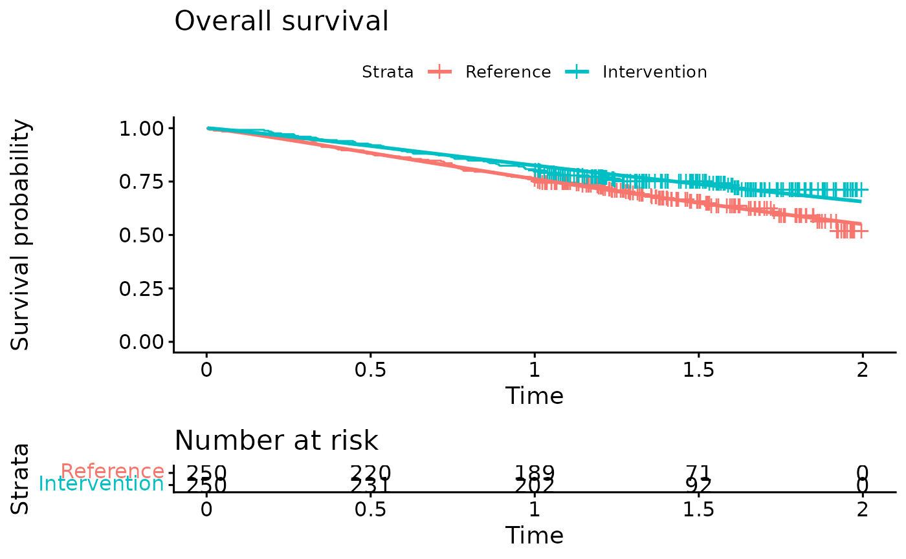
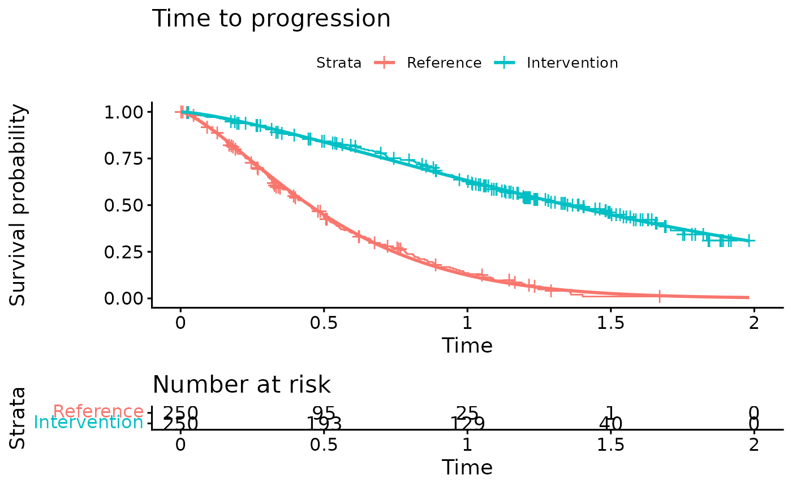
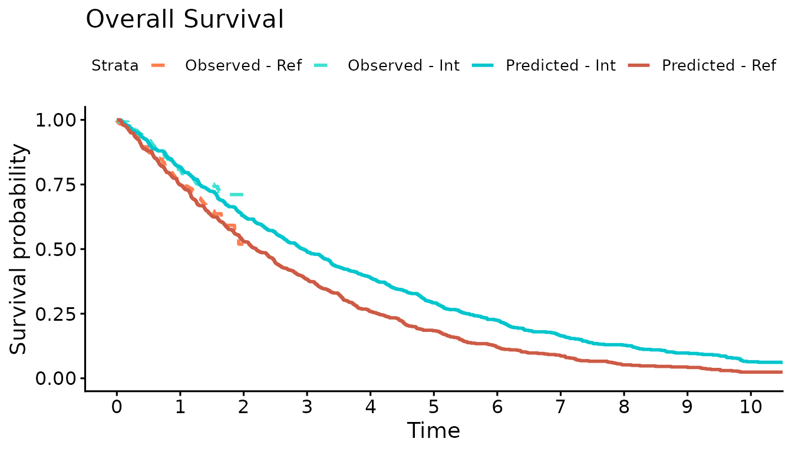
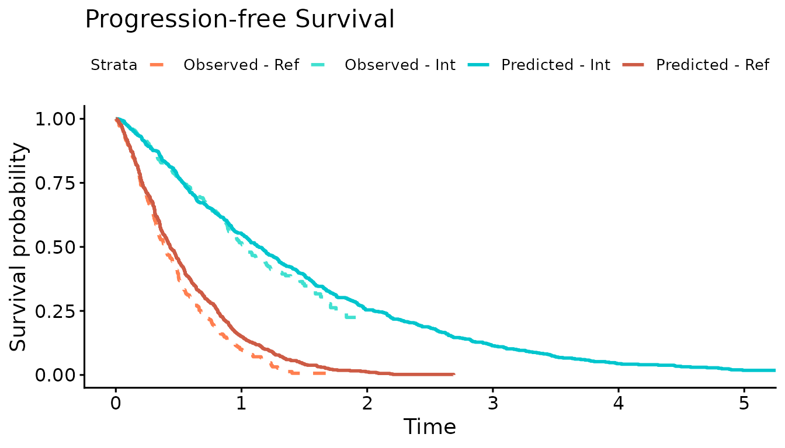

# Example with IPD trial data

## Introduction

This document runs a discrete event simulation model using simulated
individual patient data (IPD) to show how the functions can be used to
generate a model when IPD from a trial is available.

## Packages and main options

``` r
library(WARDEN)
library(dplyr)
library(survival)
library(survminer)
library(kableExtra)
library(tidyr)
library(purrr)
library(flexsurv)
```

``` r
options(scipen = 999)
options(tibble.print_max = 50)
```

## Model concept

All patients start in the progression-free state and may move to the
progressed state. At any point in time they can die, depending on the
risk of each disease stage. Patients may also experience a disease event
which accelerates progression.

## Generate dummy IPD trial data and fit survival models

The dummy IPD trial data was generated below from using the
`sim_adtte()` function from the `flexsurvPlus` package. Parametric
survival models are fit to the dummy OS and TTP IPD. We are using the
flexsurv package to fit the parametric survival models.

``` r
#Generate dummy IPD
tte.df <- WARDEN::tte.df

#Change data frame to wide format
tte.df <- tte.df %>% select(-PARAM) %>% pivot_wider(names_from = PARAMCD, values_from = c(AVAL,CNSR)) 

#Derive Time to Progression Variable from OS and PFS
tte.df <- tte.df %>% mutate(
  AVAL_TTP = AVAL_PFS,
  CNSR_TTP = ifelse(AVAL_PFS == AVAL_OS & CNSR_PFS==0 & CNSR_OS==0,1,CNSR_PFS),
  Event_OS = 1-CNSR_OS,
  Event_PFS = 1-CNSR_PFS,
  Event_TTP = 1-CNSR_TTP
  )

#Add baseline characteristics (sex and age) to time to event data
IPD <- tte.df %>% mutate(
  SEX = rbinom(500,1,0.5),
  AGE = rnorm(500,60,8)
)
```

``` r
#Plot simulated OS and TTP curves

#Overall survival
km.est.OS <- survfit(Surv(AVAL_OS/365.25, Event_OS) ~ ARMCD, data = IPD) #KM curve

OS.fit <- flexsurvreg(formula = Surv(AVAL_OS/365.25, Event_OS) ~ ARMCD, data = IPD, dist = "Weibull") #Fit Weibull model to the OS data
OS.fit
#> Call:
#> flexsurvreg(formula = Surv(AVAL_OS/365.25, Event_OS) ~ ARMCD, 
#>     data = IPD, dist = "Weibull")
#> 
#> Estimates: 
#>         data mean  est     L95%    U95%    se      exp(est)  L95%    U95%  
#> shape       NA     1.1346  0.9764  1.3185  0.0870      NA        NA      NA
#> scale       NA     3.1523  2.5170  3.9479  0.3620      NA        NA      NA
#> ARMCDB  0.5000     0.3066  0.0183  0.5949  0.1471  1.3588    1.0185  1.8129
#> 
#> N = 500,  Events: 150,  Censored: 350
#> Total time at risk: 623.0253
#> Log-likelihood = -360.0964, df = 3
#> AIC = 726.1929

ggsurvplot(OS.fit, title="Overall survival",
           legend.labs = c("Reference","Intervention"),
           risk.table = TRUE)
```



``` r

#Time to progression
km.est.TTP <- survfit(Surv(AVAL_TTP/365.25, Event_TTP) ~ ARMCD, data = IPD) #KM curve

TTP.fit <- flexsurvreg(formula = Surv(AVAL_TTP/365.25, Event_TTP) ~ ARMCD, data = IPD, dist = "Weibull") #Fit Weibull model to the TTP data
TTP.fit
#> Call:
#> flexsurvreg(formula = Surv(AVAL_TTP/365.25, Event_TTP) ~ ARMCD, 
#>     data = IPD, dist = "Weibull")
#> 
#> Estimates: 
#>         data mean  est     L95%    U95%    se      exp(est)  L95%    U95%  
#> shape       NA     1.3757  1.2590  1.5033  0.0622      NA        NA      NA
#> scale       NA     0.5865  0.5310  0.6478  0.0297      NA        NA      NA
#> ARMCDB  0.5000     1.0992  0.9277  1.2707  0.0875  3.0016    2.5286  3.5632
#> 
#> N = 500,  Events: 328,  Censored: 172
#> Total time at risk: 358.9897
#> Log-likelihood = -269.0387, df = 3
#> AIC = 544.0774

ggsurvplot(TTP.fit, title="Time to progression",
           legend.labs = c("Reference","Intervention"),
           risk.table = TRUE)
```



## Define DES model inputs

Inputs and variables that will be used in the model are defined below.
We can define inputs that are common to all patients
(`common_all_inputs`) within a simulation, inputs that are unique to a
patient independently of the treatment (e.g. natural death, defined in
`common_pt_inputs`), and inputs that are unique to that patient and that
treatment (`unique_pt_inputs`). Items can be included through the
[`add_item()`](https://jsanchezalv.github.io/WARDEN/reference/add_item.md)
function, and can be used in subsequent items. All these inputs are
generated before the events and the reaction to events are executed.
Furthermore, the program first executes `common_all_inputs`, then
`common_pt_inputs` and then `unique_pt_inputs`. So one could use the
items generated in `common_all_inputs` in `unique_pt_inputs`.

``` r

#Define variables that do not change on any patient or intervention loop
common_all_inputs <- add_item( 
  #Parameters from the survival models
  OS.scale = as.numeric(OS.fit$coef[2]),
  OS.shape = as.numeric(OS.fit$coef[1]),
  OS.coef.int = as.numeric(OS.fit$coef[3]), #Intervention effect

  TTP.scale = as.numeric(TTP.fit$coef[2]),
  TTP.shape = as.numeric(TTP.fit$coef[1]),
  TTP.coef.int = as.numeric(TTP.fit$coef[3]), #Intervention effect
  
  #Utilities
  util.PFS = 0.6, #Utility while in progression-free state
  util.PPS = 0.4, #Utility while in progressed state
  disutil.PAE = -0.02, #One-off disutility of progression-accelerating event

  #Costs
  cost.drug.int = 85000, #Annual intervention cost
  cost.drug.ref = 29000, #Annual cost of reference treatment
  cost.admin.SC = 150, #Unit cost for each SC administration
  cost.admin.oral = 300, #One-off cost for oral administration
  cost.dm.PFS = 3000, #Annual disease-management cost in progression-free state
  cost.dm.PPS = 5000, #Annual disease-management cost in progressed state
  cost.ae.int = 2200, #Annual adverse event costs for intervention
  cost.ae.ref = 1400 #Annual adverse event costs for reference treatment
    )


#Define variables that do not change as we loop through interventions for a patient
common_pt_inputs <- add_item(
  #Patient baseline characteristics
  Sex = as.numeric(IPD[i,"SEX"]), #Record sex of individual patient. 0 = Female; 1 =Male
  BLAge = as.numeric(IPD[i,"AGE"]), #Record patient age at baseline
  
  #Draw time to non-disease related death from a conditional Gompertz distribution
  nat.death = rcond_gompertz(1,shape=if(Sex==1){0.102}else{0.115},
                               rate=if(Sex==1){0.000016}else{0.0000041},
                               lower_bound = BLAge) # Baseline Age in years
  )


#Define variables that change as we loop through treatments for each patient.
unique_pt_inputs <- add_item(
  fl.int  = 0, #Flag to determine if patient is on intervention. Initialized as 0, but will be changed to current arm in the Start event.
  fl.prog = 0, #Flag to determine if patient has progressed. All patients start progression-free
  fl.ontx = 1, #Flag to determine if patient is on treatment. All patients start on treatment
  fl.PAE = 0,  #Flag to determine if progression-accelerating event occurred
  pfs.time = NA, #Recording of time at progression
  q_default = ifelse(fl.prog == 0, util.PFS, util.PPS),
  q_default_inst = 0,
  c_default = ifelse(fl.prog == 0,cost.dm.PFS,cost.dm.PPS) + if(arm=="int"){(cost.drug.int + cost.admin.SC * 12 + cost.ae.int) * fl.ontx}else{cost.drug.ref + cost.ae.ref},
  c_default_inst = 0
)
```

## Events

### Add Initial Events

We define now the possible events that can occur for the intervention
and reference arm respectively using the
[`add_tte()`](https://jsanchezalv.github.io/WARDEN/reference/add_tte.md)
function. Only patients in the intervention arm can have a treatment
discontinuation, while patients in both arms can have a progression,
progression-accelerating and death event. The seed argument is being
used in the
[`draw_tte()`](https://jsanchezalv.github.io/WARDEN/reference/draw_tte.md)
function which uses the `i` item to ensure that event times specific to
each patient can be replicated and updated at later time points.

``` r
init_event_list <- 
  #Events applicable to intervention
  add_tte(arm=c("int","ref"),
          evts = c("Start",
                   "TxDisc",
                   "Progression",
                   "PAE",
                   "Death"),
               input={
    Start <- 0
    Progression <- draw_tte(1,'weibull',coef1=TTP.shape, coef2= TTP.scale + ifelse(arm=="int",TTP.coef.int,0),seed = as.numeric(paste0(1,i,simulation)))
    TxDisc <- Inf #Treatment discontinuation will occur at progression
    Death <- min(draw_tte(1,'weibull',coef1=OS.shape, coef2= OS.scale + ifelse(arm=="int",OS.coef.int,0), seed = as.numeric(paste0(42,i,simulation))), nat.death) #Death occurs at earliest of disease-related death or non-disease-related death
    PAE <- draw_tte(1,'exp',coef1=-log(1-ifelse(arm=="int",0.05,0.15))) #Occurrence of the progression-accelerating event has a 5% or 15% probability for the intervention arm
  })
```

### Add Event Reactions

Reactions for each individual event are defined in the following using
the
[`add_reactevt()`](https://jsanchezalv.github.io/WARDEN/reference/add_reactevt.md)
function. Patients in the intervention arm discontinue treatment at
progression. Occurrence of the progression-accelerated event results in
an earlier progression (if it has not occurred yet). Note the use of the
seed argument in the
[`draw_tte()`](https://jsanchezalv.github.io/WARDEN/reference/draw_tte.md)
function which ensures that the same seed is being used in the original
and the updated draw of the time to progression.

``` r

evt_react_list <-
  add_reactevt(name_evt = "Start",
               input = {
                 fl.int = ifelse(arm=="int",1,0)
                 q_default = ifelse(fl.prog == 0, util.PFS, util.PPS)
                 c_default = ifelse(fl.prog == 0,cost.dm.PFS,cost.dm.PPS) + if(arm=="int"){(cost.drug.int + cost.admin.SC * 12 + cost.ae.int) * fl.ontx}else{cost.drug.ref + cost.ae.ref}
                 c_default_inst = cost.admin.oral
                                  
               }) %>%
  add_reactevt(name_evt = "TxDisc",
               input = {
                 q_default = ifelse(fl.prog == 0, util.PFS, util.PPS)
                 c_default = ifelse(fl.prog == 0,cost.dm.PFS,cost.dm.PPS) + if(arm=="int"){(cost.drug.int + cost.admin.SC * 12 + cost.ae.int) * fl.ontx}else{cost.drug.ref + cost.ae.ref}
                 fl.ontx = 0
               }) %>%
  add_reactevt(name_evt = "Progression",
               input = {
                 q_default = ifelse(fl.prog == 0, util.PFS, util.PPS)
                 c_default = ifelse(fl.prog == 0,cost.dm.PFS,cost.dm.PPS) + if(arm=="int"){(cost.drug.int + cost.admin.SC * 12 + cost.ae.int) * fl.ontx}else{cost.drug.ref + cost.ae.ref}
                 pfs.time=curtime
                 fl.prog= 1
                 if(arm=="int"){modify_event(c("TxDisc" = curtime))} #Trigger treatment discontinuation at progression
               }) %>%
  add_reactevt(name_evt = "Death",
               input = {
                 q_default = ifelse(fl.prog == 0, util.PFS, util.PPS)
                 c_default = ifelse(fl.prog == 0,cost.dm.PFS,cost.dm.PPS) + if(arm=="int"){(cost.drug.int + cost.admin.SC * 12 + cost.ae.int) * fl.ontx}else{cost.drug.ref + cost.ae.ref}
                 curtime = Inf
               }) %>%
  add_reactevt(name_evt = "PAE",
               input = {
                 fl.PAE = 1
                 q_default = ifelse(fl.prog == 0, util.PFS, util.PPS)
                 q_default_inst = disutil.PAE
                 c_default = ifelse(fl.prog == 0,cost.dm.PFS,cost.dm.PPS) + if(arm=="int"){(cost.drug.int + cost.admin.SC * 12 + cost.ae.int) * fl.ontx}else{cost.drug.ref + cost.ae.ref}
                 
                 if(fl.prog == 0){ #Event only accelerates progression if progression has not occurred yet
                 modify_event(c(
                   "Progression"=max(draw_tte(1,'weibull',coef1=TTP.shape, coef2= TTP.scale + TTP.coef.int*fl.int, beta_tx = 1.2, seed = as.numeric(paste0(1,i,simulation))),curtime))) #Occurrence of event accelerates progression by a factor of 1.2
                 }
               })
```

## Costs and Utilities

Costs and utilities are introduced below.

### Utilities

``` r

util_ongoing <- "q_default"

util_instant <- "q_default_inst"
```

### Costs

``` r

cost_ongoing <- "c_default"

cost_instant <- "c_default_inst"
  
```

## Model

### Model Execution

The model is executed with the event reactions and inputs previously
defined for each patient in the simulated data set.

``` r
#Logic is: per patient, per intervention, per event, react to that event.
results <- run_sim(  
  npats=as.numeric(nrow(IPD)),              # Simulating the number of patients for which we have IPD
  n_sim=1,                                  # We run all patients once (per treatment)
  psa_bool = FALSE,                         # No PSA for this example
  arm_list = c("int", "ref"),             
  common_all_inputs = common_all_inputs,    
  common_pt_inputs = common_pt_inputs,      
  unique_pt_inputs = unique_pt_inputs,      
  init_event_list = init_event_list,        
  evt_react_list = evt_react_list,          
  util_ongoing_list = util_ongoing,
  util_instant_list = util_instant,
  cost_ongoing_list = cost_ongoing,
  cost_instant_list = cost_instant,
  input_out = c("BLAge","Sex","nat.death","pfs.time")
)
#> Analysis number: 1
#> Simulation number: 1
#> Time to run simulation 1: 0.66s
#> Time to run analysis 1: 0.66s
#> Total time to run: 0.67s
#> Simulation finalized;
```

## Post-processing of Model Outputs

### Summary of Results

Once the model has been run, we can use the results and summarize them
using the `summary_results_det` to print the results of the
deterministic case. The individual patient data generated by the
simulation is recorded in the `psa_ipd` object.

``` r

summary_results_det(results[[1]][[1]]) #will print the last simulation!
#>                              int        ref
#> costs                  261251.76   94361.19
#> dcosts                      0.00  166890.57
#> lys                         3.60       2.75
#> dlys                        0.00       0.85
#> qalys                       1.71       1.41
#> dqalys                      0.00       0.30
#> ICER                          NA  195784.55
#> ICUR                          NA  563768.08
#> INMB                          NA -152089.22
#> costs_undisc           286099.08  101986.36
#> dcosts_undisc               0.00  184112.72
#> lys_undisc                  3.99       2.97
#> dlys_undisc                 0.00       1.02
#> qalys_undisc                1.88       1.52
#> dqalys_undisc               0.00       0.35
#> ICER_undisc                   NA  180232.81
#> ICUR_undisc                   NA  518666.81
#> INMB_undisc                   NA -166364.07
#> BLAge                      59.66      59.66
#> dBLAge                      0.00       0.00
#> c_default              260951.76   94061.19
#> dc_default                  0.00  166890.57
#> c_default_inst            300.00     300.00
#> dc_default_inst             0.00       0.00
#> c_default_inst_undisc     300.00     300.00
#> dc_default_inst_undisc      0.00       0.00
#> c_default_undisc       285799.08  101686.36
#> dc_default_undisc           0.00  184112.72
#> nat.death                  24.33      24.33
#> dnat.death                  0.00       0.00
#> pfs.time                    1.61       0.58
#> dpfs.time                   0.00       1.03
#> q_default                   1.73       1.43
#> dq_default                  0.00       0.30
#> q_default_inst             -0.02      -0.02
#> dq_default_inst             0.00       0.00
#> q_default_inst_undisc      -0.02      -0.02
#> dq_default_inst_undisc      0.00       0.00
#> q_default_undisc            1.89       1.54
#> dq_default_undisc           0.00       0.36
#> Sex                         0.53       0.53
#> dSex                        0.00       0.00

psa_ipd <- bind_rows(map(results[[1]], "merged_df")) 

psa_ipd[1:10,] %>%
  kable() %>%
  kable_styling(bootstrap_options = c("striped", "hover", "condensed", "responsive"))
```

| evtname |   evttime | prevtime | pat_id | arm | total_lys | total_qalys | total_costs | total_costs_undisc | total_qalys_undisc | total_lys_undisc |       lys |      qalys |       costs | lys_undisc | qalys_undisc | costs_undisc |    BLAge | Sex | nat.death | pfs.time |   c_default | c_default_inst | q_default | q_default_inst | c_default_undisc | q_default_undisc | c_default_inst_undisc | q_default_inst_undisc |  nexttime | simulation | sensitivity |
|:--------|----------:|---------:|-------:|:----|----------:|------------:|------------:|-------------------:|-------------------:|-----------------:|----------:|-----------:|------------:|-----------:|-------------:|-------------:|---------:|----:|----------:|---------:|------------:|---------------:|----------:|---------------:|-----------------:|-----------------:|----------------------:|----------------------:|----------:|-----------:|------------:|
| Start   | 0.0000000 | 0.000000 |      1 | int | 1.5055640 |   0.8841831 |   138811.88 |          141988.56 |          0.9040559 |        1.5400931 | 1.4288465 |  0.8573079 | 131753.8777 |  1.4598976 |    0.8759386 |  134610.5792 | 53.35829 |   0 |  30.07156 |       NA | 131453.8777 |            300 | 0.8573079 |      0.0000000 |      134310.5792 |        0.8759386 |                   300 |                  0.00 | 1.4598976 |          1 |           1 |
| PAE     | 1.4598976 | 0.000000 |      1 | int | 1.5055640 |   0.8841831 |   138811.88 |          141988.56 |          0.9040559 |        1.5400931 | 0.0767175 |  0.0268752 |   7058.0072 |  0.0801955 |    0.0281173 |    7377.9851 | 53.35829 |   0 |  30.07156 |       NA |   7058.0072 |              0 | 0.0460305 |     -0.0191553 |        7377.9851 |        0.0481173 |                     0 |                 -0.02 | 1.5400931 |          1 |           1 |
| Death   | 1.5400931 | 1.459898 |      1 | int | 1.5055640 |   0.8841831 |   138811.88 |          141988.56 |          0.9040559 |        1.5400931 | 0.0000000 |  0.0000000 |      0.0000 |  0.0000000 |    0.0000000 |       0.0000 | 53.35829 |   0 |  30.07156 |       NA |      0.0000 |              0 | 0.0000000 |      0.0000000 |           0.0000 |        0.0000000 |                     0 |                  0.00 | 1.5400931 |          1 |           1 |
| Start   | 0.0000000 | 0.000000 |      2 | int | 2.1750928 |   1.2858641 |   200408.54 |          207131.08 |          1.3288984 |        2.2481639 | 1.3675671 |  0.8205403 | 126116.1722 |  1.3959764 |    0.8375858 |  128729.8244 | 55.97126 |   1 |  36.09357 |       NA | 125816.1722 |            300 | 0.8205403 |      0.0000000 |      128429.8244 |        0.8375858 |                   300 |                  0.00 | 1.3959764 |          1 |           1 |
| PAE     | 1.3959764 | 0.000000 |      2 | int | 2.1750928 |   1.2858641 |   200408.54 |          207131.08 |          1.3288984 |        2.2481639 | 0.8075257 |  0.4653239 |  74292.3646 |  0.8521876 |    0.4913125 |   78401.2566 | 55.97126 |   1 |  36.09357 |       NA |  74292.3646 |              0 | 0.4845154 |     -0.0191915 |       78401.2566 |        0.5113125 |                     0 |                 -0.02 | 2.2481639 |          1 |           1 |
| Death   | 2.2481639 | 1.395976 |      2 | int | 2.1750928 |   1.2858641 |   200408.54 |          207131.08 |          1.3288984 |        2.2481639 | 0.0000000 |  0.0000000 |      0.0000 |  0.0000000 |    0.0000000 |       0.0000 | 55.97126 |   1 |  36.09357 |       NA |      0.0000 |              0 | 0.0000000 |      0.0000000 |           0.0000 |        0.0000000 |                     0 |                  0.00 | 2.2481639 |          1 |           1 |
| Start   | 0.0000000 | 0.000000 |      3 | int | 0.5544693 |   0.3326816 |    51311.17 |           51733.82 |          0.3354379 |        0.5590632 | 0.5544693 |  0.3326816 |  51311.1718 |  0.5590632 |    0.3354379 |   51733.8186 | 50.45087 |   1 |  25.36304 |       NA |  51011.1718 |            300 | 0.3326816 |      0.0000000 |       51433.8186 |        0.3354379 |                   300 |                  0.00 | 0.5590632 |          1 |           1 |
| Death   | 0.5590632 | 0.000000 |      3 | int | 0.5544693 |   0.3326816 |    51311.17 |           51733.82 |          0.3354379 |        0.5590632 | 0.0000000 |  0.0000000 |      0.0000 |  0.0000000 |    0.0000000 |       0.0000 | 50.45087 |   1 |  25.36304 |       NA |      0.0000 |              0 | 0.0000000 |      0.0000000 |           0.0000 |        0.0000000 |                     0 |                  0.00 | 0.5590632 |          1 |           1 |
| Start   | 0.0000000 | 0.000000 |      4 | int | 0.9496596 |   0.5503533 |    87668.68 |           88918.38 |          0.5579459 |        0.9632432 | 0.9431472 |  0.5658883 |  87069.5412 |  0.9565434 |    0.5739261 |   88301.9947 | 53.98621 |   0 |  37.38616 |       NA |  86769.5412 |            300 | 0.5658883 |      0.0000000 |       88001.9947 |        0.5739261 |                   300 |                  0.00 | 0.9565434 |          1 |           1 |
| PAE     | 0.9565434 | 0.000000 |      4 | int | 0.9496596 |   0.5503533 |    87668.68 |           88918.38 |          0.5579459 |        0.9632432 | 0.0065124 | -0.0155350 |    599.1403 |  0.0066998 |   -0.0159801 |     616.3833 | 53.98621 |   0 |  37.38616 |       NA |    599.1403 |              0 | 0.0039074 |     -0.0194424 |         616.3833 |        0.0040199 |                     0 |                 -0.02 | 0.9632432 |          1 |           1 |

We can also check what has been the absolute number of events per
strategy.

| arm | evtname     |   n |
|:----|:------------|----:|
| int | Death       | 500 |
| int | Start       | 500 |
| int | PAE         | 411 |
| int | Progression | 320 |
| int | TxDisc      | 320 |
| ref | Death       | 500 |
| ref | Start       | 500 |
| ref | Progression | 441 |
| ref | PAE         | 395 |

### Plots

We now use the simulation output to plot the Kaplan-Meier curves of the
simulated OS and PFS against the observed Kaplan-Meier curves. The
simulated progression-free survival curve is lower than the observed due
to the addition of the progression-accelerating event into the model.

``` r
#Overall survival
KM.death <- psa_ipd %>% filter(evtname=="Death") %>% mutate(Event = 1)

sim.km.OS <- survfit(Surv(evttime, Event) ~ arm, data = KM.death)

km.comb <- list(
  Observed = km.est.OS,
  Predicted = sim.km.OS
)

ggsurvplot(km.comb, combine = TRUE,
           title="Overall Survival",
           palette=c("coral","turquoise","turquoise3","coral3"),
           legend.labs=c("Observed - Ref","Observed - Int","Predicted - Int","Predicted - Ref"),
           linetype = c(2,2,1,1),
           xlim=c(0,10), break.time.by = 1, censor=FALSE)
```



``` r

#Progression-free survival
km.est.PFS <- survfit(Surv(AVAL_PFS/365.25, Event_PFS) ~ ARMCD, data = IPD)
KM.PFS.DES <- psa_ipd %>% filter(evtname=="Death") %>% mutate(evttime = ifelse(is.na(pfs.time),evttime,pfs.time),
                                                          Event = 1)

sim.km.PFS <- survfit(Surv(evttime, Event) ~ arm, data = KM.PFS.DES)

km.comb <- list(Observed = km.est.PFS,
                Predicted = sim.km.PFS)

ggsurvplot(km.comb,combine = TRUE,
           title="Progression-free Survival",
           palette=c("coral","turquoise","turquoise3","coral3"),
           legend.labs=c("Observed - Ref","Observed - Int","Predicted - Int","Predicted - Ref"),
           linetype = c(2,2,1,1),
           xlim=c(0,5), break.time.by = 1, censor = FALSE)
```


