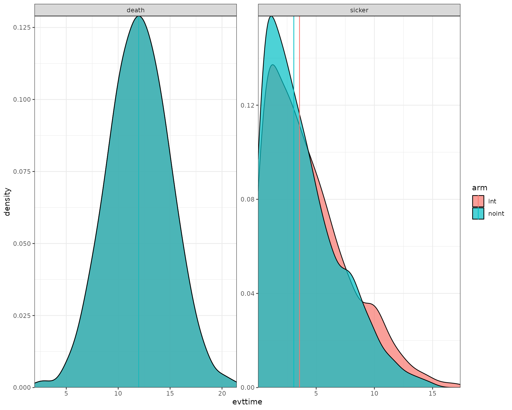

# Example for a Sick-Sicker-Dead model

## Introduction

This document runs a discrete event simulation model in the context of a
late oncology model to show how the functions can be used to generate a
model in only a few steps.

When running a DES, it’s important to consider speed. Simulation based
models can be computationally expensive, which means that using
efficient coding can have a substantial impact on performance.

### Main options

``` r
library(WARDEN)

library(dplyr)
#> 
#> Attaching package: 'dplyr'
#> The following objects are masked from 'package:stats':
#> 
#>     filter, lag
#> The following objects are masked from 'package:base':
#> 
#>     intersect, setdiff, setequal, union
library(ggplot2)
library(kableExtra)
#> 
#> Attaching package: 'kableExtra'
#> The following object is masked from 'package:dplyr':
#> 
#>     group_rows
library(purrr)
```

``` r
options(scipen = 999)
options(digits=3)
options(tibble.print_max = 50)
```

## General inputs with delayed execution

Initial inputs and flags that will be used in the model can be defined
below. We can define inputs that will only change across scenarios
(`sensitivity_inputs`), inputs which are common to all patients
(`common_all_inputs`) within a simulation, inputs that are unique to a
patient independently of the treatment (e.g. natural time to death,
defined in `common_pt_inputs`), and inputs that are unique to that
patient and that treatment (`unique_pt_inputs`). Items can be included
through the
[`add_item()`](https://jsanchezalv.github.io/WARDEN/reference/add_item.md)
function, and can be used in subsequent items. All these inputs are
generated before the events and the reaction to events are executed.
Furthermore, the program first executes `common_all_inputs`, then
`common_pt_inputs` and then `unique_pt_inputs`. So one could use the
items generated in `common_all_inputs` in `unique_pt_inputs`. Note that
inputs are “reset” after each patient, so if patient 1 arm “noint”
changes `util.sick` to be = 2, even if it’s a common parameter for
everyone, it would be reset to 1 for patient 1 arm “int”.

Note that time to death is set in the common_pt_inputs, but it could
also just be set in the `add_tte` function explained below. The user has
full flexibility on how to implement this type of inputs.

There are some auxiliary functions to help setting up inputs, like
[`pick_val_v()`](https://jsanchezalv.github.io/WARDEN/reference/pick_val_v.md)
(and
[`pick_psa()`](https://jsanchezalv.github.io/WARDEN/reference/pick_psa.md),
see below the section on [Sensitivity Analysis](#sensitivity-analysis)).
Note that
[`pick_val_v()`](https://jsanchezalv.github.io/WARDEN/reference/pick_val_v.md)
can be directly loaded as parameters (in fact, a named list will be
loaded directly by R).

``` r
#We don't need to use sensitivity_inputs here, so we don't add that object

#Put objects here that do not change on any patient or intervention loop
#We use add_item and add_item to showcase how the user can implement the inputs (either works, add_item is just faster)
common_all_inputs <-add_item(input = {
                      util.sick   <- 0.8
                      util.sicker <- 0.5
                      cost.sick   <- 3000
                      cost.sicker <- 7000
                      cost.int    <- 1000
                      coef_noint  <- log(0.2)
                      HR_int      <- 0.8
                      drc         <- 0.035 #different values than what's assumed by default
                      drq         <- 0.035
                      random_seed_sicker_i <- sample.int(100000,npats,replace = FALSE)
})  #to be used as seeds to draw the time to event for sicker, to ensure same luck for the same patient independently of the arm


#Put objects here that do not change as we loop through treatments for a patient
common_pt_inputs <- add_item(death= max(0.0000001,rnorm(n=1, mean=12, sd=3))) 

#Put objects here that change as we loop through treatments for each patient (e.g. events can affect fl.tx, but events do not affect nat.os.s)
unique_pt_inputs <- add_item(fl.sick = 1,
                             q_default = util.sick,
                             c_default = cost.sick + if(arm=="int"){cost.int}else{0}) 
```

## Events

### Add Initial Events

Events are added below through the
[`add_tte()`](https://jsanchezalv.github.io/WARDEN/reference/add_tte.md)
function. We use this function once applying to both interventions. We
must define several arguments: one to indicate the intervention, one to
define the names of the events used, one to define the names of other
objects created that we would like to store (optional, maybe we generate
an intermediate input which is not an event but that we want to save)
and the actual input in which we generate the time to event. Events and
other objects will be automatically initialized to `Inf`. We draw the
times to event for the patients. Note: the order of the `evts` argument
that appears first will be used as a reference of the order in which to
process events in the case of ties (so “sick” would be processed before
“sicker” if there is a tie in time to event.)

Note that the model will use the evnets defined in `evts` argument to
look for the objects both defined in the input list and in this
expression to allocate time to events. If an event is declared in `evts`
but not defined elsewhere, then they would be assumed TTE of `Inf` by
default.

This chunk is a bit more complex, so it’s worth spending a bit of time
explaining it.

The `init_event_list` object is populated by using the
[`add_tte()`](https://jsanchezalv.github.io/WARDEN/reference/add_tte.md)
function which applies to both arms, “int” strategy and “noint”
strategy. We first declare the `start` time to be `0`. Note this could
also be separated by arm if the user wants to have more clarity using
two `add_tte` functions (i.e.,
`add_tte(arm="noint"...) %>% add_tte(arm="int"...)`).

We then proceed to generate the actual time to event. We use the
[`draw_tte()`](https://jsanchezalv.github.io/WARDEN/reference/draw_tte.md)
function to generate the time to event, though one can set this up in
any other way (e.g., using
[`rexp()`](https://rdrr.io/r/stats/Exponential.html)). One should always
be aware of how the competing risks interact with each other. While we
have abstracted from these type of corrections here, it is recommended
to have an understanding about how these affect the results and have a
look at the competing risks/semi-competing risks literature.

``` r
init_event_list <- 
  add_tte(arm=c("noint","int"), evts = c("sick","sicker","death") ,input={
    sick <- 0
    sicker <- draw_tte(1,dist="exp", coef1=coef_noint, beta_tx = ifelse(arm=="int",HR_int,1), seed = random_seed_sicker_i[i]) #this way the value would be the same if it wasn't for the HR, effectively "cloning" patients luck
    
  })
```

### Add Reaction to Those Events

Once the initial times of the events have been defined, we also need to
declare how events react and affect each other. To do so, we use the
`evt_react_list` object and the
[`add_reactevt()`](https://jsanchezalv.github.io/WARDEN/reference/add_reactevt.md)
function. This function just needs to state which event is affected, and
the actual reaction (usually setting flags to 1 or 0, or creating
new/adjusting events).

There are a series of objects that can be used in this context to help
with the reactions. Apart from the global objects and flags defined
above, we can also use `curtime` for the current event time, `prevtime`
for the time of the previous event, `cur_evtlist` for the C++ event
queue, `arm` for the current treatment in the loop, `evt` for the
current event being processed, `i` expresses the patient iteration, and
`simulation` the specific simulation (relevant when the number of
simulations is greater than 1). Furthermore, one can also call any other
input/item that has been created before or create new ones. For example,
we could even modify a cost/utility item by changing it directly,
e.g. through assigning it directly `cost.idfs.tx <- 500`.

| Item          | What does it do                                                       |
|---------------|-----------------------------------------------------------------------|
| `curtime`     | Current event time (numeric)                                          |
| `prevtime`    | Time of the previous event (numeric)                                  |
| `cur_evtlist` | External pointer of C++ events that is yet to happen for that patient |
| `evt`         | Current event being processed (character)                             |
| `i`           | Patient being iterated (numeric)                                      |
| `arm`         | Intervention being iterated (character)                               |
| `simulation`  | Simulation being iterated (numeric)                                   |
| `sens`        | Sensitivity analysis being iterated (numeric)                         |

The functions to add/modify events and inputs use named vectors or
lists. Whenever several inputs/events are added or modified, it’s
recommended to group them within one function, as it reduces the
computation cost. So rather than use two
[`modify_event()`](https://jsanchezalv.github.io/WARDEN/reference/modify_event.md)
with a list of one element, it’s better to group them into a single
[`modify_event()`](https://jsanchezalv.github.io/WARDEN/reference/modify_event.md)
with a list of two elements.

The list of relevant functions to be used within
[`add_reactevt()`](https://jsanchezalv.github.io/WARDEN/reference/add_reactevt.md)
are:
[`new_event()`](https://jsanchezalv.github.io/WARDEN/reference/new_event.md)allows
to generate events and add them to the vector of events. It accepts more
than one event but a single event per event type.
[`modify_event()`](https://jsanchezalv.github.io/WARDEN/reference/modify_event.md)
allows to modify events (e.g. delay death). When adding an event, the
name of the events and the time of the events must be defined. When
using `modify_event`, one must indicate which events are affected and
what are the new times of the events. If the event specified does not
exist or has already occurred, it will return an error. `modify_event`
with `create_if_null = TRUE` argument will also generate events if they
don’t exist.
[`remove_event()`](https://jsanchezalv.github.io/WARDEN/reference/remove_event.md)
will remove an event from the event queue (could also be modified
instead and set to `Inf`).
[`get_event()`](https://jsanchezalv.github.io/WARDEN/reference/get_event.md)
will return the TTE of the specified event name.
[`has_event()`](https://jsanchezalv.github.io/WARDEN/reference/has_event.md)
will return a TRUE/FALSE flag depending on whether the given patient has
a specific event in the queue (will return TRUE even if time is `Inf`).
[`next_event()`](https://jsanchezalv.github.io/WARDEN/reference/next_event.md)
will return a list with the next event in the queue, with time, patient,
and event name (`patient_id`, `event_name`, and `time`).
[`next_event_pt()`](https://jsanchezalv.github.io/WARDEN/reference/next_event_pt.md)
will return a list with the next event in the queue for a specific
patient, with time, patient, and event name (`patient_id`, `event_name`,
and `time`).
[`queue_empty()`](https://jsanchezalv.github.io/WARDEN/reference/queue_empty.md)
will return TRUE if the queue of events is empty (no more events to
process, but `Inf` events are considered part of the queue)
[`queue_size()`](https://jsanchezalv.github.io/WARDEN/reference/queue_size.md)
allows to check the size of the queue of events, including `Inf` events.

Note that one could potentially omit part of the modeling set in
`init_event_list` and actually define new events dynamically through the
reactions (we do that below for the `"ae"` event). However, this can
have an impact in computation time, so if possible it’s always better to
use `init_event_list`.

To modify/create items, WARDEN now allows to assign them directly in the
code, which allows the code to run faster.

The model will run until `curtime` is set to `Inf`, so the event that
terminates the model (in this case, `os`), should modify `curtime` and
set it to `Inf`.

Finally, note that there could be two different ways of accumulating
continuous outcomes, backwards (i.e., in the example below, we would set
`q_default = util.sick` at the sicker event, and modify the `q_default`
value in the death event) and forwards (as in the example below). This
option can be modified in the
[`run_sim()`](https://jsanchezalv.github.io/WARDEN/reference/run_sim.md)
function using the `accum_backwards` argument, which assumes forwards by
default.

``` r
evt_react_list <-
  add_reactevt(name_evt = "sick",
               input = {}) %>%
  add_reactevt(name_evt = "sicker",
               input = {
                 q_default <- util.sicker
                 c_default <- cost.sicker + if(arm=="int"){cost.int}else{0}
                 fl.sick   <- 0 
               }) %>%
  add_reactevt(name_evt = "death",
               input = {
                 q_default <- 0
                 c_default <- 0
                 curtime   <- Inf
               }) 


# Below how it would be set up if using `accum_backwards = TRUE` in `run_sim()` (and will give equal final results)
# Note that we set the value applied in the reaction right up to the event, changing the interpretation of the reaction
# It is also a slower method than the standard approach
#
# evt_react_list <-
#     add_reactevt(name_evt = "sick",
#                  input = {}) %>%
#     add_reactevt(name_evt = "sicker",
#                  input = {
#                      q_default = util.sick
#                      c_default = cost.sick + if(arm=="int"){cost.int}else{0}
#                      fl.sick = 0
#                  }) %>%
#     add_reactevt(name_evt = "death",
#                  input = {
#                      c_dis <- if(fl.sick==1){cost.sick}else{cost.sicker}
#                      q_default = if(fl.sick==1){util.sick}else{util.sicker}
#                      c_default = c_dis + if(arm=="int"){cost.int}else{0}
#                      curtime = Inf
#                  }) 
```

#### Extract Interactions Within Events

As an additional optional step, to easily see the interactions between
the reactions of the events, we can also now use the
[`extract_from_reactions()`](https://jsanchezalv.github.io/WARDEN/reference/extract_from_reactions.md)
function to obtain a data.frame with all the relationships defined in
the reactions in the model. This functions looks at all assignments
(through `<-` or `=` or `assign`),
[`modify_event()`](https://jsanchezalv.github.io/WARDEN/reference/modify_event.md)
and
[`new_event()`](https://jsanchezalv.github.io/WARDEN/reference/new_event.md)
and checks which elements are being defined there, their definition, and
whether they are triggered conditionally (e.g., `"if(a == 1){b = 2}"`).
Note it would be straightforward to build a network graph showcasing all
the interactions between events in terms of events affecting other
events, or to show which (and how) events affect specific items.

``` r

df_interactions <- extract_from_reactions(evt_react_list)

kable(df_interactions)
```

| event  | name      | type | conditional_flag | definition                                          |
|:-------|:----------|:-----|:-----------------|:----------------------------------------------------|
| sicker | q_default | item | FALSE            | util.sicker                                         |
| sicker | c_default | item | FALSE            | cost.sicker + if (arm == ‘int’) {cost.int} else {0} |
| sicker | fl.sick   | item | FALSE            | 0                                                   |
| death  | q_default | item | FALSE            | 0                                                   |
| death  | c_default | item | FALSE            | 0                                                   |
| death  | curtime   | item | FALSE            | Inf                                                 |

## Costs and Utilities

Costs and utilities are introduced below. However, it’s worth noting
that the model is able to run without costs or utilities.

Utilities/Costs/Other outputs are defined by declaring which object
belongs to utilities/costs/other outputs, and whether they need to be
discounted continuously or discretely (instantaneous). These will be
passed to the
[`run_sim()`](https://jsanchezalv.github.io/WARDEN/reference/run_sim.md)
function.

### Utilities

``` r

util_ongoing <- "q_default"
```

### Costs

``` r

cost_ongoing <- "c_default"
```

## Model

### Model Execution

The model can be run using the function
[`run_sim()`](https://jsanchezalv.github.io/WARDEN/reference/run_sim.md)
below. We must define the number of patients to be simulated, the number
of simulations, whether we want to run a PSA or not, the strategy list,
the inputs, events and reactions defined above, utilities, costs and
also if we want any extra output and the level of ipd data desired to be
exported.

It is worth noting that the `psa_bool` argument does not run a PSA
automatically, but is rather an additional input/flag of the model that
we use as a reference to determine whether we want to use a
deterministic or stochastic input. As such, it could also be defined in
`common_all_inputs` as the first item to be defined, and the result
would be the same. However, we recommend it to be defined in
[`run_sim()`](https://jsanchezalv.github.io/WARDEN/reference/run_sim.md).

Note that the distribution chosen, the number of events and the
interaction between events can have a substantial impact on the running
time of the model.

Debugging can be implemented using the argument `debug` in the
[`run_sim()`](https://jsanchezalv.github.io/WARDEN/reference/run_sim.md)
function.

``` r
#Logic is: per patient, per intervention, per event, react to that event.
results <- run_sim(  
  npats=1000,                               # number of patients to be simulated
  n_sim=1,                                  # number of simulations to run
  psa_bool = FALSE,                         # use PSA or not. If n_sim > 1 and psa_bool = FALSE, then difference in outcomes is due to sampling (number of pats simulated)  
  arm_list = c("int", "noint"),             # intervention list
  common_all_inputs = common_all_inputs,    # inputs common that do not change within a simulation
  common_pt_inputs = common_pt_inputs,      # inputs that change within a simulation but are not affected by the intervention
  unique_pt_inputs = unique_pt_inputs,      # inputs that change within a simulation between interventions
  init_event_list = init_event_list,        # initial event list
  evt_react_list = evt_react_list,          # reaction of events
  util_ongoing_list = util_ongoing,
  cost_ongoing_list = cost_ongoing,
  ipd = 1
)
#> Analysis number: 1
#> Simulation number: 1
#> Time to run simulation 1: 0.88s
#> Time to run analysis 1: 0.88s
#> Total time to run: 0.88s
#> Simulation finalized;
```

## Post-processing of Model Outputs

### Summary of Results

Once the model has been run, we can use the results and summarize them
using the
[`summary_results_det()`](https://jsanchezalv.github.io/WARDEN/reference/summary_results_det.md)
to print the results of the last simulation (if `nsim = 1`, it’s the
deterministic case), and
[`summary_results_sim()`](https://jsanchezalv.github.io/WARDEN/reference/summary_results_sim.md)
to show the PSA results (with the confidence intervals). We can also use
the individual patient data generated by the simulation, which we
collect here to plot in the `psa_ipd` object.

``` r


summary_results_det(results[[1]][[1]]) #print first simulation
#>                        int    noint
#> costs             58978.88 51768.23
#> dcosts                0.00  7210.66
#> lys                   9.72     9.72
#> dlys                  0.00     0.00
#> qalys                 6.27     6.08
#> dqalys                0.00     0.19
#> ICER                    NA      Inf
#> ICUR                    NA 38286.46
#> INMB                    NA  2206.06
#> costs_undisc      74324.03 65474.81
#> dcosts_undisc         0.00  8849.22
#> lys_undisc           11.99    11.99
#> dlys_undisc           0.00     0.00
#> qalys_undisc          7.62     7.38
#> dqalys_undisc         0.00     0.24
#> ICER_undisc             NA      Inf
#> ICUR_undisc             NA 37557.56
#> INMB_undisc             NA  2931.65
#> c_default         58978.88 51768.23
#> dc_default            0.00  7210.66
#> c_default_undisc  74324.03 65474.81
#> dc_default_undisc     0.00  8849.22
#> q_default             6.27     6.08
#> dq_default            0.00     0.19
#> q_default_undisc      7.62     7.38
#> dq_default_undisc     0.00     0.24

summary_results_sim(results[[1]])
#>                                       int                   noint
#> costs             58,979 (58,979; 58,979) 51,768 (51,768; 51,768)
#> dcosts                           0 (0; 0)    7,211 (7,211; 7,211)
#> lys                     9.72 (9.72; 9.72)       9.72 (9.72; 9.72)
#> dlys                             0 (0; 0)                0 (0; 0)
#> qalys                   6.27 (6.27; 6.27)       6.08 (6.08; 6.08)
#> dqalys                           0 (0; 0)    0.188 (0.188; 0.188)
#> ICER                         NaN (NA; NA)          Inf (Inf; Inf)
#> ICUR                         NaN (NA; NA) 38,286 (38,286; 38,286)
#> INMB                         NaN (NA; NA)    2,206 (2,206; 2,206)
#> costs_undisc      74,324 (74,324; 74,324) 65,475 (65,475; 65,475)
#> dcosts_undisc                    0 (0; 0)    8,849 (8,849; 8,849)
#> lys_undisc                    12 (12; 12)             12 (12; 12)
#> dlys_undisc                      0 (0; 0)                0 (0; 0)
#> qalys_undisc            7.62 (7.62; 7.62)       7.38 (7.38; 7.38)
#> dqalys_undisc                    0 (0; 0)    0.236 (0.236; 0.236)
#> ICER_undisc                  NaN (NA; NA)          Inf (Inf; Inf)
#> ICUR_undisc                  NaN (NA; NA) 37,558 (37,558; 37,558)
#> INMB_undisc                  NaN (NA; NA)    2,932 (2,932; 2,932)
#> c_default         58,979 (58,979; 58,979) 51,768 (51,768; 51,768)
#> dc_default                       0 (0; 0)    7,211 (7,211; 7,211)
#> c_default_undisc  74,324 (74,324; 74,324) 65,475 (65,475; 65,475)
#> dc_default_undisc                0 (0; 0)    8,849 (8,849; 8,849)
#> q_default               6.27 (6.27; 6.27)       6.08 (6.08; 6.08)
#> dq_default                       0 (0; 0)    0.188 (0.188; 0.188)
#> q_default_undisc        7.62 (7.62; 7.62)       7.38 (7.38; 7.38)
#> dq_default_undisc                0 (0; 0)    0.236 (0.236; 0.236)

summary_results_sens(results)
#>        arm analysis analysis_name          variable                   value
#>     <char>    <int>        <char>            <fctr>                  <char>
#>  1:    int        1                           costs 58,979 (58,979; 58,979)
#>  2:  noint        1                           costs 51,768 (51,768; 51,768)
#>  3:    int        1                          dcosts                0 (0; 0)
#>  4:  noint        1                          dcosts    7,211 (7,211; 7,211)
#>  5:    int        1                             lys       9.72 (9.72; 9.72)
#>  6:  noint        1                             lys       9.72 (9.72; 9.72)
#>  7:    int        1                            dlys                0 (0; 0)
#>  8:  noint        1                            dlys                0 (0; 0)
#>  9:    int        1                           qalys       6.27 (6.27; 6.27)
#> 10:  noint        1                           qalys       6.08 (6.08; 6.08)
#> 11:    int        1                          dqalys                0 (0; 0)
#> 12:  noint        1                          dqalys    0.188 (0.188; 0.188)
#> 13:    int        1                            ICER            NaN (NA; NA)
#> 14:  noint        1                            ICER          Inf (Inf; Inf)
#> 15:    int        1                            ICUR            NaN (NA; NA)
#> 16:  noint        1                            ICUR 38,286 (38,286; 38,286)
#> 17:    int        1                            INMB            NaN (NA; NA)
#> 18:  noint        1                            INMB    2,206 (2,206; 2,206)
#> 19:    int        1                    costs_undisc 74,324 (74,324; 74,324)
#> 20:  noint        1                    costs_undisc 65,475 (65,475; 65,475)
#> 21:    int        1                   dcosts_undisc                0 (0; 0)
#> 22:  noint        1                   dcosts_undisc    8,849 (8,849; 8,849)
#> 23:    int        1                      lys_undisc             12 (12; 12)
#> 24:  noint        1                      lys_undisc             12 (12; 12)
#> 25:    int        1                     dlys_undisc                0 (0; 0)
#> 26:  noint        1                     dlys_undisc                0 (0; 0)
#> 27:    int        1                    qalys_undisc       7.62 (7.62; 7.62)
#> 28:  noint        1                    qalys_undisc       7.38 (7.38; 7.38)
#> 29:    int        1                   dqalys_undisc                0 (0; 0)
#> 30:  noint        1                   dqalys_undisc    0.236 (0.236; 0.236)
#> 31:    int        1                     ICER_undisc            NaN (NA; NA)
#> 32:  noint        1                     ICER_undisc          Inf (Inf; Inf)
#> 33:    int        1                     ICUR_undisc            NaN (NA; NA)
#> 34:  noint        1                     ICUR_undisc 37,558 (37,558; 37,558)
#> 35:    int        1                     INMB_undisc            NaN (NA; NA)
#> 36:  noint        1                     INMB_undisc    2,932 (2,932; 2,932)
#> 37:    int        1                       c_default 58,979 (58,979; 58,979)
#> 38:  noint        1                       c_default 51,768 (51,768; 51,768)
#> 39:    int        1                      dc_default                0 (0; 0)
#> 40:  noint        1                      dc_default    7,211 (7,211; 7,211)
#> 41:    int        1                c_default_undisc 74,324 (74,324; 74,324)
#> 42:  noint        1                c_default_undisc 65,475 (65,475; 65,475)
#> 43:    int        1               dc_default_undisc                0 (0; 0)
#> 44:  noint        1               dc_default_undisc    8,849 (8,849; 8,849)
#> 45:    int        1                       q_default       6.27 (6.27; 6.27)
#> 46:  noint        1                       q_default       6.08 (6.08; 6.08)
#> 47:    int        1                      dq_default                0 (0; 0)
#> 48:  noint        1                      dq_default    0.188 (0.188; 0.188)
#> 49:    int        1                q_default_undisc       7.62 (7.62; 7.62)
#> 50:  noint        1                q_default_undisc       7.38 (7.38; 7.38)
#> 51:    int        1               dq_default_undisc                0 (0; 0)
#> 52:  noint        1               dq_default_undisc    0.236 (0.236; 0.236)
#>        arm analysis analysis_name          variable                   value

psa_ipd <- bind_rows(map(results[[1]], "merged_df")) 

psa_ipd[1:10,] %>%
  kable() %>%
  kable_styling(bootstrap_options = c("striped", "hover", "condensed", "responsive"))
```

| evtname | evttime | prevtime | pat_id | arm | total_lys | total_qalys | total_costs | total_costs_undisc | total_qalys_undisc | total_lys_undisc |    lys | qalys | costs | lys_undisc | qalys_undisc | costs_undisc | c_default | q_default | c_default_undisc | q_default_undisc | nexttime | simulation | sensitivity |
|:--------|--------:|---------:|-------:|:----|----------:|------------:|------------:|-------------------:|-------------------:|-----------------:|-------:|------:|------:|-----------:|-------------:|-------------:|----------:|----------:|-----------------:|-----------------:|---------:|-----------:|------------:|
| sick    |   0.000 |    0.000 |      1 | int |     10.34 |        8.27 |       41358 |              51112 |              10.22 |            12.78 | 10.339 | 8.272 | 41358 |     12.778 |       10.222 |        51112 |     41358 |     8.272 |            51112 |           10.222 |   12.778 |          1 |           1 |
| death   |  12.778 |    0.000 |      1 | int |     10.34 |        8.27 |       41358 |              51112 |              10.22 |            12.78 |  0.000 | 0.000 |     0 |      0.000 |        0.000 |            0 |         0 |     0.000 |                0 |            0.000 |   12.778 |          1 |           1 |
| sick    |   0.000 |    0.000 |      2 | int |      7.75 |        4.14 |       58485 |              68551 |               4.78 |             9.02 |  0.887 | 0.710 |  3549 |      0.901 |        0.721 |         3604 |      3549 |     0.710 |             3604 |            0.721 |    0.901 |          1 |           1 |
| sicker  |   0.901 |    0.000 |      2 | int |      7.75 |        4.14 |       58485 |              68551 |               4.78 |             9.02 |  6.867 | 3.434 | 54937 |      8.118 |        4.059 |        64947 |     54937 |     3.434 |            64947 |            4.059 |    9.019 |          1 |           1 |
| death   |   9.019 |    0.901 |      2 | int |      7.75 |        4.14 |       58485 |              68551 |               4.78 |             9.02 |  0.000 | 0.000 |     0 |      0.000 |        0.000 |            0 |         0 |     0.000 |                0 |            0.000 |    9.019 |          1 |           1 |
| sick    |   0.000 |    0.000 |      3 | int |     10.94 |        5.57 |       86287 |             108582 |               6.96 |            13.73 |  0.317 | 0.253 |  1266 |      0.318 |        0.255 |         1273 |      1266 |     0.253 |             1273 |            0.255 |    0.318 |          1 |           1 |
| sicker  |   0.318 |    0.000 |      3 | int |     10.94 |        5.57 |       86287 |             108582 |               6.96 |            13.73 | 10.628 | 5.314 | 85020 |     13.414 |        6.707 |       107309 |     85020 |     5.314 |           107309 |            6.707 |   13.732 |          1 |           1 |
| death   |  13.732 |    0.318 |      3 | int |     10.94 |        5.57 |       86287 |             108582 |               6.96 |            13.73 |  0.000 | 0.000 |     0 |      0.000 |        0.000 |            0 |         0 |     0.000 |                0 |            0.000 |   13.732 |          1 |           1 |
| sick    |   0.000 |    0.000 |      4 | int |      8.61 |        5.24 |       56449 |              68546 |               6.10 |            10.22 |  3.116 | 2.493 | 12463 |      3.296 |        2.637 |        13183 |     12463 |     2.493 |            13183 |            2.637 |    3.296 |          1 |           1 |
| sicker  |   3.296 |    0.000 |      4 | int |      8.61 |        5.24 |       56449 |              68546 |               6.10 |            10.22 |  5.498 | 2.749 | 43986 |      6.920 |        3.460 |        55363 |     43986 |     2.749 |            55363 |            3.460 |   10.216 |          1 |           1 |

We can also check what has been the absolute number of events per
strategy.

| arm   | evtname |    n |
|:------|:--------|-----:|
| int   | death   | 1000 |
| int   | sick    | 1000 |
| int   | sicker  |  827 |
| noint | death   | 1000 |
| noint | sick    | 1000 |
| noint | sicker  |  880 |

### Plots

We now use the data output to plot the histograms/densities of the
simulation.

``` r

data_plot <- results[[1]][[1]]$merged_df %>%
  filter(evtname != "sick") %>%
  group_by(arm,evtname,simulation) %>%
  mutate(median = median(evttime)) %>%
  ungroup()

ggplot(data_plot) +
  geom_density(aes(fill = arm, x = evttime),
               alpha = 0.7) +
  geom_vline(aes(xintercept=median,col=arm)) +
  facet_wrap( ~ evtname, scales = "free") +
  scale_y_continuous(expand = c(0, 0)) +
  scale_x_continuous(expand = c(0, 0)) +
  theme_bw()
```



We can also plot the patient level incremental QALY/costs.

``` r

data_qaly_cost<- psa_ipd[,.SD[1],by=.(pat_id,arm,simulation)][,.(arm,qaly=total_qalys,cost=total_costs,pat_id,simulation)]
data_qaly_cost[,ps_id:=paste(pat_id,simulation,sep="_")]


mean_data_qaly_cost <- data_qaly_cost %>% group_by(arm) %>% summarise(across(where(is.numeric),mean))

ggplot(data_qaly_cost,aes(x=qaly, y = cost, col = arm)) + 
  geom_point(alpha=0.15,shape = 21) +
  geom_point(data=mean_data_qaly_cost, aes(x=qaly, y = cost, fill = arm), shape = 21,col="black",size=3) +
  scale_y_continuous(expand = c(0, 0)) +
  scale_x_continuous(expand = c(0, 0)) +
  theme_bw()+
  theme(axis.text.x = element_text(angle = 90, vjust = .5))
```


## Sensitivity Analysis

### Inputs

In this case, inputs must be created first to change across sensitivity
analysis. To do so, the item list `sensitivity_inputs` can be used. In
this case, we also use
[`pick_val_v()`](https://jsanchezalv.github.io/WARDEN/reference/pick_val_v.md)
which allows the model to automatically pick the relevant value (no PSA,
PSA or sensitivity analysis) based on the corresponding boolean flags of
psa_bool and sensitivity_bool. In this case we also use the `sens`
iterator for each sensitivity analysis and the `n_sensitivity` which is
an argument in
[`run_sim()`](https://jsanchezalv.github.io/WARDEN/reference/run_sim.md).

Note that we have then just changed how the inputs are handled in
common_all_inputs, but the same could be done with unique_pt_inputs, but
in those cases, as the inputs change per patient, the
[`pick_val_v()`](https://jsanchezalv.github.io/WARDEN/reference/pick_val_v.md)function
should be applied within unique_pt_inputs to make sure they are
evaluated when it correspond.

Note that for the psa we are directly calling the distributions and
passing the parameters.Note also that the `sens_name_used` is
automatically computed by the engine and is accessible to the user (it’s
the name of the sensitivity analysis, e.g., “scenario 1”).

The indicator parameter in
[`pick_val_v()`](https://jsanchezalv.github.io/WARDEN/reference/pick_val_v.md)
is used to determine which parameters are left “as is” and which ones
are to be substituted with the sensitivity value. There are two ways to
do this, either by setting it in a binary way (1 or 0), or by using the
indicator as the number of the parameter values to be varied (useful
when several parameters are varied at the same time, or only specific
values of a vector are varied). This can be set by using
`indicator_sens_binary` argument.

Note that
[`pick_val_v()`](https://jsanchezalv.github.io/WARDEN/reference/pick_val_v.md)
can be directly loaded as parameters (in fact, a named list will be
loaded directly by R). A small tweak is needed if it’s the first item
added, in which the item list must be initiated by using
[`add_item()`](https://jsanchezalv.github.io/WARDEN/reference/add_item.md)
(see below). Note that one can use a list of lists in the case where the
base_value or any of the other parameters are vectors instead of
elements of length 1. In this case, we showcase a list but it could also
use a data.frame.

`pick_psa` can be used to select the correct PSA distributions.

``` r
#Load some data
list_par <- list(parameter_name = list("util.sick","util.sicker","cost.sick","cost.sicker","cost.int","coef_noint","HR_int"),
                              base_value = list(0.8,0.5,3000,7000,1000,log(0.2),0.8),
                              DSA_min = list(0.6,0.3,1000,5000,800,log(0.1),0.5),
                              DSA_max = list(0.9,0.7,5000,9000,2000,log(0.4),0.9),
                              PSA_dist = list("rnorm","rbeta_mse","rgamma_mse","rgamma_mse","rgamma_mse","rnorm","rlnorm"),
                              a=list(0.8,0.5,3000,7000,1000,log(0.2),log(0.8)),
                              b=lapply(list(0.8,0.5,3000,7000,1000,log(0.2),log(0.8)), function(x) abs(x/5)),
                              scenario_1=list(0.6,0.3,1000,5000,800,log(0.1),0.5),
                              scenario_2=list(0.9,0.7,5000,9000,2000,log(0.4),0.9)
                              )

sensitivity_inputs <-add_item(
            indicators = if(sensitivity_bool){ create_indicators(sens,n_sensitivity*length(sensitivity_names),rep(1,length(list_par[[1]])))}else{
                                rep(1,length(list_par[[1]]))} #vector of indicators, value 0 everywhere except at sens, where it takes value 1 (for dsa_min and dsa_max, if not sensitivity analysis, then we activate all of them, i.e., in a PSA)
                              )

common_all_inputs <- add_item(
            pick_val_v(base        = list_par[["base_value"]],
                       psa         = pick_psa(list_par[["PSA_dist"]],rep(1,length(list_par[["PSA_dist"]])),list_par[["a"]],list_par[["b"]]),
                       sens        = list_par[[sens_name_used]],
                       psa_ind     = psa_bool,
                       sens_ind    = sensitivity_bool,
                       indicator   = indicators,
                       names_out   = list_par[["parameter_name"]]
                       )
            ) %>%
  add_item(random_seed_sicker_i = sample(1:1000,1000,replace = FALSE)) #we don't add this variable ot the sensitivity analysis
```

### Model Execution

The model is executed as before, just adding the `sensitivity_inputs`,
`sensitivity_names`, `sensitivity_bool` and `n_sensitivity` arguments.
Note that the total number of sensitivity iterations is given not by
n_sensitivity, but by n_sensitivity \* length(sensitivity_names), so in
this case it will be 2 x n_sensitivity, or 2 x 7 = 14. For two scenario
analysis it would be 2 x 1 = 2, with the `indicators` variable defined
in the previous section taking value 1 for all the variables altered in
the scenario, and 0 otherwise.

``` r
results <- run_sim(  
  npats=100,                               # number of patients to be simulated
  n_sim=1,                                  # number of simulations to run
  psa_bool = FALSE,                         # use PSA or not. If n_sim > 1 and psa_bool = FALSE, then difference in outcomes is due to sampling (number of pats simulated)  
  arm_list = c("int", "noint"),             # intervention list
  common_all_inputs = common_all_inputs,    # inputs common that do not change within a simulation
  common_pt_inputs = common_pt_inputs,      # inputs that change within a simulation but are not affected by the intervention
  unique_pt_inputs = unique_pt_inputs,      # inputs that change within a simulation between interventions
  init_event_list = init_event_list,        # initial event list
  evt_react_list = evt_react_list,          # reaction of events
  util_ongoing_list = util_ongoing,
  cost_ongoing_list = cost_ongoing,
  sensitivity_inputs = sensitivity_inputs,
  sensitivity_names = c("DSA_min","DSA_max"),
  sensitivity_bool = TRUE,
  n_sensitivity = length(list_par[[1]]),
  input_out = unlist(list_par[["parameter_name"]])
)
#> Analysis number: 1
#> Simulation number: 1
#> Time to run simulation 1: 0.13s
#> Time to run analysis 1: 0.13s
#> Analysis number: 2
#> Simulation number: 1
#> Time to run simulation 1: 0.13s
#> Time to run analysis 2: 0.13s
#> Analysis number: 3
#> Simulation number: 1
#> Time to run simulation 1: 0.13s
#> Time to run analysis 3: 0.13s
#> Analysis number: 4
#> Simulation number: 1
#> Time to run simulation 1: 0.13s
#> Time to run analysis 4: 0.13s
#> Analysis number: 5
#> Simulation number: 1
#> Time to run simulation 1: 0.12s
#> Time to run analysis 5: 0.12s
#> Analysis number: 6
#> Simulation number: 1
#> Time to run simulation 1: 0.14s
#> Time to run analysis 6: 0.14s
#> Analysis number: 7
#> Simulation number: 1
#> Time to run simulation 1: 0.13s
#> Time to run analysis 7: 0.13s
#> Analysis number: 8
#> Simulation number: 1
#> Time to run simulation 1: 0.12s
#> Time to run analysis 8: 0.12s
#> Analysis number: 9
#> Simulation number: 1
#> Time to run simulation 1: 0.13s
#> Time to run analysis 9: 0.13s
#> Analysis number: 10
#> Simulation number: 1
#> Time to run simulation 1: 0.13s
#> Time to run analysis 10: 0.13s
#> Analysis number: 11
#> Simulation number: 1
#> Time to run simulation 1: 0.13s
#> Time to run analysis 11: 0.13s
#> Analysis number: 12
#> Simulation number: 1
#> Time to run simulation 1: 0.35s
#> Time to run analysis 12: 0.35s
#> Analysis number: 13
#> Simulation number: 1
#> Time to run simulation 1: 0.12s
#> Time to run analysis 13: 0.12s
#> Analysis number: 14
#> Simulation number: 1
#> Time to run simulation 1: 0.13s
#> Time to run analysis 14: 0.13s
#> Total time to run: 2.03s
#> Simulation finalized;
```

### Check results

We briefly check below that indeed the engine has been changing the
corresponding parameter value.

``` r

data_sensitivity <- bind_rows(map_depth(results,2, "merged_df"))

#Check mean value across iterations as PSA is off
data_sensitivity %>% group_by(sensitivity) %>% summarise_at(c("util.sick","util.sicker","cost.sick","cost.sicker","cost.int","coef_noint","HR_int"),mean)
#> # A tibble: 14 × 8
#>    sensitivity util.sick util.sicker cost.sick cost.sicker cost.int coef_noint
#>          <int>     <dbl>       <dbl>     <dbl>       <dbl>    <dbl>      <dbl>
#>  1           1       0.6         0.5      3000        7000     1000      -1.61
#>  2           2       0.8         0.3      3000        7000     1000      -1.61
#>  3           3       0.8         0.5      1000        7000     1000      -1.61
#>  4           4       0.8         0.5      3000        5000     1000      -1.61
#>  5           5       0.8         0.5      3000        7000      800      -1.61
#>  6           6       0.8         0.5      3000        7000     1000      -2.30
#>  7           7       0.8         0.5      3000        7000     1000      -1.61
#>  8           8       0.8         0.5      3000        7000     1000      -1.61
#>  9           9       0.8         0.5      3000        7000     1000      -1.61
#> 10          10       0.8         0.5      3000        7000     1000      -1.61
#> 11          11       0.8         0.5      3000        7000     1000      -1.61
#> 12          12       0.8         0.5      3000        7000     1000      -1.61
#> 13          13       0.8         0.5      3000        7000     1000      -1.61
#> 14          14       0.8         0.5      3000        7000     1000      -1.61
#> # ℹ 1 more variable: HR_int <dbl>
```

### Model Execution, probabilistic DSA

The model is executed as before, just activating the psa_bool option

``` r
results <- run_sim(  
  npats=100,                               
  n_sim=6,                                  
  psa_bool = TRUE,                         
  arm_list = c("int", "noint"),             
  common_all_inputs = common_all_inputs,    
  common_pt_inputs = common_pt_inputs,      
  unique_pt_inputs = unique_pt_inputs,      
  init_event_list = init_event_list,        
  evt_react_list = evt_react_list,          
  util_ongoing_list = util_ongoing,
  cost_ongoing_list = cost_ongoing,
  sensitivity_inputs = sensitivity_inputs,
  sensitivity_names = c("DSA_min","DSA_max"),
  sensitivity_bool = TRUE,
  n_sensitivity = length(list_par[[1]]),
  input_out = unlist(list_par[["parameter_name"]])
)
#> Analysis number: 1
#> Simulation number: 1
#> Time to run simulation 1: 0.12s
#> Simulation number: 2
#> Time to run simulation 2: 0.13s
#> Simulation number: 3
#> Time to run simulation 3: 0.12s
#> Simulation number: 4
#> Time to run simulation 4: 0.13s
#> Simulation number: 5
#> Time to run simulation 5: 0.12s
#> Simulation number: 6
#> Time to run simulation 6: 0.13s
#> Time to run analysis 1: 0.74s
#> Analysis number: 2
#> Simulation number: 1
#> Time to run simulation 1: 0.12s
#> Simulation number: 2
#> Time to run simulation 2: 0.13s
#> Simulation number: 3
#> Time to run simulation 3: 0.12s
#> Simulation number: 4
#> Time to run simulation 4: 0.12s
#> Simulation number: 5
#> Time to run simulation 5: 0.12s
#> Simulation number: 6
#> Time to run simulation 6: 0.12s
#> Time to run analysis 2: 0.74s
#> Analysis number: 3
#> Simulation number: 1
#> Time to run simulation 1: 0.13s
#> Simulation number: 2
#> Time to run simulation 2: 0.12s
#> Simulation number: 3
#> Time to run simulation 3: 0.14s
#> Simulation number: 4
#> Time to run simulation 4: 0.12s
#> Simulation number: 5
#> Time to run simulation 5: 0.13s
#> Simulation number: 6
#> Time to run simulation 6: 0.12s
#> Time to run analysis 3: 0.77s
#> Analysis number: 4
#> Simulation number: 1
#> Time to run simulation 1: 0.13s
#> Simulation number: 2
#> Time to run simulation 2: 0.12s
#> Simulation number: 3
#> Time to run simulation 3: 0.13s
#> Simulation number: 4
#> Time to run simulation 4: 0.12s
#> Simulation number: 5
#> Time to run simulation 5: 0.13s
#> Simulation number: 6
#> Time to run simulation 6: 0.12s
#> Time to run analysis 4: 0.76s
#> Analysis number: 5
#> Simulation number: 1
#> Time to run simulation 1: 0.13s
#> Simulation number: 2
#> Time to run simulation 2: 0.13s
#> Simulation number: 3
#> Time to run simulation 3: 0.12s
#> Simulation number: 4
#> Time to run simulation 4: 0.13s
#> Simulation number: 5
#> Time to run simulation 5: 0.12s
#> Simulation number: 6
#> Time to run simulation 6: 0.13s
#> Time to run analysis 5: 0.77s
#> Analysis number: 6
#> Simulation number: 1
#> Time to run simulation 1: 0.12s
#> Simulation number: 2
#> Time to run simulation 2: 0.13s
#> Simulation number: 3
#> Time to run simulation 3: 0.12s
#> Simulation number: 4
#> Time to run simulation 4: 0.13s
#> Simulation number: 5
#> Time to run simulation 5: 0.12s
#> Simulation number: 6
#> Time to run simulation 6: 0.13s
#> Time to run analysis 6: 0.76s
#> Analysis number: 7
#> Simulation number: 1
#> Time to run simulation 1: 0.13s
#> Simulation number: 2
#> Time to run simulation 2: 0.12s
#> Simulation number: 3
#> Time to run simulation 3: 0.13s
#> Simulation number: 4
#> Time to run simulation 4: 0.12s
#> Simulation number: 5
#> Time to run simulation 5: 0.13s
#> Simulation number: 6
#> Time to run simulation 6: 0.12s
#> Time to run analysis 7: 0.77s
#> Analysis number: 8
#> Simulation number: 1
#> Time to run simulation 1: 0.13s
#> Simulation number: 2
#> Time to run simulation 2: 0.13s
#> Simulation number: 3
#> Time to run simulation 3: 0.12s
#> Simulation number: 4
#> Time to run simulation 4: 0.13s
#> Simulation number: 5
#> Time to run simulation 5: 0.13s
#> Simulation number: 6
#> Time to run simulation 6: 0.13s
#> Time to run analysis 8: 0.78s
#> Analysis number: 9
#> Simulation number: 1
#> Time to run simulation 1: 0.14s
#> Simulation number: 2
#> Time to run simulation 2: 0.12s
#> Simulation number: 3
#> Time to run simulation 3: 0.13s
#> Simulation number: 4
#> Time to run simulation 4: 0.13s
#> Simulation number: 5
#> Time to run simulation 5: 0.17s
#> Simulation number: 6
#> Time to run simulation 6: 0.12s
#> Time to run analysis 9: 0.82s
#> Analysis number: 10
#> Simulation number: 1
#> Time to run simulation 1: 0.14s
#> Simulation number: 2
#> Time to run simulation 2: 0.13s
#> Simulation number: 3
#> Time to run simulation 3: 0.12s
#> Simulation number: 4
#> Time to run simulation 4: 0.13s
#> Simulation number: 5
#> Time to run simulation 5: 0.13s
#> Simulation number: 6
#> Time to run simulation 6: 0.13s
#> Time to run analysis 10: 0.8s
#> Analysis number: 11
#> Simulation number: 1
#> Time to run simulation 1: 0.13s
#> Simulation number: 2
#> Time to run simulation 2: 0.14s
#> Simulation number: 3
#> Time to run simulation 3: 0.12s
#> Simulation number: 4
#> Time to run simulation 4: 0.14s
#> Simulation number: 5
#> Time to run simulation 5: 0.12s
#> Simulation number: 6
#> Time to run simulation 6: 0.14s
#> Time to run analysis 11: 0.8s
#> Analysis number: 12
#> Simulation number: 1
#> Time to run simulation 1: 0.14s
#> Simulation number: 2
#> Time to run simulation 2: 0.13s
#> Simulation number: 3
#> Time to run simulation 3: 0.14s
#> Simulation number: 4
#> Time to run simulation 4: 0.13s
#> Simulation number: 5
#> Time to run simulation 5: 0.14s
#> Simulation number: 6
#> Time to run simulation 6: 0.14s
#> Time to run analysis 12: 0.81s
#> Analysis number: 13
#> Simulation number: 1
#> Time to run simulation 1: 0.13s
#> Simulation number: 2
#> Time to run simulation 2: 0.14s
#> Simulation number: 3
#> Time to run simulation 3: 0.13s
#> Simulation number: 4
#> Time to run simulation 4: 0.14s
#> Simulation number: 5
#> Time to run simulation 5: 0.16s
#> Simulation number: 6
#> Time to run simulation 6: 0.13s
#> Time to run analysis 13: 0.83s
#> Analysis number: 14
#> Simulation number: 1
#> Time to run simulation 1: 0.14s
#> Simulation number: 2
#> Time to run simulation 2: 0.13s
#> Simulation number: 3
#> Time to run simulation 3: 0.14s
#> Simulation number: 4
#> Time to run simulation 4: 0.14s
#> Simulation number: 5
#> Time to run simulation 5: 0.14s
#> Simulation number: 6
#> Time to run simulation 6: 0.14s
#> Time to run analysis 14: 0.84s
#> Total time to run: 11s
#> Simulation finalized;
```

### Check results

We briefly check below that indeed the engine has been changing the
corresponding parameter value.

``` r

data_sensitivity <- bind_rows(map_depth(results,2, "merged_df"))

#Check mean value across iterations as PSA is off
data_sensitivity %>% group_by(sensitivity) %>% summarise_at(c("util.sick","util.sicker","cost.sick","cost.sicker","cost.int","coef_noint","HR_int"),mean)
#> # A tibble: 14 × 8
#>    sensitivity util.sick util.sicker cost.sick cost.sicker cost.int coef_noint
#>          <int>     <dbl>       <dbl>     <dbl>       <dbl>    <dbl>      <dbl>
#>  1           1     0.6         0.580     3156.       7974.    1061.      -1.61
#>  2           2     0.722       0.3       3156.       7974.    1061.      -1.61
#>  3           3     0.722       0.580     1000        7974.    1061.      -1.61
#>  4           4     0.722       0.580     3156.       5000     1061.      -1.61
#>  5           5     0.722       0.580     3156.       7974.     800       -1.61
#>  6           6     0.725       0.579     3140.       7957.    1065.      -2.30
#>  7           7     0.722       0.580     3155.       7973.    1061.      -1.62
#>  8           8     0.722       0.580     3156.       7974.    1061.      -1.61
#>  9           9     0.722       0.580     3156.       7974.    1061.      -1.61
#> 10          10     0.722       0.580     3156.       7974.    1061.      -1.61
#> 11          11     0.722       0.580     3156.       7974.    1061.      -1.61
#> 12          12     0.722       0.580     3156.       7974.    1061.      -1.61
#> 13          13     0.722       0.580     3156.       7974.    1061.      -1.61
#> 14          14     0.722       0.580     3156.       7974.    1061.      -1.61
#> # ℹ 1 more variable: HR_int <dbl>
```

### Model Execution, Simple PSA

The model is executed as before, just activating the psa_bool option and
deactivating the sensitivity_bool and removing sensitivity_names and
setting n_sensitivity = 1

``` r
results <- run_sim(  
  npats=100,                               
  n_sim=10,                                  
  psa_bool = TRUE,                         
  arm_list = c("int", "noint"),             
  common_all_inputs = common_all_inputs,    
  common_pt_inputs = common_pt_inputs,      
  unique_pt_inputs = unique_pt_inputs,      
  init_event_list = init_event_list,        
  evt_react_list = evt_react_list,          
  util_ongoing_list = util_ongoing,
  cost_ongoing_list = cost_ongoing,
  sensitivity_inputs = sensitivity_inputs,
  sensitivity_bool = FALSE,
  n_sensitivity = 1,
  input_out = unlist(list_par[["parameter_name"]])
)
#> Analysis number: 1
#> Simulation number: 1
#> Time to run simulation 1: 0.14s
#> Simulation number: 2
#> Time to run simulation 2: 0.15s
#> Simulation number: 3
#> Time to run simulation 3: 0.14s
#> Simulation number: 4
#> Time to run simulation 4: 0.34s
#> Simulation number: 5
#> Time to run simulation 5: 0.12s
#> Simulation number: 6
#> Time to run simulation 6: 0.13s
#> Simulation number: 7
#> Time to run simulation 7: 0.12s
#> Simulation number: 8
#> Time to run simulation 8: 0.13s
#> Simulation number: 9
#> Time to run simulation 9: 0.12s
#> Simulation number: 10
#> Time to run simulation 10: 0.13s
#> Time to run analysis 1: 1.52s
#> Total time to run: 1.52s
#> Simulation finalized;
```

### Check results

We briefly check below that indeed the engine has been changing the
corresponding parameter values.

``` r

data_simulation <- bind_rows(map_depth(results,2, "merged_df"))

#Check mean value across iterations as PSA is off
data_simulation %>% group_by(simulation) %>% summarise_at(c("util.sick","util.sicker","cost.sick","cost.sicker","cost.int","coef_noint","HR_int"),mean)
#> # A tibble: 10 × 8
#>    simulation util.sick util.sicker cost.sick cost.sicker cost.int coef_noint
#>         <int>     <dbl>       <dbl>     <dbl>       <dbl>    <dbl>      <dbl>
#>  1          1     0.528       0.563     5010.       9352.    1073.      -1.43
#>  2          2     0.666       0.544     3065.       7914.     808.      -1.07
#>  3          3     0.742       0.526     2393.       7690.    1323.      -1.99
#>  4          4     0.727       0.767     2491.       8069.    1009.      -1.34
#>  5          5     0.808       0.570     4021.       7834.    1026.      -1.93
#>  6          6     0.874       0.501     1881.       6913.    1158.      -2.01
#>  7          7     0.859       0.457     2730.       9349.    1264.      -1.70
#>  8          8     0.935       0.438     3954.       6225.     813.      -1.35
#>  9          9     0.886       0.648     3104.       7909.     695.      -1.75
#> 10         10     0.870       0.576     3952.       6264.    1176.      -1.52
#> # ℹ 1 more variable: HR_int <dbl>
```
