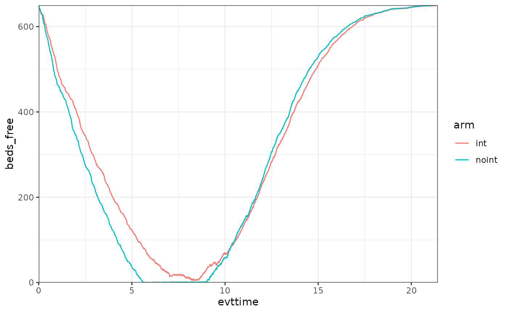
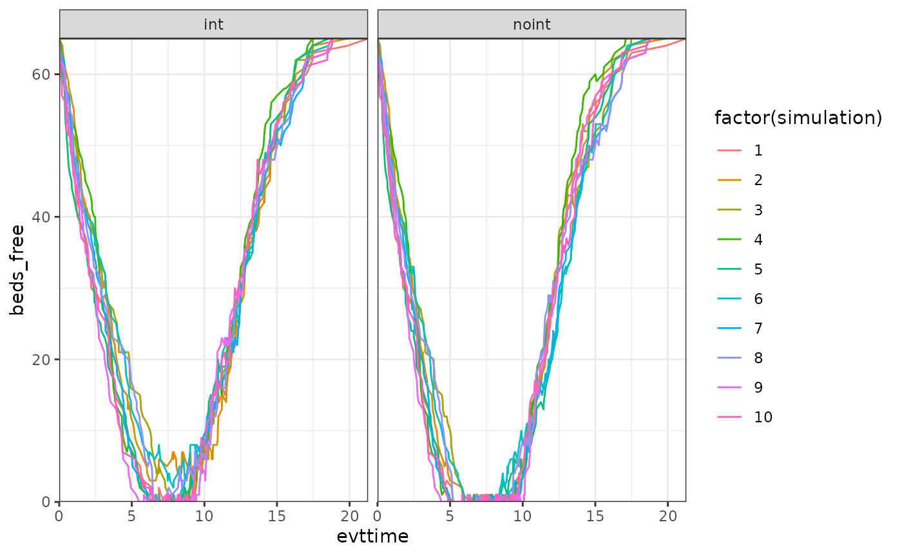

# Example for a Resource Constrained Sick-Sicker-Dead model

## Introduction

This document runs a discrete event simulation model in the context of a
late oncology model to show how the functions can be used to generate a
model in only a few steps. In this particular case, we document how to
run a model with constrained resources.

### Main options

``` r
library(WARDEN)

library(dplyr)
#> 
#> Attaching package: 'dplyr'
#> The following objects are masked from 'package:stats':
#> 
#>     filter, lag
#> The following objects are masked from 'package:base':
#> 
#>     intersect, setdiff, setequal, union
library(ggplot2)
library(kableExtra)
#> 
#> Attaching package: 'kableExtra'
#> The following object is masked from 'package:dplyr':
#> 
#>     group_rows
library(purrr)
```

``` r
options(scipen = 999)
options(digits=3)
options(tibble.print_max = 50)
```

## General inputs with delayed execution

Compared to the standard sick-sicker-death model vignette, here nothing
changes, except that now we add a resource which will be constrained (in
a discrete manner, i.e., it accepts an integer amount of units and the
resource can only be used unit-wise, like hospital beds, or doctors).

We should be careful about where we put the constrained resource, as the
level at which we set it up will determine its availability to patients.
Normally the intention is to have the resource being shared within an
arm by patients (and cloned across arms to make sure we compare apples
to apples), which means the resource should be allocated in
`common_all_inputs` (as those inputs will be cloned per arm, so they
will not be shared across arms unless explicitly declared so using the
specific constrained objects like
[`resource_discrete()`](https://jsanchezalv.github.io/WARDEN/reference/resource_discrete.md)
or
[`shared_input()`](https://jsanchezalv.github.io/WARDEN/reference/shared_input.md)).
In our case, we call the resource `beds`, and we use
[`resource_discrete()`](https://jsanchezalv.github.io/WARDEN/reference/resource_discrete.md)
to set 650 beds to be shared. We also keep track of the number of beds
free for the purpose of seeing it in the results.

For the sake of an example, we also create a shared input that we will
be updating as a counter of patients as they go through the simulation,
to showcase how inputs can be shared. Objects that are not defined in
[`resource_discrete()`](https://jsanchezalv.github.io/WARDEN/reference/resource_discrete.md)
or `shared_inputs()` will not be shared, and hard copies will be made
(unless the user introduces objects which are environments, in which
case by their own nature they will be modified by reference, so they
will be shared across analyses, simulations, arms, and patients, so
their use is not really recommended except for advanced R users).

Because of the way the constrained simulation works, it is very
important to pre-define any random numbers that will be used before the
simulation executes (normally at the `unique_pt_inputs` level, though
depends on the case, see below for an exception and the early breast
cancer model for the norm), and not to call the “r” functions
([`rexp()`](https://rdrr.io/r/stats/Exponential.html),
[`rpois()`](https://rdrr.io/r/stats/Poisson.html)…) in the event
reactions. This is because the random state of the model will change as
it goes over the model, and the nature of the loop makes it so that the
random states can be mixed between patients between one simulation and
another if an event TTE is altered so its position in the queue changes
from one simulation to another. This is also very important if we want
to compare outcomes using constrained = FALSE and constrained = TRUE (as
in constrained = FALSE the random state is patient specific and can be
tracked, but in constrained is much harder to do so or would violate
CRAN norms).

``` r
#We don't need to use sensitivity_inputs here, so we don't add that object

#Put objects here that do not change on any patient or intervention loop
#We use add_item and add_item to showcase how the user can implement the inputs (either works, add_item is just faster)
common_all_inputs <-add_item(input = {
                      util.sick   <- 0.8
                      util.sicker <- 0.5
                      cost.sick   <- 3000
                      cost.sicker <- 7000
                      cost.int    <- 1000
                      coef_noint  <- log(0.2)
                      HR_int      <- 0.8
                      drc         <- 0.035 #different values than what's assumed by default
                      drq         <- 0.035
                      random_seed_sicker_i <- sample.int(100000,npats,replace = FALSE)
                      beds <- resource_discrete(650) #initialized with 650 beds
                      beds_free <- beds$n_free() #extract current n_free
                      shared_accumulator <- shared_input(0) #initialized at 0
                      value_accum <- shared_accumulator$value() #extract value
})  


#Put objects here that do not change as we loop through treatments for a patient
common_pt_inputs <- add_item(death= max(0.0000001,rnorm(n=1, mean=12, sd=3))) 

#Put objects here that change as we loop through treatments for each patient (e.g. events can affect fl.tx, but events do not affect nat.os.s)
unique_pt_inputs <- add_item(fl.sick = 1,
                             q_default = util.sick,
                             c_default = cost.sick + if(arm=="int"){cost.int}else{0},
                             success_blocking_bed = FALSE,
                             had_to_queue = 0,
                             time_in_queue = NA,
                             time_start_queue = NA) 
```

## Events

### Add Initial Events

Nothing changes here relative to the standard approach.

``` r
init_event_list <- 
  add_tte(arm=c("noint","int"), evts = c("sick","sicker","death") ,input={
    sick <- 0
    sicker <- draw_tte(1,dist="exp", coef1=coef_noint, beta_tx = ifelse(arm=="int",HR_int,1), seed = random_seed_sicker_i[i]) #this way the value would be the same if it wasn't for the HR, effectively "cloning" patients luck
    
  })
```

### Add Reaction to Those Events

We will assume that when the patients enter the sicker event, they
attempt to use one of the beds. If they do so, everything goes as
normal. If they fail to use one of the beds, the time to death is
accelerated as they cannot get the right treatment.

The discrete resources work similarly to R6 objects, i.e., we call
functions from themselves (in this case, `beds$attempt_block()` as
opposed to what would be a traditional approach `attempt_block(beds)`),
and they automatically modify the `beds` object without needing to
return anything. An advantage of using R6-like objects is that we can
also make them return something to the user (as well as keep modifying
themselves!). In this case, `attempt_block` will return `TRUE` or
`FALSE` depending on the success or failure of using the resource.

If the patient fails to block the bed, then the time to death is
accelerated by a factor of 0.8. Note that because resources are shared,
we can 1) know who the next patient in the queue is, and 2) create a new
event for that specific patient, even if the current patient being
evaluated is another.

Once a patient reaches the sicker state (or dies), the resource is freed
(if being used)/ the patient is removed from the queue (using
`attempt_free()`) and we set the event time for the next patient in the
queue to use.

We are also tracking a few things just to keep track of them, like free
beds count, time in a queue for patients who queued, and also whether
the patient had to queue or not.

``` r
evt_react_list <-
  add_reactevt(name_evt = "sick",
               input = {
                 shared_accumulator <- shared_accumulator$modify(shared_accumulator$value() + 1)
                 value_accum <- shared_accumulator$value()
                 beds_free <- beds$n_free()
                 time_in_queue <- NA
               }) %>%
  add_reactevt(name_evt = "sicker",
               input = {
                 success_blocking_bed <- beds$attempt_block()
                 beds_free <- beds$n_free()
                 if(!success_blocking_bed){
                   time_start_queue <- curtime
                   modify_event(c(death = max(curtime,get_event("death") * 0.8)))
                   had_to_queue <- 1
                 }else{
                   time_in_queue <- ifelse(had_to_queue == 1, curtime - time_start_queue,NA)
                 }
                 q_default <- util.sicker
                 c_default <- cost.sicker + if(arm=="int"){cost.int}else{0}
                 fl.sick   <- 0 
               }) %>%
  add_reactevt(name_evt = "death",
               input = {
                 beds$attempt_free() #remove from using or from the queue
                 if(success_blocking_bed & beds$queue_size() > 0){
                    new_event(c(sicker = curtime),
                               cur_evtlist,
                               patient_id = beds$next_patient_in_line())
                 }
                 success_blocking_bed <- FALSE
                 time_in_queue <- NA
                 beds_free <- beds$n_free()
                 q_default <- 0
                 c_default <- 0
                 curtime   <- Inf
               }) 
```

## Costs and Utilities

### Utilities

``` r

util_ongoing <- "q_default"
```

### Costs

``` r

cost_ongoing <- "c_default"
```

## Model

### Model Execution

The model is executed in exactly the same way as before, but we just
need to add `constrained = TRUE` to the arguments of `run_sim`.

``` r
#Logic is: per patient, per intervention, per event, react to that event.
results <- run_sim(  
  npats=1000,                               # number of patients to be simulated
  n_sim=1,                                  # number of simulations to run
  psa_bool = FALSE,                         # use PSA or not. If n_sim > 1 and psa_bool = FALSE, then difference in outcomes is due to sampling (number of pats simulated)  
  arm_list = c("int", "noint"),             # intervention list
  common_all_inputs = common_all_inputs,    # inputs common that do not change within a simulation
  common_pt_inputs = common_pt_inputs,      # inputs that change within a simulation but are not affected by the intervention
  unique_pt_inputs = unique_pt_inputs,
  init_event_list = init_event_list,        # initial event list
  evt_react_list = evt_react_list,          # reaction of events
  util_ongoing_list = util_ongoing,
  cost_ongoing_list = cost_ongoing,
  constrained = TRUE,
  ipd = 1,
  input_out = c("beds_free","had_to_queue","time_in_queue","value_accum")
)
#> Analysis number: 1
#> Simulation number: 1
#> Time to run simulation 1: 1.21s
#> Time to run analysis 1: 1.21s
#> Total time to run: 1.21s
#> Simulation finalized;
```

## Post-processing of Model Outputs

### Summary of Results

``` r


summary_results_det(results[[1]][[1]]) #print first simulation
#>                        int    noint
#> costs             58978.88 50094.68
#> dcosts                0.00  8884.20
#> lys                   9.72     9.48
#> dlys                  0.00     0.24
#> qalys                 6.27     5.96
#> dqalys                0.00     0.31
#> ICER                    NA 37160.24
#> ICUR                    NA 28856.67
#> INMB                    NA  6509.47
#> costs_undisc      74324.03 62968.98
#> dcosts_undisc         0.00 11355.04
#> lys_undisc           11.99    11.63
#> dlys_undisc           0.00     0.36
#> qalys_undisc          7.62     7.20
#> dqalys_undisc         0.00     0.41
#> ICER_undisc             NA 31720.16
#> ICUR_undisc             NA 27387.61
#> INMB_undisc             NA  9375.22
#> beds_free           261.50   241.64
#> dbeds_free            0.00    19.87
#> c_default         58978.88 50094.68
#> dc_default            0.00  8884.20
#> c_default_undisc  74324.03 62968.98
#> dc_default_undisc     0.00 11355.04
#> had_to_queue          0.00     0.15
#> dhad_to_queue         0.00    -0.15
#> q_default             6.27     5.96
#> dq_default            0.00     0.31
#> q_default_undisc      7.62     7.20
#> dq_default_undisc     0.00     0.41
#> time_in_queue          NaN      NaN
#> dtime_in_queue         NaN      NaN
#> value_accum         500.50   500.50
#> dvalue_accum          0.00     0.00

psa_ipd <- bind_rows(map(results[[1]], "merged_df")) 

psa_ipd[1:10,] %>%
  kable() %>%
  kable_styling(bootstrap_options = c("striped", "hover", "condensed", "responsive"))
```

| evtname | evttime | prevtime | pat_id | arm | total_lys | total_qalys | total_costs | total_costs_undisc | total_qalys_undisc | total_lys_undisc |    lys | qalys | costs | lys_undisc | qalys_undisc | costs_undisc | beds_free | had_to_queue | time_in_queue | value_accum | c_default | q_default | c_default_undisc | q_default_undisc | nexttime | simulation | sensitivity |
|:--------|--------:|---------:|-------:|:----|----------:|------------:|------------:|-------------------:|-------------------:|-----------------:|-------:|------:|------:|-----------:|-------------:|-------------:|----------:|-------------:|--------------:|------------:|----------:|----------:|-----------------:|-----------------:|---------:|-----------:|------------:|
| sick    |   0.000 |    0.000 |      1 | int |     10.34 |        8.27 |       41358 |              51112 |              10.22 |            12.78 | 10.339 | 8.272 | 41358 |     12.778 |       10.222 |        51112 |       650 |            0 |            NA |           1 |     41358 |     8.272 |            51112 |           10.222 |   12.778 |          1 |           1 |
| death   |  12.778 |    0.000 |      1 | int |     10.34 |        8.27 |       41358 |              51112 |              10.22 |            12.78 |  0.000 | 0.000 |     0 |      0.000 |        0.000 |            0 |       313 |            0 |            NA |           1 |         0 |     0.000 |                0 |            0.000 |   12.778 |          1 |           1 |
| sick    |   0.000 |    0.000 |      2 | int |      7.75 |        4.14 |       58485 |              68551 |               4.78 |             9.02 |  0.887 | 0.710 |  3549 |      0.901 |        0.721 |         3604 |       650 |            0 |            NA |           2 |      3549 |     0.710 |             3604 |            0.721 |    0.901 |          1 |           1 |
| sicker  |   0.901 |    0.000 |      2 | int |      7.75 |        4.14 |       58485 |              68551 |               4.78 |             9.02 |  6.867 | 3.434 | 54937 |      8.118 |        4.059 |        64947 |       521 |            0 |            NA |           2 |     54937 |     3.434 |            64947 |            4.059 |    9.019 |          1 |           1 |
| death   |   9.019 |    0.901 |      2 | int |      7.75 |        4.14 |       58485 |              68551 |               4.78 |             9.02 |  0.000 | 0.000 |     0 |      0.000 |        0.000 |            0 |        32 |            0 |            NA |           2 |         0 |     0.000 |                0 |            0.000 |    9.019 |          1 |           1 |
| sick    |   0.000 |    0.000 |      3 | int |     10.94 |        5.57 |       86287 |             108582 |               6.96 |            13.73 |  0.317 | 0.253 |  1266 |      0.318 |        0.255 |         1273 |       650 |            0 |            NA |           3 |      1266 |     0.253 |             1273 |            0.255 |    0.318 |          1 |           1 |
| sicker  |   0.318 |    0.000 |      3 | int |     10.94 |        5.57 |       86287 |             108582 |               6.96 |            13.73 | 10.628 | 5.314 | 85020 |     13.414 |        6.707 |       107309 |       609 |            0 |            NA |           3 |     85020 |     5.314 |           107309 |            6.707 |   13.732 |          1 |           1 |
| death   |  13.732 |    0.318 |      3 | int |     10.94 |        5.57 |       86287 |             108582 |               6.96 |            13.73 |  0.000 | 0.000 |     0 |      0.000 |        0.000 |            0 |       405 |            0 |            NA |           3 |         0 |     0.000 |                0 |            0.000 |   13.732 |          1 |           1 |
| sick    |   0.000 |    0.000 |      4 | int |      8.61 |        5.24 |       56449 |              68546 |               6.10 |            10.22 |  3.116 | 2.493 | 12463 |      3.296 |        2.637 |        13183 |       650 |            0 |            NA |           4 |     12463 |     2.493 |            13183 |            2.637 |    3.296 |          1 |           1 |
| sicker  |   3.296 |    0.000 |      4 | int |      8.61 |        5.24 |       56449 |              68546 |               6.10 |            10.22 |  5.498 | 2.749 | 43986 |      6.920 |        3.460 |        55363 |       266 |            0 |            NA |           4 |     43986 |     2.749 |            55363 |            3.460 |   10.216 |          1 |           1 |

We can also check the evolution of the free beds over time per arm. As
it can be seen, 650 beds is just enough for the `int` arm to handle all
the requests, however in the `noint` arm there are a few patients which
must queue for some time. Note that the same thing we do to see the
number of free beds could be used to understand the % of patients that
were able to use a bed, etc. WARDEN is flexible in that sense, one just
needs to keep track of those numbers. For example, below we can see that
around 15% of the `noint` patients had to queue at a certain point. We
can also track things like queuing time, etc. In this case, for these
15% of patients, the average queuing time was around 9 months.



    #> Warning: Removed 1883 rows containing non-finite outside the scale range
    #> (`stat_bin()`).


## Sensitivity Analysis

### Run model with constrained = FALSE

It can be seen that with `constrained = FALSE`, the results are
equivalent to the SSD standard vignette. Furthermore, if the model is
run with constrained = TRUE but in such a way that the constraint does
not bind (e.g., with 1000+ beds) then the results are also equivalent.
If the model is run with `constrained = FALSE`, then shared inputs and
resources are no longer shared. This allows to very quickly evaluate how
the model outputs change when resources are constrained vs. when they
are not.

``` r
#Logic is: per patient, per intervention, per event, react to that event.
results <- run_sim(  
  npats=1000,                               # number of patients to be simulated
  n_sim=1,                                  # number of simulations to run
  psa_bool = FALSE,                         # use PSA or not. If n_sim > 1 and psa_bool = FALSE, then difference in outcomes is due to sampling (number of pats simulated)  
  arm_list = c("int", "noint"),             # intervention list
  common_all_inputs = common_all_inputs,    # inputs common that do not change within a simulation
  common_pt_inputs = common_pt_inputs,      # inputs that change within a simulation but are not affected by the intervention
  unique_pt_inputs = unique_pt_inputs,
  init_event_list = init_event_list,        # initial event list
  evt_react_list = evt_react_list,          # reaction of events
  util_ongoing_list = util_ongoing,
  cost_ongoing_list = cost_ongoing,
  constrained = FALSE,
  ipd = 1,
  input_out = c("beds_free","had_to_queue","time_in_queue")
)
#> Analysis number: 1
#> Simulation number: 1
#> Time to run simulation 1: 0.81s
#> Time to run analysis 1: 0.81s
#> Total time to run: 0.81s
#> Simulation finalized;

summary_results_det(results[[1]][[1]]) #print first simulation
#>                        int    noint
#> costs             58978.88 51768.23
#> dcosts                0.00  7210.66
#> lys                   9.72     9.72
#> dlys                  0.00     0.00
#> qalys                 6.27     6.08
#> dqalys                0.00     0.19
#> ICER                    NA      Inf
#> ICUR                    NA 38286.46
#> INMB                    NA  2206.06
#> costs_undisc      74324.03 65474.81
#> dcosts_undisc         0.00  8849.22
#> lys_undisc           11.99    11.99
#> dlys_undisc           0.00     0.00
#> qalys_undisc          7.62     7.38
#> dqalys_undisc         0.00     0.24
#> ICER_undisc             NA      Inf
#> ICUR_undisc             NA 37557.56
#> INMB_undisc             NA  2931.65
#> beds_free           650.00   650.00
#> dbeds_free            0.00     0.00
#> c_default         58978.88 51768.23
#> dc_default            0.00  7210.66
#> c_default_undisc  74324.03 65474.81
#> dc_default_undisc     0.00  8849.22
#> had_to_queue          0.00     0.00
#> dhad_to_queue         0.00     0.00
#> q_default             6.27     6.08
#> dq_default            0.00     0.19
#> q_default_undisc      7.62     7.38
#> dq_default_undisc     0.00     0.24
```

### Run model constrained but unbinding

If the model is run with `constrainted = TRUE` but in such a way that
the constraint does not bind (e.g., with 1000+ beds) then the results
are also equivalent to `constrained = FALSE`.

``` r
common_all_inputs <-add_item(input = {
                      util.sick   <- 0.8
                      util.sicker <- 0.5
                      cost.sick   <- 3000
                      cost.sicker <- 7000
                      cost.int    <- 1000
                      coef_noint  <- log(0.2)
                      HR_int      <- 0.8
                      drc         <- 0.035 #different values than what's assumed by default
                      drq         <- 0.035
                      random_seed_sicker_i <- sample.int(100000,npats,replace = FALSE)
                      beds <- resource_discrete(1000)
                      beds_free <- beds$n_free()
                      shared_accumulator <- shared_input(0)
                      value_accum <- shared_accumulator$value()
})  

#Logic is: per patient, per intervention, per event, react to that event.
results <- run_sim(  
  npats=1000,                               # number of patients to be simulated
  n_sim=1,                                  # number of simulations to run
  psa_bool = FALSE,                         # use PSA or not. If n_sim > 1 and psa_bool = FALSE, then difference in outcomes is due to sampling (number of pats simulated)  
  arm_list = c("int", "noint"),             # intervention list
  common_all_inputs = common_all_inputs,    # inputs common that do not change within a simulation
  common_pt_inputs = common_pt_inputs,      # inputs that change within a simulation but are not affected by the intervention
  unique_pt_inputs = unique_pt_inputs,
  init_event_list = init_event_list,        # initial event list
  evt_react_list = evt_react_list,          # reaction of events
  util_ongoing_list = util_ongoing,
  cost_ongoing_list = cost_ongoing,
  constrained = TRUE,
  ipd = 1,
  input_out = c("beds_free","had_to_queue","time_in_queue")
)
#> Analysis number: 1
#> Simulation number: 1
#> Time to run simulation 1: 0.81s
#> Time to run analysis 1: 0.81s
#> Total time to run: 0.82s
#> Simulation finalized;

summary_results_det(results[[1]][[1]]) #print first simulation
#>                        int    noint
#> costs             58978.88 51768.23
#> dcosts                0.00  7210.66
#> lys                   9.72     9.72
#> dlys                  0.00     0.00
#> qalys                 6.27     6.08
#> dqalys                0.00     0.19
#> ICER                    NA      Inf
#> ICUR                    NA 38286.46
#> INMB                    NA  2206.06
#> costs_undisc      74324.03 65474.81
#> dcosts_undisc         0.00  8849.22
#> lys_undisc           11.99    11.99
#> dlys_undisc           0.00     0.00
#> qalys_undisc          7.62     7.38
#> dqalys_undisc         0.00     0.24
#> ICER_undisc             NA      Inf
#> ICUR_undisc             NA 37557.56
#> INMB_undisc             NA  2931.65
#> beds_free           611.50   576.97
#> dbeds_free            0.00    34.53
#> c_default         58978.88 51768.23
#> dc_default            0.00  7210.66
#> c_default_undisc  74324.03 65474.81
#> dc_default_undisc     0.00  8849.22
#> had_to_queue          0.00     0.00
#> dhad_to_queue         0.00     0.00
#> q_default             6.27     6.08
#> dq_default            0.00     0.19
#> q_default_undisc      7.62     7.38
#> dq_default_undisc     0.00     0.24
```

### Inputs

``` r
#Load some data
list_par <- list(parameter_name = list("util.sick","util.sicker","cost.sick","cost.sicker","cost.int","coef_noint","HR_int"),
                              base_value = list(0.8,0.5,3000,7000,1000,log(0.2),0.8),
                              DSA_min = list(0.6,0.3,1000,5000,800,log(0.1),0.5),
                              DSA_max = list(0.9,0.7,5000,9000,2000,log(0.4),0.9),
                              PSA_dist = list("rnorm","rbeta_mse","rgamma_mse","rgamma_mse","rgamma_mse","rnorm","rlnorm"),
                              a=list(0.8,0.5,3000,7000,1000,log(0.2),log(0.8)),
                              b=lapply(list(0.8,0.5,3000,7000,1000,log(0.2),log(0.8)), function(x) abs(x/5)),
                              scenario_1=list(0.6,0.3,1000,5000,800,log(0.1),0.5),
                              scenario_2=list(0.9,0.7,5000,9000,2000,log(0.4),0.9)
                              )

sensitivity_inputs <-add_item(
            indicators = if(sensitivity_bool){ create_indicators(sens,n_sensitivity*length(sensitivity_names),rep(1,length(list_par[[1]])))}else{
                                rep(1,length(list_par[[1]]))} #vector of indicators, value 0 everywhere except at sens, where it takes value 1 (for dsa_min and dsa_max, if not sensitivity analysis, then we activate all of them, i.e., in a PSA)
                              )

common_all_inputs <- add_item(
            pick_val_v(base        = list_par[["base_value"]],
                       psa         = pick_psa(list_par[["PSA_dist"]],rep(1,length(list_par[["PSA_dist"]])),list_par[["a"]],list_par[["b"]]),
                       sens        = list_par[[sens_name_used]],
                       psa_ind     = psa_bool,
                       sens_ind    = sensitivity_bool,
                       indicator   = indicators,
                       names_out   = list_par[["parameter_name"]]
                       )
            ) %>%
  add_item(input = {
    random_seed_sicker_i = sample(1:1000,1000,replace = FALSE) #we don't add this variable to the sensitivity analysis
    beds <- resource_discrete(1000)
    beds_free <- beds$n_free()
    shared_accumulator <- shared_input(0)
    value_accum <- shared_accumulator$value()
    }) 
```

### Model Execution

The model is executed as before, just adding the `sensitivity_inputs`,
`sensitivity_names`, `sensitivity_bool` and `n_sensitivity` arguments.
Note that the total number of sensitivity iterations is given not by
n_sensitivity, but by n_sensitivity \* length(sensitivity_names), so in
this case it will be 2 x n_sensitivity, or 2 x 7 = 14. For two scenario
analysis it would be 2 x 1 = 2, with the `indicators` variable defined
in the previous section taking value 1 for all the variables altered in
the scenario, and 0 otherwise.

``` r
results <- run_sim(  
  npats=100,                               # number of patients to be simulated
  n_sim=1,                                  # number of simulations to run
  psa_bool = FALSE,                         # use PSA or not. If n_sim > 1 and psa_bool = FALSE, then difference in outcomes is due to sampling (number of pats simulated)  
  arm_list = c("int", "noint"),             # intervention list
  common_all_inputs = common_all_inputs,    # inputs common that do not change within a simulation
  common_pt_inputs = common_pt_inputs,      # inputs that change within a simulation but are not affected by the intervention
  unique_pt_inputs = unique_pt_inputs,      # inputs that change within a simulation between interventions
  init_event_list = init_event_list,        # initial event list
  evt_react_list = evt_react_list,          # reaction of events
  util_ongoing_list = util_ongoing,
  cost_ongoing_list = cost_ongoing,
  sensitivity_inputs = sensitivity_inputs,
  sensitivity_names = c("DSA_min","DSA_max"),
  sensitivity_bool = TRUE,
  constrained = TRUE,
  n_sensitivity = length(list_par[[1]]),
  input_out = unlist(list_par[["parameter_name"]])
)
#> Analysis number: 1
#> Simulation number: 1
#> Time to run simulation 1: 0.15s
#> Time to run analysis 1: 0.15s
#> Analysis number: 2
#> Simulation number: 1
#> Time to run simulation 1: 0.24s
#> Time to run analysis 2: 0.24s
#> Analysis number: 3
#> Simulation number: 1
#> Time to run simulation 1: 0.15s
#> Time to run analysis 3: 0.15s
#> Analysis number: 4
#> Simulation number: 1
#> Time to run simulation 1: 0.17s
#> Time to run analysis 4: 0.17s
#> Analysis number: 5
#> Simulation number: 1
#> Time to run simulation 1: 0.17s
#> Time to run analysis 5: 0.17s
#> Analysis number: 6
#> Simulation number: 1
#> Time to run simulation 1: 0.15s
#> Time to run analysis 6: 0.15s
#> Analysis number: 7
#> Simulation number: 1
#> Time to run simulation 1: 0.16s
#> Time to run analysis 7: 0.16s
#> Analysis number: 8
#> Simulation number: 1
#> Time to run simulation 1: 0.36s
#> Time to run analysis 8: 0.36s
#> Analysis number: 9
#> Simulation number: 1
#> Time to run simulation 1: 0.14s
#> Time to run analysis 9: 0.15s
#> Analysis number: 10
#> Simulation number: 1
#> Time to run simulation 1: 0.14s
#> Time to run analysis 10: 0.14s
#> Analysis number: 11
#> Simulation number: 1
#> Time to run simulation 1: 0.15s
#> Time to run analysis 11: 0.15s
#> Analysis number: 12
#> Simulation number: 1
#> Time to run simulation 1: 0.14s
#> Time to run analysis 12: 0.14s
#> Analysis number: 13
#> Simulation number: 1
#> Time to run simulation 1: 0.15s
#> Time to run analysis 13: 0.15s
#> Analysis number: 14
#> Simulation number: 1
#> Time to run simulation 1: 0.16s
#> Time to run analysis 14: 0.16s
#> Total time to run: 2.44s
#> Simulation finalized;
```

### Check results

We briefly check below that indeed the engine has been changing the
corresponding parameter value.

``` r

data_sensitivity <- bind_rows(map_depth(results,2, "merged_df"))

#Check mean value across iterations as PSA is off
data_sensitivity %>% group_by(sensitivity) %>% summarise_at(c("util.sick","util.sicker","cost.sick","cost.sicker","cost.int","coef_noint","HR_int"),mean)
#> # A tibble: 14 × 8
#>    sensitivity util.sick util.sicker cost.sick cost.sicker cost.int coef_noint
#>          <int>     <dbl>       <dbl>     <dbl>       <dbl>    <dbl>      <dbl>
#>  1           1       0.6         0.5      3000        7000     1000      -1.61
#>  2           2       0.8         0.3      3000        7000     1000      -1.61
#>  3           3       0.8         0.5      1000        7000     1000      -1.61
#>  4           4       0.8         0.5      3000        5000     1000      -1.61
#>  5           5       0.8         0.5      3000        7000      800      -1.61
#>  6           6       0.8         0.5      3000        7000     1000      -2.30
#>  7           7       0.8         0.5      3000        7000     1000      -1.61
#>  8           8       0.8         0.5      3000        7000     1000      -1.61
#>  9           9       0.8         0.5      3000        7000     1000      -1.61
#> 10          10       0.8         0.5      3000        7000     1000      -1.61
#> 11          11       0.8         0.5      3000        7000     1000      -1.61
#> 12          12       0.8         0.5      3000        7000     1000      -1.61
#> 13          13       0.8         0.5      3000        7000     1000      -1.61
#> 14          14       0.8         0.5      3000        7000     1000      -1.61
#> # ℹ 1 more variable: HR_int <dbl>
```

### Model Execution, probabilistic DSA

The model is executed as before, just activating the psa_bool option

``` r
results <- run_sim(  
  npats=100,                               
  n_sim=6,                                  
  psa_bool = TRUE,                         
  arm_list = c("int", "noint"),             
  common_all_inputs = common_all_inputs,    
  common_pt_inputs = common_pt_inputs,      
  unique_pt_inputs = unique_pt_inputs,      
  init_event_list = init_event_list,        
  evt_react_list = evt_react_list,          
  util_ongoing_list = util_ongoing,
  cost_ongoing_list = cost_ongoing,
  sensitivity_inputs = sensitivity_inputs,
  sensitivity_names = c("DSA_min","DSA_max"),
  sensitivity_bool = TRUE,
  constrained = TRUE,
  n_sensitivity = length(list_par[[1]]),
  input_out = c(unlist(list_par[["parameter_name"]]), "beds_free")
)
#> Analysis number: 1
#> Simulation number: 1
#> Time to run simulation 1: 0.15s
#> Simulation number: 2
#> Time to run simulation 2: 0.16s
#> Simulation number: 3
#> Time to run simulation 3: 0.15s
#> Simulation number: 4
#> Time to run simulation 4: 0.15s
#> Simulation number: 5
#> Time to run simulation 5: 0.15s
#> Simulation number: 6
#> Time to run simulation 6: 0.16s
#> Time to run analysis 1: 0.92s
#> Analysis number: 2
#> Simulation number: 1
#> Time to run simulation 1: 0.14s
#> Simulation number: 2
#> Time to run simulation 2: 0.16s
#> Simulation number: 3
#> Time to run simulation 3: 0.15s
#> Simulation number: 4
#> Time to run simulation 4: 0.14s
#> Simulation number: 5
#> Time to run simulation 5: 0.15s
#> Simulation number: 6
#> Time to run simulation 6: 0.16s
#> Time to run analysis 2: 0.92s
#> Analysis number: 3
#> Simulation number: 1
#> Time to run simulation 1: 0.15s
#> Simulation number: 2
#> Time to run simulation 2: 0.16s
#> Simulation number: 3
#> Time to run simulation 3: 0.16s
#> Simulation number: 4
#> Time to run simulation 4: 0.15s
#> Simulation number: 5
#> Time to run simulation 5: 0.15s
#> Simulation number: 6
#> Time to run simulation 6: 0.15s
#> Time to run analysis 3: 0.92s
#> Analysis number: 4
#> Simulation number: 1
#> Time to run simulation 1: 0.15s
#> Simulation number: 2
#> Time to run simulation 2: 0.15s
#> Simulation number: 3
#> Time to run simulation 3: 0.15s
#> Simulation number: 4
#> Time to run simulation 4: 0.16s
#> Simulation number: 5
#> Time to run simulation 5: 0.14s
#> Simulation number: 6
#> Time to run simulation 6: 0.15s
#> Time to run analysis 4: 0.91s
#> Analysis number: 5
#> Simulation number: 1
#> Time to run simulation 1: 0.16s
#> Simulation number: 2
#> Time to run simulation 2: 0.16s
#> Simulation number: 3
#> Time to run simulation 3: 0.14s
#> Simulation number: 4
#> Time to run simulation 4: 0.16s
#> Simulation number: 5
#> Time to run simulation 5: 0.15s
#> Simulation number: 6
#> Time to run simulation 6: 0.21s
#> Time to run analysis 5: 0.98s
#> Analysis number: 6
#> Simulation number: 1
#> Time to run simulation 1: 0.15s
#> Simulation number: 2
#> Time to run simulation 2: 0.16s
#> Simulation number: 3
#> Time to run simulation 3: 0.14s
#> Simulation number: 4
#> Time to run simulation 4: 0.16s
#> Simulation number: 5
#> Time to run simulation 5: 0.16s
#> Simulation number: 6
#> Time to run simulation 6: 0.15s
#> Time to run analysis 6: 0.91s
#> Analysis number: 7
#> Simulation number: 1
#> Time to run simulation 1: 0.17s
#> Simulation number: 2
#> Time to run simulation 2: 0.16s
#> Simulation number: 3
#> Time to run simulation 3: 0.15s
#> Simulation number: 4
#> Time to run simulation 4: 0.17s
#> Simulation number: 5
#> Time to run simulation 5: 0.16s
#> Simulation number: 6
#> Time to run simulation 6: 0.15s
#> Time to run analysis 7: 0.96s
#> Analysis number: 8
#> Simulation number: 1
#> Time to run simulation 1: 0.16s
#> Simulation number: 2
#> Time to run simulation 2: 0.16s
#> Simulation number: 3
#> Time to run simulation 3: 0.15s
#> Simulation number: 4
#> Time to run simulation 4: 0.16s
#> Simulation number: 5
#> Time to run simulation 5: 0.16s
#> Simulation number: 6
#> Time to run simulation 6: 0.15s
#> Time to run analysis 8: 0.94s
#> Analysis number: 9
#> Simulation number: 1
#> Time to run simulation 1: 0.16s
#> Simulation number: 2
#> Time to run simulation 2: 0.16s
#> Simulation number: 3
#> Time to run simulation 3: 0.16s
#> Simulation number: 4
#> Time to run simulation 4: 0.16s
#> Simulation number: 5
#> Time to run simulation 5: 0.16s
#> Simulation number: 6
#> Time to run simulation 6: 0.16s
#> Time to run analysis 9: 0.97s
#> Analysis number: 10
#> Simulation number: 1
#> Time to run simulation 1: 0.16s
#> Simulation number: 2
#> Time to run simulation 2: 0.16s
#> Simulation number: 3
#> Time to run simulation 3: 0.21s
#> Simulation number: 4
#> Time to run simulation 4: 0.17s
#> Simulation number: 5
#> Time to run simulation 5: 0.18s
#> Simulation number: 6
#> Time to run simulation 6: 0.18s
#> Time to run analysis 10: 1.05s
#> Analysis number: 11
#> Simulation number: 1
#> Time to run simulation 1: 0.15s
#> Simulation number: 2
#> Time to run simulation 2: 0.18s
#> Simulation number: 3
#> Time to run simulation 3: 0.19s
#> Simulation number: 4
#> Time to run simulation 4: 0.16s
#> Simulation number: 5
#> Time to run simulation 5: 0.17s
#> Simulation number: 6
#> Time to run simulation 6: 0.16s
#> Time to run analysis 11: 1.02s
#> Analysis number: 12
#> Simulation number: 1
#> Time to run simulation 1: 0.16s
#> Simulation number: 2
#> Time to run simulation 2: 0.17s
#> Simulation number: 3
#> Time to run simulation 3: 0.15s
#> Simulation number: 4
#> Time to run simulation 4: 0.18s
#> Simulation number: 5
#> Time to run simulation 5: 0.17s
#> Simulation number: 6
#> Time to run simulation 6: 0.16s
#> Time to run analysis 12: 0.99s
#> Analysis number: 13
#> Simulation number: 1
#> Time to run simulation 1: 0.18s
#> Simulation number: 2
#> Time to run simulation 2: 0.18s
#> Simulation number: 3
#> Time to run simulation 3: 0.15s
#> Simulation number: 4
#> Time to run simulation 4: 0.18s
#> Simulation number: 5
#> Time to run simulation 5: 0.18s
#> Simulation number: 6
#> Time to run simulation 6: 0.16s
#> Time to run analysis 13: 1.03s
#> Analysis number: 14
#> Simulation number: 1
#> Time to run simulation 1: 0.18s
#> Simulation number: 2
#> Time to run simulation 2: 0.21s
#> Simulation number: 3
#> Time to run simulation 3: 0.16s
#> Simulation number: 4
#> Time to run simulation 4: 0.19s
#> Simulation number: 5
#> Time to run simulation 5: 0.18s
#> Simulation number: 6
#> Time to run simulation 6: 0.16s
#> Time to run analysis 14: 1.09s
#> Total time to run: 13.62s
#> Simulation finalized;
```

### Check results

We briefly check below that indeed the engine has been changing the
corresponding parameter value. As expected, `beds_free` is only affected
by the `HR_int` and `coef_noint`, as those affect efficacy and therefore
how beds are allocated.

``` r

data_sensitivity <- bind_rows(map_depth(results,2, "merged_df"))

#Check mean value across iterations as PSA is off
data_sensitivity %>% group_by(sensitivity) %>% summarise_at(c("util.sick","util.sicker","cost.sick","cost.sicker","cost.int","coef_noint","HR_int", "beds_free"),mean)
#> # A tibble: 14 × 9
#>    sensitivity util.sick util.sicker cost.sick cost.sicker cost.int coef_noint
#>          <int>     <dbl>       <dbl>     <dbl>       <dbl>    <dbl>      <dbl>
#>  1           1     0.6         0.580     3156.       7974.    1061.      -1.61
#>  2           2     0.722       0.3       3156.       7974.    1061.      -1.61
#>  3           3     0.722       0.580     1000        7974.    1061.      -1.61
#>  4           4     0.722       0.580     3156.       5000     1061.      -1.61
#>  5           5     0.722       0.580     3156.       7974.     800       -1.61
#>  6           6     0.725       0.579     3140.       7957.    1065.      -2.30
#>  7           7     0.722       0.580     3155.       7973.    1061.      -1.62
#>  8           8     0.722       0.580     3156.       7974.    1061.      -1.61
#>  9           9     0.722       0.580     3156.       7974.    1061.      -1.61
#> 10          10     0.722       0.580     3156.       7974.    1061.      -1.61
#> 11          11     0.722       0.580     3156.       7974.    1061.      -1.61
#> 12          12     0.722       0.580     3156.       7974.    1061.      -1.61
#> 13          13     0.722       0.580     3156.       7974.    1061.      -1.61
#> 14          14     0.722       0.580     3156.       7974.    1061.      -1.61
#> # ℹ 2 more variables: HR_int <dbl>, beds_free <dbl>
```

### Model Execution, Simple PSA

The model is executed as before, just activating the psa_bool option and
deactivating the `sensitivity_bool` and removing sensitivity_names and
setting `n_sensitivity = 1`

``` r
common_all_inputs <-add_item(input = {
                      util.sick   <- 0.8
                      util.sicker <- 0.5
                      cost.sick   <- 3000
                      cost.sicker <- 7000
                      cost.int    <- 1000
                      coef_noint  <- log(0.2)
                      HR_int      <- 0.8
                      drc         <- 0.035 #different values than what's assumed by default
                      drq         <- 0.035
                      random_seed_sicker_i <- sample.int(100000,npats,replace = FALSE)
                      beds <- resource_discrete(65)
                      beds_free <- beds$n_free()
                      shared_accumulator <- shared_input(0)
                      value_accum <- shared_accumulator$value()
                      
})  


results <- run_sim(  
  npats=100,                               
  n_sim=10,                                  
  psa_bool = TRUE,                         
  arm_list = c("int", "noint"),             
  common_all_inputs = common_all_inputs,    
  common_pt_inputs = common_pt_inputs,      
  unique_pt_inputs = unique_pt_inputs,      
  init_event_list = init_event_list,        
  evt_react_list = evt_react_list,          
  util_ongoing_list = util_ongoing,
  cost_ongoing_list = cost_ongoing,
  sensitivity_inputs = sensitivity_inputs,
  sensitivity_bool = FALSE,
  constrained = TRUE,
  n_sensitivity = 1,
  input_out = c(unlist(list_par[["parameter_name"]]), "beds_free")
)
#> Analysis number: 1
#> Simulation number: 1
#> Time to run simulation 1: 0.15s
#> Simulation number: 2
#> Time to run simulation 2: 0.15s
#> Simulation number: 3
#> Time to run simulation 3: 0.15s
#> Simulation number: 4
#> Time to run simulation 4: 0.15s
#> Simulation number: 5
#> Time to run simulation 5: 0.15s
#> Simulation number: 6
#> Time to run simulation 6: 0.14s
#> Simulation number: 7
#> Time to run simulation 7: 0.15s
#> Simulation number: 8
#> Time to run simulation 8: 0.16s
#> Simulation number: 9
#> Time to run simulation 9: 0.15s
#> Simulation number: 10
#> Time to run simulation 10: 0.16s
#> Time to run analysis 1: 1.52s
#> Total time to run: 1.52s
#> Simulation finalized;
```

### Check results

We briefly check below that indeed the engine has been changing the
corresponding parameter values, and see how the `free_beds` has been
changing over time per simulation.

``` r

data_simulation <- bind_rows(map_depth(results,2, "merged_df"))

#Check mean value across iterations as PSA is off
data_simulation %>% group_by(simulation) %>% summarise_at(c("util.sick","util.sicker","cost.sick","cost.sicker","cost.int","coef_noint","HR_int", "beds_free"),mean)
#> # A tibble: 10 × 9
#>    simulation util.sick util.sicker cost.sick cost.sicker cost.int coef_noint
#>         <int>     <dbl>       <dbl>     <dbl>       <dbl>    <dbl>      <dbl>
#>  1          1       0.8         0.5      3000        7000     1000      -1.61
#>  2          2       0.8         0.5      3000        7000     1000      -1.61
#>  3          3       0.8         0.5      3000        7000     1000      -1.61
#>  4          4       0.8         0.5      3000        7000     1000      -1.61
#>  5          5       0.8         0.5      3000        7000     1000      -1.61
#>  6          6       0.8         0.5      3000        7000     1000      -1.61
#>  7          7       0.8         0.5      3000        7000     1000      -1.61
#>  8          8       0.8         0.5      3000        7000     1000      -1.61
#>  9          9       0.8         0.5      3000        7000     1000      -1.61
#> 10         10       0.8         0.5      3000        7000     1000      -1.61
#> # ℹ 2 more variables: HR_int <dbl>, beds_free <dbl>

ggplot(data_simulation,aes(x=evttime,y=beds_free, col = factor(simulation))) +
  facet_wrap(arm~.) + 
  geom_line()+
  scale_y_continuous(expand = c(0, 0)) +
  scale_x_continuous(expand = c(0, 0)) +
  theme_bw()
```


