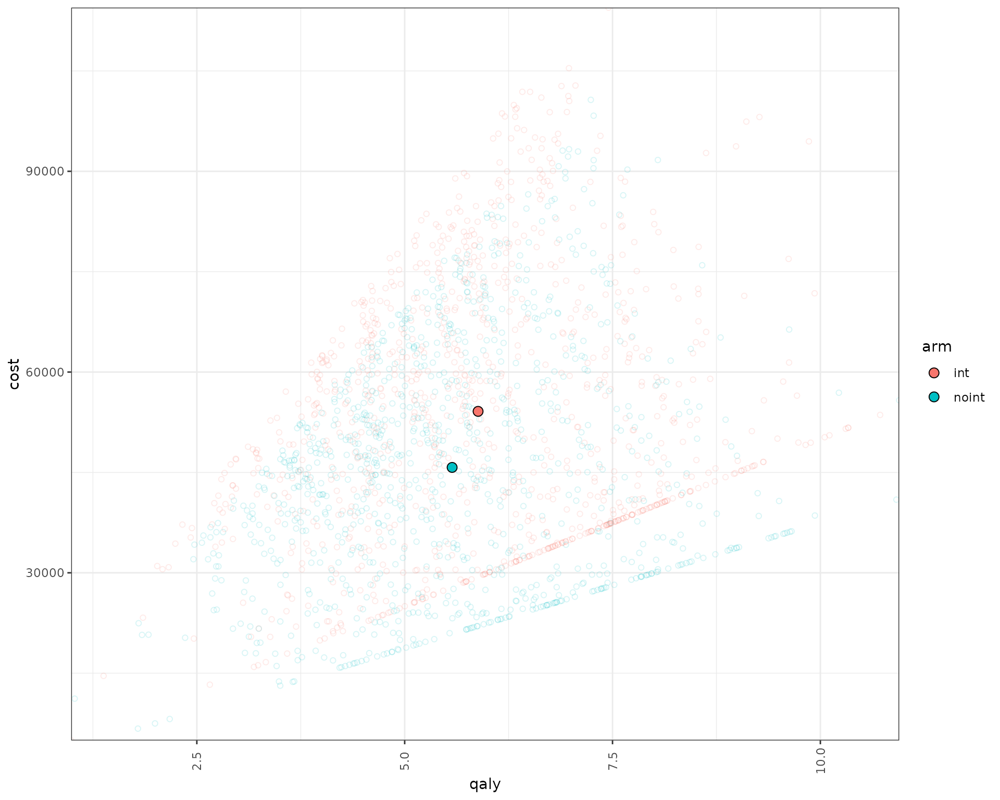

# Example for a Sick-Sicker-Dead model - Random Number Streams & Luck Adjustment

## Introduction

This document runs a discrete event simulation model in the context of a
late oncology model to show how the random stream functions can be used
to generate a model using random numbers in quick steps.

### Main options

``` r
library(WARDEN)

library(dplyr)
#> 
#> Attaching package: 'dplyr'
#> The following objects are masked from 'package:stats':
#> 
#>     filter, lag
#> The following objects are masked from 'package:base':
#> 
#>     intersect, setdiff, setequal, union
library(ggplot2)
library(kableExtra)
#> 
#> Attaching package: 'kableExtra'
#> The following object is masked from 'package:dplyr':
#> 
#>     group_rows
library(purrr)
```

``` r
options(scipen = 999)
options(digits=3)
options(tibble.print_max = 50)
```

## General inputs with delayed execution

We generate random stream of numbers using the
[`random_stream()`](https://jsanchezalv.github.io/WARDEN/reference/random_stream.md)
function, which generates a stream of (in this case) 100 random numbers
to be used for specific objects, so as to ensure clarity and to make
sure each object follows its own random stream of numbers.

``` r
#We don't need to use sensitivity_inputs here, so we don't add that object

#Put objects here that do not change on any patient or intervention loop
common_all_inputs <-add_item(
                      util.sick = 0.8,
                      util.sicker = 0.5,
                      cost.sick = 3000,
                      cost.sicker = 7000,
                      cost.int = 1000,
                      coef_noint = log(0.2),
                      HR_int = 0.8,
                      drc = 0.035, #different values than what's assumed by default
                      drq = 0.035) #different values than what's assumed by default


#Put objects here that do not change as we loop through treatments for a patient
common_pt_inputs <- add_item(input = {
  rnd_stream_a <- random_stream(100) #arbitrary amount of random numbers to be used, should be >= max number of calls that use that random number (e.g., if item/event A requires 5 random numbers due to repeated calls, then at least 5 numbers should be generated )
  rnd_stream_b <- random_stream(100)
  common_luck <- runif(1)
  fl.sick  <- 1
  q_default  <- util.sick
  })

#Put objects here that change as we loop through treatments for each patient (e.g. events can affect fl.tx, but events do not affect nat.os.s)
unique_pt_inputs <- add_item(c_default = cost.sick + if(arm=="int"){cost.int}else{0}) 
```

## Events

### Add Initial Events

We pull a value from the random stream using `draw_n()` function from
the random stream object `rnd_stream_a` in a similar way to what we
would do with R6 objects. This will automatically pull a value and
remove it from the pending list of random numbers, so the next time we
call that function it will provide a new number, saving a few lines of
code in which we would need to assign the value (e.g.,
`rnd_used_a <- vector_of_random_values[1]; vector_of_random_values <- vector_of_random_values[-1]`)
reducing the risk of human mistakes + making the code clearer.

``` r
init_event_list <- 
  add_tte(arm=c("noint","int"), evts = c("sick","sicker","death") ,input={ 
    sick <- 0
    sicker <- qexp(rnd_stream_a$draw_n(),exp(coef_noint + ifelse(arm=="int",log(HR_int),0))) #use draw_n to automatically use the random number and update it in rnd_stream_a
    death <-  max(0.0000001,qnorm(rnd_stream_b$draw_n(), mean=12, sd=3))
  })
```

### Add Reaction to Those Events

We use in this case a luck adjustment as we update the death time to
event using the
[`luck_adj()`](https://jsanchezalv.github.io/WARDEN/reference/luck_adj.md)
function. The parameters go from mean 12 to 10, and sd from 3 to 2, so
we update the currently used random number (obtained through `random_n`
and then we redraw the time to event.

``` r
evt_react_list <-
  add_reactevt(name_evt = "sick",
               input = {}) %>%
  add_reactevt(name_evt = "sicker",
               input = {
                 q_default <- util.sicker
                 c_default <- cost.sicker + if(arm=="int"){cost.int}else{0}
                 fl.sick <- 0 
                 
                 #We perform a luck adjustment randomly but being slightly more likely in the "noint" arm
                 if((common_luck + ifelse(arm=="noint", 0.1,0) ) >0.7){
                    rnd_stream_b$random_n <- luck_adj(prevsurv = 1 - pnorm(q=curtime,12,3),
                                                      cursurv = 1 - pnorm(q=curtime,8,2),
                                                      luck = rnd_stream_b$random_n,
                                                      condq = FALSE)
                    modify_event(c(
                      death = max(curtime,qnorm(rnd_stream_b$random_n, mean=8, sd=2))
                    ))
                    }
                 
                 
               }) %>%
  add_reactevt(name_evt = "death",
               input = {
                 q_default <- 0
                 c_default <- 0
                 curtime <- Inf
               }) 
```

## Costs and Utilities

Costs and utilities are introduced below. However, it’s worth noting
that the model is able to run without costs or utilities.

Utilities/Costs/Other outputs are defined by declaring which object
belongs to utilities/costs/other outputs, and whether they need to be
discounted continuously or discretely (instantaneous). These will be
passed to the
[`run_sim()`](https://jsanchezalv.github.io/WARDEN/reference/run_sim.md)
function.

### Utilities

``` r

util_ongoing <- "q_default"
```

### Costs

``` r

cost_ongoing <- "c_default"
```

## Model

### Model Execution

``` r
#Logic is: per patient, per intervention, per event, react to that event.
results <- run_sim(  
  npats=1000,                               # number of patients to be simulated
  n_sim=1,                                  # number of simulations to run
  psa_bool = FALSE,                         # use PSA or not. If n_sim > 1 and psa_bool = FALSE, then difference in outcomes is due to sampling (number of pats simulated)  
  arm_list = c("int", "noint"),             # intervention list
  common_all_inputs = common_all_inputs,    # inputs common that do not change within a simulation
  common_pt_inputs = common_pt_inputs,      # inputs that change within a simulation but are not affected by the intervention
  unique_pt_inputs = unique_pt_inputs,      # inputs that change within a simulation between interventions
  init_event_list = init_event_list,        # initial event list
  evt_react_list = evt_react_list,          # reaction of events
  util_ongoing_list = util_ongoing,
  cost_ongoing_list = cost_ongoing,
  ipd = 1
)
#> Analysis number: 1
#> Simulation number: 1
#> Time to run simulation 1: 0.95s
#> Time to run analysis 1: 0.95s
#> Total time to run: 0.95s
#> Simulation finalized;
```

## Post-processing of Model Outputs

### Summary of Results

``` r


summary_results_det(results[[1]][[1]]) #print first simulation
#>                        int    noint
#> costs             54126.08 45747.63
#> dcosts                0.00  8378.44
#> lys                   9.04     8.78
#> dlys                  0.00     0.26
#> qalys                 5.88     5.57
#> dqalys                0.00     0.31
#> ICER                    NA 32688.17
#> ICUR                    NA 26833.80
#> INMB                    NA  7233.29
#> costs_undisc      67095.76 56588.86
#> dcosts_undisc         0.00 10506.90
#> lys_undisc           10.99    10.63
#> dlys_undisc           0.00     0.37
#> qalys_undisc          7.06     6.65
#> dqalys_undisc         0.00     0.41
#> ICER_undisc             NA 28765.37
#> ICUR_undisc             NA 25578.19
#> INMB_undisc             NA 10031.89
#> c_default         54126.08 45747.63
#> dc_default            0.00  8378.44
#> c_default_undisc  67095.76 56588.86
#> dc_default_undisc     0.00 10506.90
#> q_default             5.88     5.57
#> dq_default            0.00     0.31
#> q_default_undisc      7.06     6.65
#> dq_default_undisc     0.00     0.41

summary_results_sim(results[[1]])
#>                                       int                   noint
#> costs             54,126 (54,126; 54,126) 45,748 (45,748; 45,748)
#> dcosts                           0 (0; 0)    8,378 (8,378; 8,378)
#> lys                     9.04 (9.04; 9.04)       8.78 (8.78; 8.78)
#> dlys                             0 (0; 0)    0.256 (0.256; 0.256)
#> qalys                   5.88 (5.88; 5.88)       5.57 (5.57; 5.57)
#> dqalys                           0 (0; 0)    0.312 (0.312; 0.312)
#> ICER                         NaN (NA; NA) 32,688 (32,688; 32,688)
#> ICUR                         NaN (NA; NA) 26,834 (26,834; 26,834)
#> INMB                         NaN (NA; NA)    7,233 (7,233; 7,233)
#> costs_undisc      67,096 (67,096; 67,096) 56,589 (56,589; 56,589)
#> dcosts_undisc                    0 (0; 0) 10,507 (10,507; 10,507)
#> lys_undisc                    11 (11; 11)       10.6 (10.6; 10.6)
#> dlys_undisc                      0 (0; 0)    0.365 (0.365; 0.365)
#> qalys_undisc            7.06 (7.06; 7.06)       6.65 (6.65; 6.65)
#> dqalys_undisc                    0 (0; 0)    0.411 (0.411; 0.411)
#> ICER_undisc                  NaN (NA; NA) 28,765 (28,765; 28,765)
#> ICUR_undisc                  NaN (NA; NA) 25,578 (25,578; 25,578)
#> INMB_undisc                  NaN (NA; NA) 10,032 (10,032; 10,032)
#> c_default         54,126 (54,126; 54,126) 45,748 (45,748; 45,748)
#> dc_default                       0 (0; 0)    8,378 (8,378; 8,378)
#> c_default_undisc  67,096 (67,096; 67,096) 56,589 (56,589; 56,589)
#> dc_default_undisc                0 (0; 0) 10,507 (10,507; 10,507)
#> q_default               5.88 (5.88; 5.88)       5.57 (5.57; 5.57)
#> dq_default                       0 (0; 0)    0.312 (0.312; 0.312)
#> q_default_undisc        7.06 (7.06; 7.06)       6.65 (6.65; 6.65)
#> dq_default_undisc                0 (0; 0)    0.411 (0.411; 0.411)

summary_results_sens(results)
#>        arm analysis analysis_name          variable                   value
#>     <char>    <int>        <char>            <fctr>                  <char>
#>  1:    int        1                           costs 54,126 (54,126; 54,126)
#>  2:  noint        1                           costs 45,748 (45,748; 45,748)
#>  3:    int        1                          dcosts                0 (0; 0)
#>  4:  noint        1                          dcosts    8,378 (8,378; 8,378)
#>  5:    int        1                             lys       9.04 (9.04; 9.04)
#>  6:  noint        1                             lys       8.78 (8.78; 8.78)
#>  7:    int        1                            dlys                0 (0; 0)
#>  8:  noint        1                            dlys    0.256 (0.256; 0.256)
#>  9:    int        1                           qalys       5.88 (5.88; 5.88)
#> 10:  noint        1                           qalys       5.57 (5.57; 5.57)
#> 11:    int        1                          dqalys                0 (0; 0)
#> 12:  noint        1                          dqalys    0.312 (0.312; 0.312)
#> 13:    int        1                            ICER            NaN (NA; NA)
#> 14:  noint        1                            ICER 32,688 (32,688; 32,688)
#> 15:    int        1                            ICUR            NaN (NA; NA)
#> 16:  noint        1                            ICUR 26,834 (26,834; 26,834)
#> 17:    int        1                            INMB            NaN (NA; NA)
#> 18:  noint        1                            INMB    7,233 (7,233; 7,233)
#> 19:    int        1                    costs_undisc 67,096 (67,096; 67,096)
#> 20:  noint        1                    costs_undisc 56,589 (56,589; 56,589)
#> 21:    int        1                   dcosts_undisc                0 (0; 0)
#> 22:  noint        1                   dcosts_undisc 10,507 (10,507; 10,507)
#> 23:    int        1                      lys_undisc             11 (11; 11)
#> 24:  noint        1                      lys_undisc       10.6 (10.6; 10.6)
#> 25:    int        1                     dlys_undisc                0 (0; 0)
#> 26:  noint        1                     dlys_undisc    0.365 (0.365; 0.365)
#> 27:    int        1                    qalys_undisc       7.06 (7.06; 7.06)
#> 28:  noint        1                    qalys_undisc       6.65 (6.65; 6.65)
#> 29:    int        1                   dqalys_undisc                0 (0; 0)
#> 30:  noint        1                   dqalys_undisc    0.411 (0.411; 0.411)
#> 31:    int        1                     ICER_undisc            NaN (NA; NA)
#> 32:  noint        1                     ICER_undisc 28,765 (28,765; 28,765)
#> 33:    int        1                     ICUR_undisc            NaN (NA; NA)
#> 34:  noint        1                     ICUR_undisc 25,578 (25,578; 25,578)
#> 35:    int        1                     INMB_undisc            NaN (NA; NA)
#> 36:  noint        1                     INMB_undisc 10,032 (10,032; 10,032)
#> 37:    int        1                       c_default 54,126 (54,126; 54,126)
#> 38:  noint        1                       c_default 45,748 (45,748; 45,748)
#> 39:    int        1                      dc_default                0 (0; 0)
#> 40:  noint        1                      dc_default    8,378 (8,378; 8,378)
#> 41:    int        1                c_default_undisc 67,096 (67,096; 67,096)
#> 42:  noint        1                c_default_undisc 56,589 (56,589; 56,589)
#> 43:    int        1               dc_default_undisc                0 (0; 0)
#> 44:  noint        1               dc_default_undisc 10,507 (10,507; 10,507)
#> 45:    int        1                       q_default       5.88 (5.88; 5.88)
#> 46:  noint        1                       q_default       5.57 (5.57; 5.57)
#> 47:    int        1                      dq_default                0 (0; 0)
#> 48:  noint        1                      dq_default    0.312 (0.312; 0.312)
#> 49:    int        1                q_default_undisc       7.06 (7.06; 7.06)
#> 50:  noint        1                q_default_undisc       6.65 (6.65; 6.65)
#> 51:    int        1               dq_default_undisc                0 (0; 0)
#> 52:  noint        1               dq_default_undisc    0.411 (0.411; 0.411)
#>        arm analysis analysis_name          variable                   value

psa_ipd <- bind_rows(map(results[[1]], "merged_df")) 

psa_ipd[1:10,] %>%
  kable() %>%
  kable_styling(bootstrap_options = c("striped", "hover", "condensed", "responsive"))
```

| evtname | evttime | prevtime | pat_id | arm | total_lys | total_qalys | total_costs | total_costs_undisc | total_qalys_undisc | total_lys_undisc |  lys | qalys | costs | lys_undisc | qalys_undisc | costs_undisc | c_default | q_default | c_default_undisc | q_default_undisc | nexttime | simulation | sensitivity |
|:--------|--------:|---------:|-------:|:----|----------:|------------:|------------:|-------------------:|-------------------:|-----------------:|-----:|------:|------:|-----------:|-------------:|-------------:|----------:|----------:|-----------------:|-----------------:|---------:|-----------:|------------:|
| sick    |    0.00 |     0.00 |      1 | int |      10.3 |        6.69 |       61100 |              78079 |               8.05 |             12.6 | 5.23 | 4.182 | 20910 |       5.76 |        4.610 |        23052 |     20910 |     4.182 |            23052 |            4.610 |     5.76 |          1 |           1 |
| sicker  |    5.76 |     0.00 |      1 | int |      10.3 |        6.69 |       61100 |              78079 |               8.05 |             12.6 | 5.02 | 2.512 | 40189 |       6.88 |        3.439 |        55028 |     40189 |     2.512 |            55028 |            3.439 |    12.64 |          1 |           1 |
| death   |   12.64 |     5.76 |      1 | int |      10.3 |        6.69 |       61100 |              78079 |               8.05 |             12.6 | 0.00 | 0.000 |     0 |       0.00 |        0.000 |            0 |         0 |     0.000 |                0 |            0.000 |    12.64 |          1 |           1 |
| sick    |    0.00 |     0.00 |      2 | int |      10.9 |        5.75 |       82612 |             104438 |               7.13 |             13.6 | 1.07 | 0.857 |  4285 |       1.09 |        0.873 |         4365 |      4285 |     0.857 |             4365 |            0.873 |     1.09 |          1 |           1 |
| sicker  |    1.09 |     0.00 |      2 | int |      10.9 |        5.75 |       82612 |             104438 |               7.13 |             13.6 | 9.79 | 4.895 | 78327 |      12.51 |        6.255 |       100073 |     78327 |     4.895 |           100073 |            6.255 |    13.60 |          1 |           1 |
| death   |   13.60 |     1.09 |      2 | int |      10.9 |        5.75 |       82612 |             104438 |               7.13 |             13.6 | 0.00 | 0.000 |     0 |       0.00 |        0.000 |            0 |         0 |     0.000 |                0 |            0.000 |    13.60 |          1 |           1 |
| sick    |    0.00 |     0.00 |      3 | int |      11.4 |        7.79 |       63583 |              84281 |               9.62 |             14.5 | 6.93 | 5.543 | 27714 |       7.92 |        6.332 |        31658 |     27714 |     5.543 |            31658 |            6.332 |     7.92 |          1 |           1 |
| sicker  |    7.92 |     0.00 |      3 | int |      11.4 |        7.79 |       63583 |              84281 |               9.62 |             14.5 | 4.48 | 2.242 | 35869 |       6.58 |        3.289 |        52622 |     35869 |     2.242 |            52622 |            3.289 |    14.49 |          1 |           1 |
| death   |   14.49 |     7.92 |      3 | int |      11.4 |        7.79 |       63583 |              84281 |               9.62 |             14.5 | 0.00 | 0.000 |     0 |       0.00 |        0.000 |            0 |         0 |     0.000 |                0 |            0.000 |    14.49 |          1 |           1 |
| sick    |    0.00 |     0.00 |      4 | int |      12.4 |        6.77 |       91212 |             120927 |               8.67 |             16.1 | 1.95 | 1.560 |  7802 |       2.02 |        1.615 |         8076 |      7802 |     1.560 |             8076 |            1.615 |     2.02 |          1 |           1 |

We can check what has been the absolute number of events per strategy.

| arm   | evtname |    n |
|:------|:--------|-----:|
| int   | death   | 1000 |
| int   | sick    | 1000 |
| int   | sicker  |  839 |
| noint | death   | 1000 |
| noint | sick    | 1000 |
| noint | sicker  |  893 |

### Plots

We now use the data output to plot the histograms/densities of the
simulation.

``` r

data_plot <- results[[1]][[1]]$merged_df %>%
  filter(evtname != "sick") %>%
  group_by(arm,evtname,simulation) %>%
  mutate(median = median(evttime)) %>%
  ungroup()

ggplot(data_plot) +
  geom_density(aes(fill = arm, x = evttime),
               alpha = 0.7) +
  geom_vline(aes(xintercept=median,col=arm)) +
  facet_wrap( ~ evtname, scales = "free") +
  scale_y_continuous(expand = c(0, 0)) +
  scale_x_continuous(expand = c(0, 0)) +
  theme_bw()
```


We can also plot the patient level incremental QALY/costs.

``` r

data_qaly_cost<- psa_ipd[,.SD[1],by=.(pat_id,arm,simulation)][,.(arm,qaly=total_qalys,cost=total_costs,pat_id,simulation)]
data_qaly_cost[,ps_id:=paste(pat_id,simulation,sep="_")]


mean_data_qaly_cost <- data_qaly_cost %>% group_by(arm) %>% summarise(across(where(is.numeric),mean))

ggplot(data_qaly_cost,aes(x=qaly, y = cost, col = arm)) + 
  geom_point(alpha=0.15,shape = 21) +
  geom_point(data=mean_data_qaly_cost, aes(x=qaly, y = cost, fill = arm), shape = 21,col="black",size=3) +
  scale_y_continuous(expand = c(0, 0)) +
  scale_x_continuous(expand = c(0, 0)) +
  theme_bw()+
  theme(axis.text.x = element_text(angle = 90, vjust = .5))
```



## Sensitivity Analysis

### Inputs

We leave `common_pt_inputs` untouched, as those should not change per
sensitivity analysis to ensure results are fully comparable across
simulations and analyses.

``` r
#Load some data
df_par <- list(parameter_name = c("util.sick","util.sicker","cost.sick","cost.sicker","cost.int","coef_noint","HR_int"),
                              base_value = c(0.8,0.5,3000,7000,1000,log(0.2),0.8),
                              DSA_min = c(0.6,0.3,1000,5000,800,log(0.1),0.5),
                              DSA_max = c(0.9,0.7,5000,9000,2000,log(0.4),0.9),
                              PSA_dist = c("rnorm","rbeta_mse","rgamma_mse","rgamma_mse","rgamma_mse","rnorm","rlnorm"),
                              a = list(0.8,0.5,3000,7000,1000,log(0.2),log(0.8)),
                              b = lapply(list(0.8,0.5,3000,7000,1000,log(0.2),log(0.8)), function(x) abs(x/10)),
                              scenario_1=c(0.6,0.3,1000,5000,800,log(0.1),0.5),
                              scenario_2=c(0.9,0.7,5000,9000,2000,log(0.4),0.9)
                              )

sensitivity_inputs <-add_item(
            pos_indicator = sens - n_sensitivity*floor((sens-1)/n_sensitivity), # which position to use to put the value 1 in indicator
            indicators = append(rep(0, length(df_par$parameter_name))[-pos_indicator],1,pos_indicator-1) #vector of indicators, value 0 everywhere except at sens, where it takes value 1
                              )

common_all_inputs <-add_item(
            pick_val_v(base        = df_par[["base_value"]],
                       psa         = pick_psa(df_par[["PSA_dist"]],rep(1,length(df_par[["PSA_dist"]])),df_par[["a"]],df_par[["b"]]),
                       sens        = df_par[[sens_name_used]],
                       psa_ind     = psa_bool,
                       sens_ind    = sensitivity_bool,
                       indicator   = indicators,
                       names_out   = df_par[["parameter_name"]]
                       )
            )
```

### Model Execution

``` r
results <- run_sim(  
  npats=100,                               # number of patients to be simulated
  n_sim=1,                                  # number of simulations to run
  psa_bool = FALSE,                         # use PSA or not. If n_sim > 1 and psa_bool = FALSE, then difference in outcomes is due to sampling (number of pats simulated)  
  arm_list = c("int", "noint"),             # intervention list
  common_all_inputs = common_all_inputs,    # inputs common that do not change within a simulation
  common_pt_inputs = common_pt_inputs,      # inputs that change within a simulation but are not affected by the intervention
  unique_pt_inputs = unique_pt_inputs,      # inputs that change within a simulation between interventions
  init_event_list = init_event_list,        # initial event list
  evt_react_list = evt_react_list,          # reaction of events
  util_ongoing_list = util_ongoing,
  cost_ongoing_list = cost_ongoing,
  sensitivity_inputs = sensitivity_inputs,
  sensitivity_names = c("DSA_min","DSA_max"),
  sensitivity_bool = TRUE,
  n_sensitivity = length(df_par$parameter_name),
  input_out = c(df_par[["parameter_name"]])
)
#> Analysis number: 1
#> Simulation number: 1
#> Time to run simulation 1: 0.13s
#> Time to run analysis 1: 0.13s
#> Analysis number: 2
#> Simulation number: 1
#> Time to run simulation 1: 0.13s
#> Time to run analysis 2: 0.13s
#> Analysis number: 3
#> Simulation number: 1
#> Time to run simulation 1: 0.13s
#> Time to run analysis 3: 0.13s
#> Analysis number: 4
#> Simulation number: 1
#> Time to run simulation 1: 0.14s
#> Time to run analysis 4: 0.14s
#> Analysis number: 5
#> Simulation number: 1
#> Time to run simulation 1: 0.13s
#> Time to run analysis 5: 0.13s
#> Analysis number: 6
#> Simulation number: 1
#> Time to run simulation 1: 0.13s
#> Time to run analysis 6: 0.13s
#> Analysis number: 7
#> Simulation number: 1
#> Time to run simulation 1: 0.13s
#> Time to run analysis 7: 0.13s
#> Analysis number: 8
#> Simulation number: 1
#> Time to run simulation 1: 0.14s
#> Time to run analysis 8: 0.14s
#> Analysis number: 9
#> Simulation number: 1
#> Time to run simulation 1: 0.13s
#> Time to run analysis 9: 0.13s
#> Analysis number: 10
#> Simulation number: 1
#> Time to run simulation 1: 0.34s
#> Time to run analysis 10: 0.34s
#> Analysis number: 11
#> Simulation number: 1
#> Time to run simulation 1: 0.13s
#> Time to run analysis 11: 0.13s
#> Analysis number: 12
#> Simulation number: 1
#> Time to run simulation 1: 0.12s
#> Time to run analysis 12: 0.12s
#> Analysis number: 13
#> Simulation number: 1
#> Time to run simulation 1: 0.13s
#> Time to run analysis 13: 0.13s
#> Analysis number: 14
#> Simulation number: 1
#> Time to run simulation 1: 0.12s
#> Time to run analysis 14: 0.12s
#> Total time to run: 2.06s
#> Simulation finalized;
```

### Check results

We briefly check below that indeed the engine has been changing the
corresponding parameter value.

``` r

data_sensitivity <- bind_rows(map_depth(results,2, "merged_df"))

#Check mean value across iterations as PSA is off
data_sensitivity %>% group_by(sensitivity) %>% summarise_at(c("util.sick","util.sicker","cost.sick","cost.sicker","cost.int","coef_noint","HR_int"),mean)
#> # A tibble: 14 × 8
#>    sensitivity util.sick util.sicker cost.sick cost.sicker cost.int coef_noint
#>          <int>     <dbl>       <dbl>     <dbl>       <dbl>    <dbl>      <dbl>
#>  1           1       0.6         0.5      3000        7000     1000     -1.61 
#>  2           2       0.8         0.3      3000        7000     1000     -1.61 
#>  3           3       0.8         0.5      1000        7000     1000     -1.61 
#>  4           4       0.8         0.5      3000        5000     1000     -1.61 
#>  5           5       0.8         0.5      3000        7000      800     -1.61 
#>  6           6       0.8         0.5      3000        7000     1000     -2.30 
#>  7           7       0.8         0.5      3000        7000     1000     -1.61 
#>  8           8       0.9         0.5      3000        7000     1000     -1.61 
#>  9           9       0.8         0.7      3000        7000     1000     -1.61 
#> 10          10       0.8         0.5      5000        7000     1000     -1.61 
#> 11          11       0.8         0.5      3000        9000     1000     -1.61 
#> 12          12       0.8         0.5      3000        7000     2000     -1.61 
#> 13          13       0.8         0.5      3000        7000     1000     -0.916
#> 14          14       0.8         0.5      3000        7000     1000     -1.61 
#> # ℹ 1 more variable: HR_int <dbl>
```

### Model Execution, probabilistic DSA

The model is executed as before, just activating the psa_bool option

``` r
results <- run_sim(  
  npats=100,                               
  n_sim=6,                                  
  psa_bool = TRUE,                         
  arm_list = c("int", "noint"),             
  common_all_inputs = common_all_inputs,    
  common_pt_inputs = common_pt_inputs,      
  unique_pt_inputs = unique_pt_inputs,      
  init_event_list = init_event_list,        
  evt_react_list = evt_react_list,          
  util_ongoing_list = util_ongoing,
  cost_ongoing_list = cost_ongoing,
  sensitivity_inputs = sensitivity_inputs,
  sensitivity_names = c("DSA_min","DSA_max"),
  sensitivity_bool = TRUE,
  n_sensitivity = length(df_par$parameter_name),
  input_out = c(df_par[["parameter_name"]])
)
#> Analysis number: 1
#> Simulation number: 1
#> Time to run simulation 1: 0.13s
#> Simulation number: 2
#> Time to run simulation 2: 0.12s
#> Simulation number: 3
#> Time to run simulation 3: 0.13s
#> Simulation number: 4
#> Time to run simulation 4: 0.12s
#> Simulation number: 5
#> Time to run simulation 5: 0.13s
#> Simulation number: 6
#> Time to run simulation 6: 0.13s
#> Time to run analysis 1: 0.78s
#> Analysis number: 2
#> Simulation number: 1
#> Time to run simulation 1: 0.13s
#> Simulation number: 2
#> Time to run simulation 2: 0.13s
#> Simulation number: 3
#> Time to run simulation 3: 0.12s
#> Simulation number: 4
#> Time to run simulation 4: 0.13s
#> Simulation number: 5
#> Time to run simulation 5: 0.13s
#> Simulation number: 6
#> Time to run simulation 6: 0.13s
#> Time to run analysis 2: 0.78s
#> Analysis number: 3
#> Simulation number: 1
#> Time to run simulation 1: 0.13s
#> Simulation number: 2
#> Time to run simulation 2: 0.13s
#> Simulation number: 3
#> Time to run simulation 3: 0.15s
#> Simulation number: 4
#> Time to run simulation 4: 0.13s
#> Simulation number: 5
#> Time to run simulation 5: 0.13s
#> Simulation number: 6
#> Time to run simulation 6: 0.13s
#> Time to run analysis 3: 0.81s
#> Analysis number: 4
#> Simulation number: 1
#> Time to run simulation 1: 0.14s
#> Simulation number: 2
#> Time to run simulation 2: 0.13s
#> Simulation number: 3
#> Time to run simulation 3: 0.14s
#> Simulation number: 4
#> Time to run simulation 4: 0.13s
#> Simulation number: 5
#> Time to run simulation 5: 0.14s
#> Simulation number: 6
#> Time to run simulation 6: 0.12s
#> Time to run analysis 4: 0.79s
#> Analysis number: 5
#> Simulation number: 1
#> Time to run simulation 1: 0.14s
#> Simulation number: 2
#> Time to run simulation 2: 0.13s
#> Simulation number: 3
#> Time to run simulation 3: 0.14s
#> Simulation number: 4
#> Time to run simulation 4: 0.13s
#> Simulation number: 5
#> Time to run simulation 5: 0.13s
#> Simulation number: 6
#> Time to run simulation 6: 0.14s
#> Time to run analysis 5: 0.81s
#> Analysis number: 6
#> Simulation number: 1
#> Time to run simulation 1: 0.12s
#> Simulation number: 2
#> Time to run simulation 2: 0.14s
#> Simulation number: 3
#> Time to run simulation 3: 0.12s
#> Simulation number: 4
#> Time to run simulation 4: 0.14s
#> Simulation number: 5
#> Time to run simulation 5: 0.13s
#> Simulation number: 6
#> Time to run simulation 6: 0.14s
#> Time to run analysis 6: 0.79s
#> Analysis number: 7
#> Simulation number: 1
#> Time to run simulation 1: 0.14s
#> Simulation number: 2
#> Time to run simulation 2: 0.13s
#> Simulation number: 3
#> Time to run simulation 3: 0.14s
#> Simulation number: 4
#> Time to run simulation 4: 0.13s
#> Simulation number: 5
#> Time to run simulation 5: 0.14s
#> Simulation number: 6
#> Time to run simulation 6: 0.13s
#> Time to run analysis 7: 0.81s
#> Analysis number: 8
#> Simulation number: 1
#> Time to run simulation 1: 0.14s
#> Simulation number: 2
#> Time to run simulation 2: 0.14s
#> Simulation number: 3
#> Time to run simulation 3: 0.13s
#> Simulation number: 4
#> Time to run simulation 4: 0.14s
#> Simulation number: 5
#> Time to run simulation 5: 0.14s
#> Simulation number: 6
#> Time to run simulation 6: 0.13s
#> Time to run analysis 8: 0.82s
#> Analysis number: 9
#> Simulation number: 1
#> Time to run simulation 1: 0.14s
#> Simulation number: 2
#> Time to run simulation 2: 0.14s
#> Simulation number: 3
#> Time to run simulation 3: 0.13s
#> Simulation number: 4
#> Time to run simulation 4: 0.17s
#> Simulation number: 5
#> Time to run simulation 5: 0.13s
#> Simulation number: 6
#> Time to run simulation 6: 0.14s
#> Time to run analysis 9: 0.86s
#> Analysis number: 10
#> Simulation number: 1
#> Time to run simulation 1: 0.13s
#> Simulation number: 2
#> Time to run simulation 2: 0.15s
#> Simulation number: 3
#> Time to run simulation 3: 0.14s
#> Simulation number: 4
#> Time to run simulation 4: 0.13s
#> Simulation number: 5
#> Time to run simulation 5: 0.14s
#> Simulation number: 6
#> Time to run simulation 6: 0.13s
#> Time to run analysis 10: 0.82s
#> Analysis number: 11
#> Simulation number: 1
#> Time to run simulation 1: 0.14s
#> Simulation number: 2
#> Time to run simulation 2: 0.13s
#> Simulation number: 3
#> Time to run simulation 3: 0.14s
#> Simulation number: 4
#> Time to run simulation 4: 0.13s
#> Simulation number: 5
#> Time to run simulation 5: 0.14s
#> Simulation number: 6
#> Time to run simulation 6: 0.14s
#> Time to run analysis 11: 0.84s
#> Analysis number: 12
#> Simulation number: 1
#> Time to run simulation 1: 0.13s
#> Simulation number: 2
#> Time to run simulation 2: 0.14s
#> Simulation number: 3
#> Time to run simulation 3: 0.13s
#> Simulation number: 4
#> Time to run simulation 4: 0.14s
#> Simulation number: 5
#> Time to run simulation 5: 0.14s
#> Simulation number: 6
#> Time to run simulation 6: 0.13s
#> Time to run analysis 12: 0.83s
#> Analysis number: 13
#> Simulation number: 1
#> Time to run simulation 1: 0.14s
#> Simulation number: 2
#> Time to run simulation 2: 0.14s
#> Simulation number: 3
#> Time to run simulation 3: 0.14s
#> Simulation number: 4
#> Time to run simulation 4: 0.17s
#> Simulation number: 5
#> Time to run simulation 5: 0.13s
#> Simulation number: 6
#> Time to run simulation 6: 0.15s
#> Time to run analysis 13: 0.88s
#> Analysis number: 14
#> Simulation number: 1
#> Time to run simulation 1: 0.14s
#> Simulation number: 2
#> Time to run simulation 2: 0.14s
#> Simulation number: 3
#> Time to run simulation 3: 0.14s
#> Simulation number: 4
#> Time to run simulation 4: 0.14s
#> Simulation number: 5
#> Time to run simulation 5: 0.14s
#> Simulation number: 6
#> Time to run simulation 6: 0.15s
#> Time to run analysis 14: 0.85s
#> Total time to run: 11.48s
#> Simulation finalized;
```

### Check results

We briefly check below that indeed the engine has been changing the
corresponding parameter value.

``` r

data_sensitivity <- bind_rows(map_depth(results,2, "merged_df"))

#Check mean value across iterations as PSA is off
data_sensitivity %>% group_by(sensitivity) %>% summarise_at(c("util.sick","util.sicker","cost.sick","cost.sicker","cost.int","coef_noint","HR_int"),mean)
#> # A tibble: 14 × 8
#>    sensitivity util.sick util.sicker cost.sick cost.sicker cost.int coef_noint
#>          <int>     <dbl>       <dbl>     <dbl>       <dbl>    <dbl>      <dbl>
#>  1           1     0.6         0.541     3069.       7509.    1035.     -1.61 
#>  2           2     0.762       0.3       3069.       7509.    1035.     -1.61 
#>  3           3     0.762       0.541     1000        7509.    1035.     -1.61 
#>  4           4     0.762       0.541     3069.       5000     1035.     -1.61 
#>  5           5     0.762       0.541     3069.       7509.     800      -1.61 
#>  6           6     0.762       0.541     3066.       7506.    1036.     -2.30 
#>  7           7     0.761       0.541     3070.       7510.    1035.     -1.61 
#>  8           8     0.9         0.541     3069.       7509.    1035.     -1.61 
#>  9           9     0.762       0.7       3069.       7509.    1035.     -1.61 
#> 10          10     0.762       0.541     5000        7509.    1035.     -1.61 
#> 11          11     0.762       0.541     3069.       9000     1035.     -1.61 
#> 12          12     0.762       0.541     3069.       7509.    2000      -1.61 
#> 13          13     0.762       0.541     3066.       7506.    1036.     -0.916
#> 14          14     0.762       0.541     3069.       7509.    1035.     -1.62 
#> # ℹ 1 more variable: HR_int <dbl>
```
