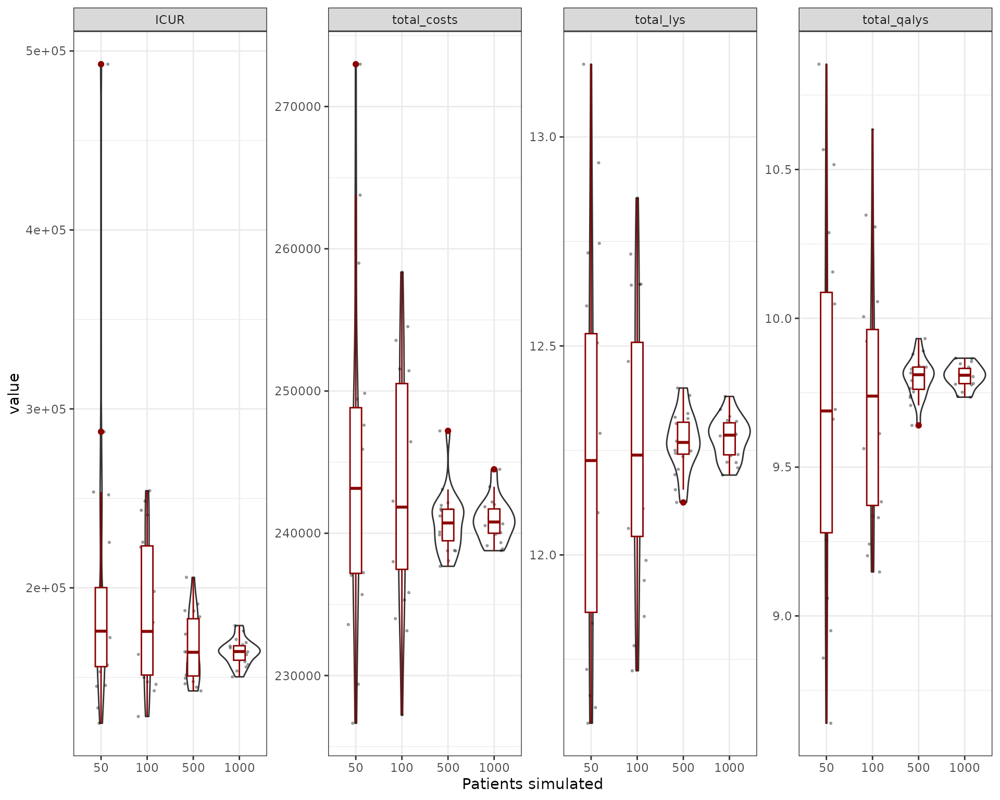
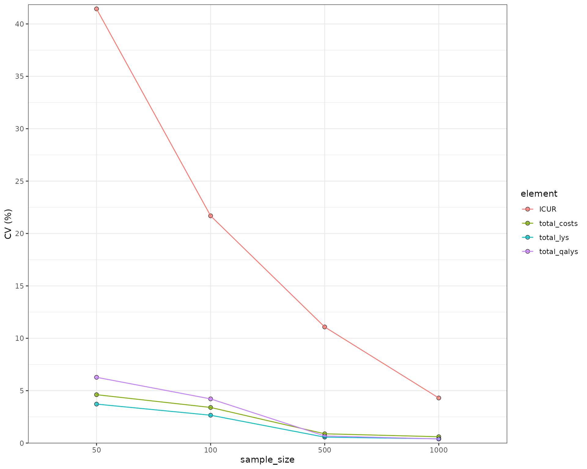
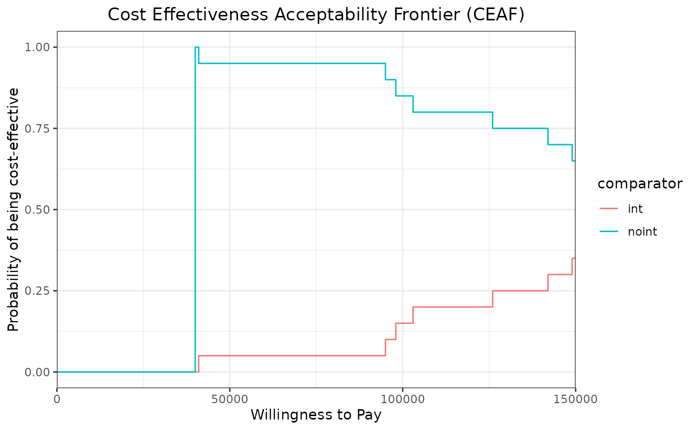
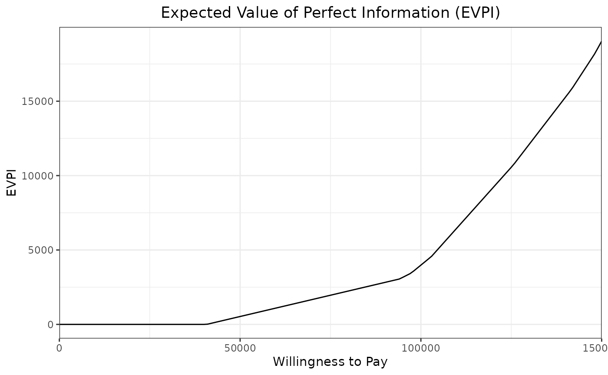

# Structural and Parametric Uncertainty

## Introduction

This document runs a discrete event simulation model in the context of
early breast cancer to show how uncertainty behaves in a simulation
setting and how it complements with a standard PSA. As the model is
extremely similar to the example in early breast cancer, the user can
check the original model for details on functions, parameters etc.

### Main options

``` r
library(WARDEN)

library(dplyr)
#> 
#> Attaching package: 'dplyr'
#> The following objects are masked from 'package:stats':
#> 
#>     filter, lag
#> The following objects are masked from 'package:base':
#> 
#>     intersect, setdiff, setequal, union
library(purrr)
library(tidyr)
library(flexsurv)
#> Loading required package: survival
library(ggplot2)
library(kableExtra)
#> 
#> Attaching package: 'kableExtra'
#> The following object is masked from 'package:dplyr':
#> 
#>     group_rows
```

### Load Data

The dummy data for costs and utility is generated below.

## General inputs with delayed execution

Initial inputs and flags that will be used in the model can be defined
below. This is exactly the same as in the original model, the only
difference is that now we are adding an extra chunk which reflects the
uncertainty of parameters to draw distributions. Furthermore, utilities
and costs also have a distribution.

``` r
#Each patient is identified through "i"
#Items used in the model should be unnamed numeric/vectors! otherwise if they are processed by model it can lead to strangely named outcomes
#In this case, util_v is a named vector, but it's not processed by the model. We extract unnamed numerics from it.

#Put objects here that do not change on any patient or intervention loop
common_all_inputs <- add_item() %>%
  add_item( #utilities
  pick_val_v(
    base =  util.data$value,
    psa = MASS::mvrnorm(1,util.data$value,diag(util.data$se^2)),
    sens = util.data$value,
    psa_ind = psa_bool,
    sens_ind = sensitivity_bool,
    indicator = rep(0, nrow(util.data)),
    names_out =util.data$name
  ),#costs
  pick_val_v(
    base =  cost.data$value,
    psa = rgamma_mse(1,cost.data$value,cost.data$se),
    sens = cost.data$value,
    psa_ind = psa_bool,
    sens_ind = sensitivity_bool,
    indicator = rep(0, nrow(cost.data)),
    names_out =cost.data$name
  )
) %>%
  add_item( #parameter uncertainty, alternative approach to using pick_val_v, it also does work
    coef11_psa = ifelse(psa_bool,rnorm(1,2,0.1),2),
    coef12_psa = ifelse(psa_bool,rnorm(1,3,0.1),3),
    coef13_psa = ifelse(psa_bool,rnorm(1,0.8,0.05),0.8),
    coef14_psa = ifelse(psa_bool,rnorm(1,0.5,0.05),0.5),
    coef15_psa = ifelse(psa_bool,rnorm(1,2.3,0.1),2.3),
    coef16_psa = ifelse(psa_bool,log(rnorm(1,0.08,0.005)),log(0.08)),
    coef2_psa = ifelse(psa_bool,log(rnorm(1,0.2,0.01)),log(0.2)),
    hr_psa = ifelse(psa_bool,exp(rnorm(1,log(1.2),0.05)),1.2)
    )

#Put objects here that do not change as we loop through interventions for a patient
common_pt_inputs <- add_item(input={ 
    sex_pt <- ifelse(rbinom(1,1,p=0.01),"male","female")
    nat.os.s <- rcond_gompertz(1,
                               shape=if(sex_pt=="male"){0.102}else{0.115},
                               rate=if(sex_pt=="male"){0.000016}else{0.0000041},
                               lower_bound = 50)   #in years, for a patient who is 50yo
    fl.remission <- rbinom(1,1,0.8) #80% probability of going into remission
    })

#Put objects here that change as we loop through treatments for each patient (e.g. events can affect fl.tx, but events do not affect nat.os.s)
#common across arm but changes per pt could be implemented here (if (arm==)... )
unique_pt_inputs <- add_item(input={
    fl.idfs.ontx              <- 1
    fl.idfs                   <- 1
    fl.mbcs.ontx              <- 1
    fl.mbcs.progression.mbc   <- 1
    fl.tx.beva                <- 1  
    fl.mbcs                   <- 0
    fl.mbcs_2ndline           <- 0
    fl.recurrence             <- 0
    q_default <- if (fl.idfs==1) {
        util.idfs.ontx * fl.idfs.ontx + (1-fl.idfs.ontx) * (1-fl.idfs.ontx) 
    } else if (fl.idfs==0 & fl.mbcs==0) {
        util.remission * fl.remission + fl.recurrence*util.recurrence
    } else if (fl.mbcs==1) {
        util.mbc.progression.mbc * fl.mbcs.progression.mbc + (1-fl.mbcs.progression.mbc)*util.mbc.pps
    }
    c_default <- if(arm=="noint"){cost.idfs.txnoint* fl.idfs.ontx  + cost.idfs}else{(cost.idfs.tx) * fl.idfs.ontx + cost.tx.beva * fl.tx.beva + cost.idfs}
    c_ae <- 0
    rnd_stream_ae  <- random_stream(100)
    rnd_stream_mbc <- random_stream(100)
})
```

## Events

### Add Initial Events

Events are generated as before, the only difference being that the
parameters are not a simple number but the objects created as part of
`common_all_inputs`.

``` r
init_event_list <- 
  add_tte(arm="int",
               evts = c("start","ttot", "ttot.beva","progression.mbc", "os","idfs","ttot.early","remission","recurrence","start.early.mbc","ae","2ndline_mbc"),
               other_inp = c("os.early","os.mbc"),
               input={ #intervention
    start <- 0
    
    #Early
    
    idfs <- draw_tte(1,'lnorm',coef1=coef11_psa, coef2=coef2_psa) 
    ttot.early <- min(draw_tte(1,'lnorm',coef1=coef11_psa, coef2=coef2_psa),idfs)
    ttot.beva <- draw_tte(1,'lnorm',coef1=coef11_psa, coef2=coef2_psa)

    os.early <- draw_tte(1,'lnorm',coef1=coef12_psa, coef2=coef2_psa) 
    
    #if patient has remission, check when will recurrence happen
    if (fl.remission) { 
      recurrence <- idfs + draw_tte(1,'lnorm',coef1=coef11_psa, coef2=coef2_psa)
      remission <- idfs
      
      #if recurrence happens before death
      if (min(os.early,nat.os.s)>recurrence) { 
        
        #Late metastatic (after finishing idfs and recurrence)
        
        os.mbc <- draw_tte(1,'lnorm',coef1=coef13_psa, coef2=coef2_psa) + idfs  +  recurrence 
        
        progression.mbc <- draw_tte(1,'lnorm',coef1=coef14_psa, coef2=coef2_psa) + idfs +  recurrence 
        
        ttot <- draw_tte(1,'lnorm',coef1=coef14_psa, coef2=coef2_psa) + idfs +  recurrence
        
        
      }
      
    } else{ #If early metastatic
      start.early.mbc <- draw_tte(1,'lnorm',coef1=coef15_psa, coef2=coef2_psa)
      
      idfs <- ifelse(start.early.mbc<idfs,start.early.mbc,idfs)
      ttot.early <- min(ifelse(start.early.mbc<idfs,start.early.mbc,idfs),ttot.early)
      
      os.mbc <- draw_tte(1,'lnorm',coef1=coef13_psa, coef2=coef2_psa) + start.early.mbc
      
      progression.mbc <- draw_tte(1,'lnorm',coef1=coef14_psa, coef2=coef2_psa) + start.early.mbc
      
      ttot <- draw_tte(1,'lnorm',coef1=coef14_psa, coef2=coef2_psa) + start.early.mbc
      
    }
    
    os <- min(os.mbc,os.early,nat.os.s)
    

  }) %>%  add_tte(arm="noint",
                       evts = c("start","ttot", "ttot.beva","progression.mbc", "os","idfs","ttot.early","remission","recurrence","start.early.mbc"),
                       other_inp = c("os.early","os.mbc"),                       
                       input={  #reference strategy
    start <- 0

    #Early
    
    idfs <- draw_tte(1,'lnorm',coef1=coef11_psa, coef2=coef2_psa,beta_tx = hr_psa) 
    ttot.early <- min(draw_tte(1,'lnorm',coef1=coef11_psa, coef2=coef2_psa,beta_tx = hr_psa),idfs)
    
    os.early <- draw_tte(1,'lnorm',coef1=coef12_psa, coef2=coef2_psa,beta_tx = hr_psa) 
    
    #if patient has remission, check when will recurrence happen
    if (fl.remission) { 
      recurrence <- idfs +draw_tte(1,'lnorm',coef1=coef11_psa, coef2=coef2_psa)
      remission <- idfs
      
      #if recurrence happens before death
      if (min(os.early,nat.os.s)>recurrence) { 
        
        #Late metastatic (after finishing idfs and recurrence)
        
        os.mbc <- draw_tte(1,'lnorm',coef1=coef13_psa, coef2=coef2_psa) + idfs  +  recurrence 
        
        progression.mbc <- draw_tte(1,'lnorm',coef1=coef14_psa, coef2=coef2_psa) + idfs +  recurrence 
        
        ttot <- draw_tte(1,'lnorm',coef1=coef14_psa, coef2=coef2_psa) + idfs +  recurrence
        
      }
      
    } else{ #If early metastatic
      start.early.mbc <- draw_tte(1,'lnorm',coef1=coef15_psa, coef2=coef2_psa)
      
      idfs <- ifelse(start.early.mbc<idfs,start.early.mbc,idfs)
      ttot.early <- min(ifelse(start.early.mbc<idfs,start.early.mbc,idfs),ttot.early)
      
      os.mbc <- draw_tte(1,'lnorm',coef1=coef13_psa, coef2=coef2_psa) + start.early.mbc
      
      progression.mbc <- draw_tte(1,'lnorm',coef1=coef14_psa, coef2=coef2_psa) + start.early.mbc
      
      ttot <- draw_tte(1,'lnorm',coef1=coef14_psa, coef2=coef2_psa) + start.early.mbc
      
      
    }    
    os <- min(os.mbc,os.early,nat.os.s)
    
  })
```

### Add Reaction to Those Events

The reactions are set in the same fashion as in the original model. A
small modification has been made in generating the event `2ndline_mbc`,
which now also uses a random parameter if the PSA option is active.

``` r

evt_react_list <-
  add_reactevt(name_evt = "start",
               input = { }) %>%
  add_reactevt(name_evt = "ttot",
               input = {
                 q_default <- if (fl.idfs==1) {
                                util.idfs.ontx * fl.idfs.ontx + (1-fl.idfs.ontx) * (1-fl.idfs.ontx) 
                              } else if (fl.idfs==0 & fl.mbcs==0) {
                                util.remission * fl.remission + fl.recurrence*util.recurrence
                              } else if (fl.mbcs==1) {
                                util.mbc.progression.mbc * fl.mbcs.progression.mbc + (1-fl.mbcs.progression.mbc)*util.mbc.pps
                              }
                 c_default <- cost.mbc.tx  * fl.mbcs.ontx + cost.mbc.progression.mbc * fl.mbcs.progression.mbc + cost.mbc.pps * (1-fl.mbcs.progression.mbc) + cost.2ndline*fl.mbcs_2ndline
                 fl.mbcs.ontx <-  0 #Flag that patient is now off-treatment
                 
               }) %>%
  add_reactevt(name_evt = "ttot.beva",
               input = {
                 q_default <- if (fl.idfs==1) {
                                util.idfs.ontx * fl.idfs.ontx + (1-fl.idfs.ontx) * (1-fl.idfs.ontx) 
                              } else if (fl.idfs==0 & fl.mbcs==0) {
                                util.remission * fl.remission + fl.recurrence*util.recurrence
                              } else if (fl.mbcs==1) {
                                util.mbc.progression.mbc * fl.mbcs.progression.mbc + (1-fl.mbcs.progression.mbc)*util.mbc.pps
                              }
                 c_default <- cost.mbc.tx  * fl.mbcs.ontx + cost.mbc.progression.mbc * fl.mbcs.progression.mbc + cost.mbc.pps * (1-fl.mbcs.progression.mbc) + cost.2ndline*fl.mbcs_2ndline
                fl.tx.beva <- 0 #Flag that patient is now off-treatment
                 
               }) %>%
  add_reactevt(name_evt = "progression.mbc",
               input = {
                 q_default <- if (fl.idfs==1) {
                                util.idfs.ontx * fl.idfs.ontx + (1-fl.idfs.ontx) * (1-fl.idfs.ontx) 
                              } else if (fl.idfs==0 & fl.mbcs==0) {
                                util.remission * fl.remission + fl.recurrence*util.recurrence
                              } else if (fl.mbcs==1) {
                                util.mbc.progression.mbc * fl.mbcs.progression.mbc + (1-fl.mbcs.progression.mbc)*util.mbc.pps
                              }
                 c_default <- cost.mbc.tx  * fl.mbcs.ontx + cost.mbc.progression.mbc * fl.mbcs.progression.mbc + cost.mbc.pps * (1-fl.mbcs.progression.mbc) + cost.2ndline*fl.mbcs_2ndline
                 fl.mbcs.progression.mbc <- 0
                 fl.mbcs_2ndline <- 1 #Flag that patient is progressed and going in 2nd line
                 
                 new_event(c("2ndline_mbc" = curtime + qexp(rnd_stream_mbc$draw_n(), 0.08)/12))
                 
               }) %>%
  add_reactevt(name_evt = "idfs",
               input = {
                 q_default = if (fl.idfs==1) {
                                util.idfs.ontx * fl.idfs.ontx + (1-fl.idfs.ontx) * (1-fl.idfs.ontx) 
                              } else if (fl.idfs==0 & fl.mbcs==0) {
                                util.remission * fl.remission + fl.recurrence*util.recurrence
                              } else if (fl.mbcs==1) {
                                util.mbc.progression.mbc * fl.mbcs.progression.mbc + (1-fl.mbcs.progression.mbc)*util.mbc.pps
                              }
                 c_default <- if(arm=="noint"){cost.idfs.txnoint* fl.idfs.ontx  + cost.idfs}else{(cost.idfs.tx) * fl.idfs.ontx + cost.tx.beva * fl.tx.beva + cost.idfs}
                 fl.idfs <- 0
                 
               }) %>%
  add_reactevt(name_evt = "ttot.early",
               input = {
                 q_default <- if (fl.idfs==1) {
                                util.idfs.ontx * fl.idfs.ontx + (1-fl.idfs.ontx) * (1-fl.idfs.ontx) 
                              } else if (fl.idfs==0 & fl.mbcs==0) {
                                util.remission * fl.remission + fl.recurrence*util.recurrence
                              } else if (fl.mbcs==1) {
                                util.mbc.progression.mbc * fl.mbcs.progression.mbc + (1-fl.mbcs.progression.mbc)*util.mbc.pps
                              }
                 c_default <- if(arm=="noint"){cost.idfs.txnoint* fl.idfs.ontx  + cost.idfs}else{(cost.idfs.tx) * fl.idfs.ontx + cost.tx.beva * fl.tx.beva + cost.idfs}
                 fl.idfs.ontx <- 0
                 fl.tx.beva <- 0 #Flag that patient is now off-treatment
                 
                 n_ae <- qpois(rnd_stream_ae$draw_n(),lambda=0.25*(curtime -prevtime)) #1 AE every 4 years
                 
                 if (n_ae>0) {
                     new_event(c("ae" = curtime + 0.0001))
                     n_ae <- n_ae - 1
                 }
               }) %>%
  add_reactevt(name_evt = "remission",
               input = {
                 q_default <- if (fl.idfs==1) {
                                util.idfs.ontx * fl.idfs.ontx + (1-fl.idfs.ontx) * (1-fl.idfs.ontx) 
                              } else if (fl.idfs==0 & fl.mbcs==0) {
                                util.remission * fl.remission + fl.recurrence*util.recurrence
                              } else if (fl.mbcs==1) {
                                util.mbc.progression.mbc * fl.mbcs.progression.mbc + (1-fl.mbcs.progression.mbc)*util.mbc.pps
                              }
                 c_default <- cost.recurrence * fl.recurrence
                 fl.remission <- 1
                 
               }) %>%
  add_reactevt(name_evt = "recurrence",
               input = {
                 q_default <- if (fl.idfs==1) {
                                util.idfs.ontx * fl.idfs.ontx + (1-fl.idfs.ontx) * (1-fl.idfs.ontx) 
                              } else if (fl.idfs==0 & fl.mbcs==0) {
                                util.remission * fl.remission + fl.recurrence*util.recurrence
                              } else if (fl.mbcs==1) {
                                util.mbc.progression.mbc * fl.mbcs.progression.mbc + (1-fl.mbcs.progression.mbc)*util.mbc.pps
                              }
                 c_default <- cost.recurrence * fl.recurrence
                 fl.recurrence <- 1
                 fl.remission <- 0
                 fl.mbcs <- 1
                 fl.mbcs.progression.mbc <- 1 #ad-hoc for plot
                 
               }) %>%
  add_reactevt(name_evt = "start.early.mbc",
               input = {
                 q_default <- if (fl.idfs==1) {
                                util.idfs.ontx * fl.idfs.ontx + (1-fl.idfs.ontx) * (1-fl.idfs.ontx) 
                              } else if (fl.idfs==0 & fl.mbcs==0) {
                                util.remission * fl.remission + fl.recurrence*util.recurrence
                              } else if (fl.mbcs==1) {
                                util.mbc.progression.mbc * fl.mbcs.progression.mbc + (1-fl.mbcs.progression.mbc)*util.mbc.pps
                              }
                 c_default <- cost.recurrence * fl.recurrence
                 fl.mbcs <- 1
                 fl.mbcs.progression.mbc <- 1
                 
               }) %>%
  add_reactevt(name_evt = "2ndline_mbc",
               input = {
                 q_default <- if (fl.idfs==1) {
                                util.idfs.ontx * fl.idfs.ontx + (1-fl.idfs.ontx) * (1-fl.idfs.ontx) 
                              } else if (fl.idfs==0 & fl.mbcs==0) {
                                util.remission * fl.remission + fl.recurrence*util.recurrence
                              } else if (fl.mbcs==1) {
                                util.mbc.progression.mbc * fl.mbcs.progression.mbc + (1-fl.mbcs.progression.mbc)*util.mbc.pps
                              }
                 c_default <- cost.mbc.tx  * fl.mbcs.ontx + cost.mbc.progression.mbc * fl.mbcs.progression.mbc + cost.mbc.pps * (1-fl.mbcs.progression.mbc) + cost.2ndline*fl.mbcs_2ndline
                 fl.mbcs_2ndline <- 0
                 
                 n_ae <- qpois(rnd_stream_ae$draw_n(),lambda=0.25*(curtime -prevtime)) #1 AE every 4 years

                 if (n_ae>0) {
                     new_event(c("ae" = curtime + 0.0001))
                     n_ae <- n_ae - 1
                 }
               }) %>%
  add_reactevt(name_evt = "ae",
               input = {
                 if (n_ae>0) {
                     new_event(c("ae" = curtime))
                     n_ae <- n_ae - 1
                 }
                 
                 q_default = if (fl.idfs==1) {
                                util.idfs.ontx * fl.idfs.ontx + (1-fl.idfs.ontx) * (1-fl.idfs.ontx) 
                              } else if (fl.idfs==0 & fl.mbcs==0) {
                                util.remission * fl.remission + fl.recurrence*util.recurrence
                              } else if (fl.mbcs==1) {
                                util.mbc.progression.mbc * fl.mbcs.progression.mbc + (1-fl.mbcs.progression.mbc)*util.mbc.pps
                              }
                 c_default <- cost.mbc.tx  * fl.mbcs.ontx + cost.mbc.progression.mbc * fl.mbcs.progression.mbc + cost.mbc.pps * (1-fl.mbcs.progression.mbc) + cost.2ndline*fl.mbcs_2ndline
                 c_ae <- cost.ae
                 
                 modify_event(c("os" =max(get_event("os") - 0.125,curtime +0.0001) ))#each AE brings forward death by 1.5 months
               }) %>%
  add_reactevt(name_evt = "os",
               input = {
                 q_default <- if (fl.idfs==1) {
                                util.idfs.ontx * fl.idfs.ontx + (1-fl.idfs.ontx) * (1-fl.idfs.ontx) 
                              } else if (fl.idfs==0 & fl.mbcs==0) {
                                util.remission * fl.remission + fl.recurrence*util.recurrence
                              } else if (fl.mbcs==1) {
                                util.mbc.progression.mbc * fl.mbcs.progression.mbc + (1-fl.mbcs.progression.mbc)*util.mbc.pps
                              }
                 c_default <- cost.mbc.tx  * fl.mbcs.ontx + cost.mbc.progression.mbc * fl.mbcs.progression.mbc + cost.mbc.pps * (1-fl.mbcs.progression.mbc) + cost.2ndline*fl.mbcs_2ndline
                 fl.tx.beva <- 0
                 fl.mbcs.ontx <- 0
                 fl.idfs <- 0
                 fl.mbcs <- 0
                 curtime <- Inf
               }) 
```

## Costs and Utilities

Costs and utilities are introduced below.

``` r

util_ongoing <- "q_default"

cost_ongoing <- "c_default"

cost_instant <-  "c_ae"
```

## Model

The model can now be executed as normal. Given that this modeling
exercise relies on sampling from distributions and simulating a finite
number of patients, there is some randomness involved that can affect
the results, even under the assumption that the parameters are fixed.
However, running more patients also means the simulation is slower, so
there is a trade-off between accuracy and speed. An important question
here is to understand how much of the uncertainty we observe when
running a PSA comes from the parametric uncertainty and how much comes
from the fact that we are simulating a finite sample.

### Structural Uncertainty

One way to test this is to run a few simulations for an increasing
number of patients simulated. For example, below we run 20 deterministic
simulations for 50, 100, 500, and 1,000 patients, to show how the model
outcome can change depending on the random seed used. Note that this
exercise can be very time consuming. It’s important to note that the
optimal number of patients simulated will depend on the dispersion of
the distributions, the patient pathway, the number of possible outcomes
and the difference among these. For example, an event with low
probability but high impact and variability implies a higher number of
patients simulated in order to obtain stable outcomes.

To do this test, we set `psa_bool = FALSE` and (optional) we set
`ipd = FALSE`. This last option means that we are not exporting IPD data
from all these simulations, but rather the aggregate outcomes (and the
last simulation, which is included by default). This is important when
simulating a large number of patients with a lot of simulations, which
can generate very large objects (\>1 GB). This option can also be
especially relevant when running a PSA, which would require
`psa_bool = TRUE` and a high number of simulations.

``` r

sample_sizes <- c(50,100,500,1000)

sim_size_df <- NULL
for (sample_size in sample_sizes) {
  results <- suppressWarnings( #run without warnings
      run_sim(  
    npats=sample_size,                        # number of patients to be simulated
    n_sim=20,                                # number of simulations to run
    psa_bool = FALSE,                         # use PSA or not. If n_sim > 1 and psa_bool = FALSE, then difference in outcomes is due to sampling (number of pats simulated)
    arm_list = c("int", "noint"),             # intervention list
    common_all_inputs = common_all_inputs,    # inputs common that do not change within a simulation
    common_pt_inputs = common_pt_inputs,      # inputs that change within a simulation but are not affected by the intervention
    unique_pt_inputs = unique_pt_inputs,      # inputs that change within a simulation between interventions
    init_event_list = init_event_list,        # initial event list
    evt_react_list = evt_react_list,          # reaction of events
    util_ongoing_list = util_ongoing,
    cost_ongoing_list = cost_ongoing,
    cost_instant_list = cost_instant,
    ipd=FALSE                                 # Return IPD data through merged_df? Set to FALSE as it's not of interest here and it makes code slower
  )) 

  #We're extracting the overall ICER/ICUR and also costs/qalys/lys for the "noint" intervention
  loop_df <- rbind(extract_psa_result(results[[1]],"total_costs"),
                   extract_psa_result(results[[1]],"total_lys"),
                   extract_psa_result(results[[1]],"total_qalys"))
  
  loop_df <- rbind(loop_df %>%
                     pivot_longer(cols=c("int","noint"),names_to="arm"),
                   loop_df %>%
                     mutate(dif = int - noint) %>%
                     group_by(simulation) %>%
                     transmute(value = dif[element=="total_costs"]/dif[element=="total_qalys"],element = "ICUR", arm="noint") %>%
                     relocate(element, arm) %>%
                     ungroup() %>%
                     distinct())
    

  loop_df$sample_size <- sample_size
  sim_size_df <- rbind(sim_size_df,loop_df)
  
}
```

We can then plot the results (in this case, the costs, lys and qalys are
for the “noint” intervention)


We can also try to understand what is the relative size of the
uncertainty provided by the sampling. We compute the coefficient of
variation for the outcomes exported (costs, qalys, lys, ICER and ICUR).
The first thing to be noticed is that the ICER and ICUR CV is much
higher than for costs/lys/qalys. This is because of the incremental
nature of ICER/ICUR, which means it’s more sensitive to small variations
of these outputs. So while the costs/qalys/lys are quite precise with a
reduced number of simulations (~1,000), in order to have a precise
ICER/ICUR we would need to go higher (~5,000/10,000). However, one could
see that the mean would be quite stable at ~5,000 patients.

| element     | sample_size |      mean |       sd | CV (%) |
|:------------|:------------|----------:|---------:|-------:|
| ICUR        | 50          | 196797.73 | 81550.74 |  41.44 |
| ICUR        | 100         | 187029.50 | 40558.60 |  21.69 |
| ICUR        | 500         | 166506.72 | 18449.38 |  11.08 |
| ICUR        | 1000        | 164018.16 |  7056.78 |   4.30 |
| total_costs | 50          | 244265.08 | 11274.89 |   4.62 |
| total_costs | 100         | 242987.45 |  8256.98 |   3.40 |
| total_costs | 500         | 240760.88 |  2127.62 |   0.88 |
| total_costs | 1000        | 240893.99 |  1453.84 |   0.60 |
| total_lys   | 50          |     12.25 |     0.46 |   3.72 |
| total_lys   | 100         |     12.27 |     0.33 |   2.66 |
| total_lys   | 500         |     12.27 |     0.07 |   0.57 |
| total_lys   | 1000        |     12.28 |     0.05 |   0.40 |
| total_qalys | 50          |      9.70 |     0.61 |   6.28 |
| total_qalys | 100         |      9.75 |     0.41 |   4.22 |
| total_qalys | 500         |      9.80 |     0.07 |   0.68 |
| total_qalys | 1000        |      9.81 |     0.04 |   0.39 |

We can plot the CV to see this more clearly:


### Parameter Uncertainty

Structural uncertainty is not the only type of uncertainty that the
model can have. Parameters can also be changed across simulations by
using the `psa_bool = TRUE` option. Let’s see what happens when we
compare the true PSA to the structural uncertainty with 1,000 patients.

``` r

sample_sizes <- 1000

sim_size_psa_df <- NULL
for (sample_size in sample_sizes) {
  results <- suppressWarnings( #run without warnings
      run_sim(  
    npats=sample_size,                        # number of patients to be simulated
    n_sim=20,                                # number of simulations to run
    psa_bool = TRUE,                         # use PSA or not. If n_sim > 1 and psa_bool = FALSE, then difference in outcomes is due to sampling (number of pats simulated)
    arm_list = c("int", "noint"),             # intervention list
    common_all_inputs = common_all_inputs,    # inputs common that do not change within a simulation
    common_pt_inputs = common_pt_inputs,      # inputs that change within a simulation but are not affected by the intervention
    unique_pt_inputs = unique_pt_inputs,      # inputs that change within a simulation between interventions
    init_event_list = init_event_list,        # initial event list
    evt_react_list = evt_react_list,          # reaction of events
    util_ongoing_list = util_ongoing,
    cost_ongoing_list = cost_ongoing,
    cost_instant_list = cost_instant,
    ipd=FALSE                                 # Return IPD data through merged_df? Set to FALSE as it's not of interest here and it makes code slower
  )) 

  #We're extracting the overall ICER/ICUR and also costs/qalys/lys for the "noint" intervention
  loop_psa_df <- rbind(extract_psa_result(results[[1]],"total_costs"),
                   extract_psa_result(results[[1]],"total_lys"),
                   extract_psa_result(results[[1]],"total_qalys"))
  
  loop_psa_df <- rbind(loop_psa_df %>%
                     pivot_longer(cols=c("int","noint"),names_to="arm"),
                   loop_psa_df %>%
                     mutate(dif = int - noint) %>%
                     group_by(simulation) %>%
                     transmute(value = dif[element=="total_costs"]/dif[element=="total_qalys"],element = "ICUR", arm="noint") %>%
                     relocate(element, arm) %>%
                     ungroup() %>%
                     distinct())
  
  loop_psa_df$sample_size  <-  sample_size
  sim_size_psa_df <- rbind(sim_size_psa_df,loop_psa_df)
  
}
```

Now the uncertainty is much bigger when compared to the same case with
1,000 iterations and no parameter uncertainty.

| element     | sample_size | uncertainty            |      mean |        sd | CV (%) |
|:------------|:------------|:-----------------------|----------:|----------:|-------:|
| ICUR        | 1000        | structural             | 164018.16 |   7056.78 |   4.30 |
| ICUR        | 1000        | structural + parameter | 225668.87 | 146751.48 |  65.03 |
| total_costs | 1000        | structural             | 240893.99 |   1453.84 |   0.60 |
| total_costs | 1000        | structural + parameter | 251899.46 |  50616.31 |  20.09 |
| total_lys   | 1000        | structural             |     12.28 |      0.05 |   0.40 |
| total_lys   | 1000        | structural + parameter |     12.48 |      0.57 |   4.59 |
| total_qalys | 1000        | structural             |      9.81 |      0.04 |   0.39 |
| total_qalys | 1000        | structural + parameter |     10.02 |      0.54 |   5.41 |

## CEAC/CEAF and EVPI

When a PSA is run, additional analyses can be performed to understand
the importance and behavior of uncertainty.

### CEAC/CEAF

We can now use the `ceac_des` function with a vector of willingness to
pay and the results of our PSA to generate the CEAC and CEAF plots.

``` r

wtp <- seq(from=0,to=150000,by=1000)
ceac_out <-ceac_des(wtp,results)

ggplot(ceac_out,aes(x=wtp,y=prob_best,group=comparator,col=comparator)) +
  geom_line()+
  xlab("Willingness to Pay") +
  ylab("Probability of being cost-effective")+
  theme_bw() +
  scale_x_continuous(expand = c(0, 0)) +
  ggtitle("Cost Effectiveness Acceptability Curve (CEAC)") +
  theme(plot.title = element_text(hjust = 0.5))
```


``` r


ggplot(ceac_out,aes(x=wtp,y=prob_best,group=comparator,col=comparator)) +
  geom_step()+
  xlab("Willingness to Pay") +
  ylab("Probability of being cost-effective")+
  theme_bw() +
  scale_x_continuous(expand = c(0, 0)) +
  ggtitle("Cost Effectiveness Acceptability Frontier (CEAF)")+
  theme(plot.title = element_text(hjust = 0.5))
```



### EVPI

Similarly to `ceac_des`, the function `evpi_des` also allows to compute
the EVPI.

``` r

evpi_out <-evpi_des(wtp,results)

ggplot(evpi_out,aes(x=wtp,y=evpi)) +
  geom_line()+
  xlab("Willingness to Pay") +
  ylab("EVPI")+
  theme_bw() +
  scale_x_continuous(expand = c(0, 0)) +
  ggtitle("Expected Value of Perfect Information (EVPI)") +
  theme(plot.title = element_text(hjust = 0.5))
```


